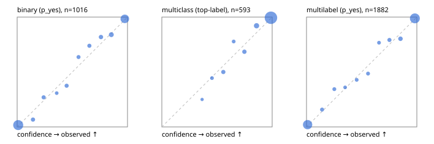

# Evaluation report

- model `Qwen/Qwen3-Reranker-4B` @ `22e683669b` (shared-prefix tree (tree-v1)), adapter/checkpoint `runs/tree_4b_ova/adapter`, prompt `tree-v1` (bc025ae9f6bc)
- data data/ova/eval2.jsonl; splits ['test']; n=1991; calibration `None`
- cuda / bfloat16; 2026-09-24T09:40:37+0000; wall 251.6s

## Overall

question accuracy 91.6%

**binary**: n 1016, positives 435, accuracy 0.938, precision 0.925, recall 0.931, f1 0.928, auroc 0.981, brier 0.049, log_loss 0.174, ece 0.017

**multiclass**: n 593, accuracy 0.949, macro_f1 0.911, log_loss 0.140, brier 0.072, ece_top_label 0.015

**multilabel**: n 382, labels 1882, exact_match 0.804, micro_f1 0.946, macro_f1 0.901, label_auroc 0.987, brier 0.043, log_loss 0.146, ece 0.015

## By family

| family | n | question acc % | details |
|---|---|---|---|
| e2_hard | 673 | 90.8 | bin acc 93.7 F1 91.3 AUROC 0.977 ECE 0.024; mc acc 94.8 mF1 90.6 ECE 0.032; ml EM 77.3 µF1 93.5 ECE 0.018 |
| e2_simple | 664 | 94.9 | bin acc 95.6 F1 96.0 AUROC 0.990 ECE 0.020; mc acc 97.5 mF1 94.7 ECE 0.018; ml EM 88.3 µF1 97.7 ECE 0.021 |
| e2_very_hard | 654 | 89.0 | bin acc 92.0 F1 89.3 AUROC 0.969 ECE 0.029; mc acc 92.5 mF1 88.2 ECE 0.028; ml EM 76.2 µF1 92.6 ECE 0.031 |

## by hard case

| slice | n | question acc % |
|---|---|---|
| (none) | 569 | 95.6 |
| contradiction | 172 | 94.8 |
| distractor | 474 | 89.7 |
| double_negation | 126 | 88.1 |
| evidence_end | 57 | 94.7 |
| evidence_middle | 114 | 93.9 |
| evidence_start | 17 | 82.4 |
| exception | 213 | 89.7 |
| hypothetical | 128 | 94.5 |
| injection | 151 | 87.4 |
| lexical_overlap | 201 | 94.5 |
| long_state | 191 | 91.1 |
| missing_evidence | 141 | 93.6 |
| multi_positive | 322 | 81.1 |
| multi_turn | 149 | 93.3 |
| negation | 257 | 94.6 |
| nota | 118 | 86.4 |
| numeric_reasoning | 224 | 83.0 |
| paraphrase | 218 | 89.0 |
| role_reversal | 187 | 88.8 |
| sarcasm | 149 | 85.2 |
| temporal_reasoning | 203 | 79.3 |
| zero_positive | 73 | 90.4 |
| zero_positive_distractor | 1 | 100.0 |

## by state tokens

| slice | n | question acc % |
|---|---|---|
| 00000-00127 | 662 | 91.7 |
| 00128-00511 | 477 | 88.1 |
| 00512-02047 | 484 | 93.6 |
| 02048-08191 | 329 | 93.0 |
| 08192+ | 39 | 94.9 |

## by candidates

| slice | n | question acc % |
|---|---|---|
| 01 | 1016 | 93.8 |
| 03 | 128 | 92.2 |
| 04 | 515 | 92.8 |
| 05 | 224 | 84.8 |
| 06 | 86 | 76.7 |
| 07 | 18 | 83.3 |
| 08 | 4 | 75.0 |

## Paraphrase groups

76 groups; same prediction 75.0%; all correct 80.3%

## Multiclass abstention (coverage vs error on accepted)

| abstain_below | coverage % | error % |
|---|---|---|
| 0.0 | 100.0 | 5.1 |
| 0.4 | 99.3 | 4.6 |
| 0.5 | 97.8 | 3.8 |
| 0.6 | 95.1 | 2.5 |
| 0.7 | 93.6 | 2.2 |
| 0.8 | 90.4 | 1.1 |
| 0.9 | 84.0 | 0.6 |

## Reliability: binary

| bin | n | mean confidence | observed frequency |
|---|---|---|---|
| [0.0,0.1) | 485 | 0.010 | 0.016 |
| [0.1,0.2) | 30 | 0.143 | 0.067 |
| [0.2,0.3) | 26 | 0.240 | 0.269 |
| [0.3,0.4) | 13 | 0.358 | 0.308 |
| [0.4,0.5) | 24 | 0.448 | 0.375 |
| [0.5,0.6) | 22 | 0.556 | 0.636 |
| [0.6,0.7) | 23 | 0.654 | 0.739 |
| [0.7,0.8) | 33 | 0.759 | 0.818 |
| [0.8,0.9) | 50 | 0.853 | 0.840 |
| [0.9,1.0] | 310 | 0.975 | 0.984 |

## Reliability: multiclass

| bin | n | mean confidence | observed frequency |
|---|---|---|---|
| [0.3,0.4) | 4 | 0.365 | 0.250 |
| [0.4,0.5) | 9 | 0.454 | 0.444 |
| [0.5,0.6) | 16 | 0.557 | 0.500 |
| [0.6,0.7) | 9 | 0.651 | 0.778 |
| [0.7,0.8) | 19 | 0.748 | 0.684 |
| [0.8,0.9) | 38 | 0.858 | 0.921 |
| [0.9,1.0] | 498 | 0.989 | 0.994 |

## Reliability: multilabel

| bin | n | mean confidence | observed frequency |
|---|---|---|---|
| [0.0,0.1) | 729 | 0.010 | 0.021 |
| [0.1,0.2) | 38 | 0.141 | 0.158 |
| [0.2,0.3) | 32 | 0.252 | 0.344 |
| [0.3,0.4) | 25 | 0.350 | 0.360 |
| [0.4,0.5) | 28 | 0.455 | 0.429 |
| [0.5,0.6) | 35 | 0.558 | 0.486 |
| [0.6,0.7) | 30 | 0.657 | 0.767 |
| [0.7,0.8) | 48 | 0.751 | 0.792 |
| [0.8,0.9) | 66 | 0.852 | 0.803 |
| [0.9,1.0] | 851 | 0.982 | 0.988 |
