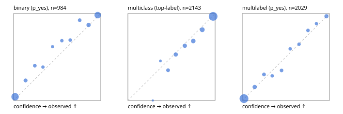

# Evaluation report

- model `Qwen/Qwen3-Reranker-4B` @ `22e683669b` (shared-prefix tree (tree-v1)), adapter/checkpoint `runs/tree_4b_ova/adapter`, prompt `tree-v1` (bc025ae9f6bc)
- data data/ova/hf.jsonl, data/ova/eval.jsonl; splits ['test']; n=3471; calibration `None`
- cuda / bfloat16; 2026-09-24T09:36:18+0000; wall 264.1s

## Overall

question accuracy 82.6%

**binary**: n 984, positives 475, accuracy 0.892, precision 0.915, recall 0.857, f1 0.885, auroc 0.962, brier 0.081, log_loss 0.265, ece 0.044

**multiclass**: n 2143, accuracy 0.836, macro_f1 0.878, log_loss 0.456, brier 0.231, ece_top_label 0.025

**multilabel**: n 344, labels 2029, exact_match 0.578, micro_f1 0.764, macro_f1 0.804, label_auroc 0.946, brier 0.073, log_loss 0.237, ece 0.014

## By family

| family | n | question acc % | details |
|---|---|---|---|
| eval_adversarial | 27 | 92.6 | bin acc 93.3 F1 92.3 AUROC 1.000 ECE 0.074; mc acc 100.0 mF1 100.0 ECE 0.006; ml EM 80.0 µF1 94.7 ECE 0.064 |
| eval_agent_output | 26 | 69.2 | bin acc 92.9 F1 93.3 AUROC 0.959 ECE 0.061; mc acc 42.9 mF1 21.4 ECE 0.462; ml EM 40.0 µF1 80.0 ECE 0.154 |
| eval_evidence | 17 | 94.1 | bin acc 100.0 F1 100.0 AUROC 1.000 ECE 0.030; ml EM 50.0 µF1 66.7 ECE 0.217 |
| eval_multilabel | 32 | 93.8 | bin acc 100.0 F1 100.0 AUROC 1.000 ECE 0.016; mc acc 100.0 mF1 100.0 ECE 0.212; ml EM 91.7 µF1 97.0 ECE 0.031 |
| eval_policy | 22 | 63.6 | bin acc 69.2 F1 71.4 AUROC 0.786 ECE 0.228; mc acc 40.0 mF1 25.0 ECE 0.601; ml EM 75.0 µF1 94.1 ECE 0.138 |
| eval_routing | 25 | 84.0 | bin acc 90.0 F1 88.9 AUROC 1.000 ECE 0.096; mc acc 92.3 mF1 87.9 ECE 0.116; ml EM 0.0 µF1 66.7 ECE 0.156 |
| eval_urgency_sentiment | 22 | 90.9 | bin acc 90.0 F1 92.3 AUROC 0.958 ECE 0.149; mc acc 90.0 mF1 75.0 ECE 0.065; ml EM 100.0 µF1 100.0 ECE 0.009 |
| heldout_boolq | 300 | 83.7 | bin acc 83.7 F1 85.8 AUROC 0.932 ECE 0.083 |
| heldout_emotion_multiclass | 300 | 57.7 | mc acc 57.7 mF1 44.4 ECE 0.187 |
| heldout_intent_clinc | 300 | 90.3 | mc acc 90.3 mF1 91.1 ECE 0.055 |
| heldout_question_type_trec | 300 | 87.3 | mc acc 87.3 mF1 86.9 ECE 0.056 |
| heldout_sentiment_sst2 | 300 | 88.7 | bin acc 88.7 F1 87.6 AUROC 0.968 ECE 0.098 |
| heldout_topic_dbpedia | 300 | 97.0 | mc acc 97.0 mF1 96.7 ECE 0.018 |
| hf_emotions_multilabel | 300 | 55.0 | ml EM 55.0 µF1 71.9 ECE 0.016 |
| hf_intent_banking77 | 300 | 96.3 | mc acc 96.3 mF1 95.7 ECE 0.035 |
| hf_nli | 300 | 95.0 | bin acc 95.0 F1 93.2 AUROC 0.984 ECE 0.027 |
| hf_sentiment_tweets | 300 | 68.0 | mc acc 68.0 mF1 68.3 ECE 0.058 |
| hf_topic_agnews | 300 | 89.0 | mc acc 89.0 mF1 89.1 ECE 0.056 |

## by hard case

| slice | n | question acc % |
|---|---|---|
| (none) | 3042 | 82.4 |
| contradiction | 107 | 100.0 |
| distractor | 33 | 72.7 |
| double_negation | 6 | 100.0 |
| evidence_end | 13 | 92.3 |
| evidence_middle | 11 | 90.9 |
| evidence_start | 9 | 100.0 |
| exception | 7 | 42.9 |
| hypothetical | 7 | 71.4 |
| injection | 10 | 90.0 |
| lexical_overlap | 20 | 90.0 |
| long_state | 50 | 82.0 |
| missing_evidence | 104 | 90.4 |
| multi_positive | 81 | 48.1 |
| multi_turn | 9 | 88.9 |
| negation | 30 | 90.0 |
| new_label_names | 3 | 100.0 |
| nota | 46 | 97.8 |
| numeric_reasoning | 16 | 68.8 |
| paraphrase | 22 | 95.5 |
| role_reversal | 15 | 80.0 |
| sarcasm | 12 | 100.0 |
| temporal_reasoning | 29 | 62.1 |
| zero_positive | 6 | 83.3 |

## by state tokens

| slice | n | question acc % |
|---|---|---|
| 00000-00127 | 3211 | 82.5 |
| 00128-00511 | 208 | 84.6 |
| 00512-02047 | 52 | 82.7 |

## by candidates

| slice | n | question acc % |
|---|---|---|
| 01 | 984 | 89.2 |
| 03 | 310 | 68.7 |
| 04 | 333 | 87.4 |
| 05 | 22 | 77.3 |
| 06 | 1218 | 74.4 |
| 07 | 49 | 98.0 |
| 08 | 555 | 92.8 |

## Paraphrase groups

11 groups; same prediction 72.7%; all correct 90.9%

## Multiclass abstention (coverage vs error on accepted)

| abstain_below | coverage % | error % |
|---|---|---|
| 0.0 | 100.0 | 16.4 |
| 0.4 | 98.9 | 16.0 |
| 0.5 | 94.6 | 13.7 |
| 0.6 | 87.3 | 10.9 |
| 0.7 | 80.2 | 8.6 |
| 0.8 | 71.2 | 5.7 |
| 0.9 | 59.9 | 3.3 |

## Reliability: binary

| bin | n | mean confidence | observed frequency |
|---|---|---|---|
| [0.0,0.1) | 400 | 0.017 | 0.043 |
| [0.1,0.2) | 52 | 0.137 | 0.231 |
| [0.2,0.3) | 40 | 0.244 | 0.400 |
| [0.3,0.4) | 26 | 0.337 | 0.385 |
| [0.4,0.5) | 21 | 0.447 | 0.619 |
| [0.5,0.6) | 32 | 0.554 | 0.688 |
| [0.6,0.7) | 36 | 0.650 | 0.694 |
| [0.7,0.8) | 39 | 0.758 | 0.923 |
| [0.8,0.9) | 68 | 0.860 | 0.868 |
| [0.9,1.0] | 270 | 0.965 | 0.981 |

## Reliability: multiclass

| bin | n | mean confidence | observed frequency |
|---|---|---|---|
| [0.2,0.3) | 2 | 0.285 | 0.000 |
| [0.3,0.4) | 22 | 0.373 | 0.455 |
| [0.4,0.5) | 92 | 0.461 | 0.348 |
| [0.5,0.6) | 157 | 0.549 | 0.529 |
| [0.6,0.7) | 151 | 0.653 | 0.629 |
| [0.7,0.8) | 193 | 0.750 | 0.684 |
| [0.8,0.9) | 242 | 0.853 | 0.814 |
| [0.9,1.0] | 1284 | 0.977 | 0.967 |

## Reliability: multilabel

| bin | n | mean confidence | observed frequency |
|---|---|---|---|
| [0.0,0.1) | 1259 | 0.020 | 0.021 |
| [0.1,0.2) | 142 | 0.143 | 0.155 |
| [0.2,0.3) | 87 | 0.250 | 0.299 |
| [0.3,0.4) | 67 | 0.344 | 0.284 |
| [0.4,0.5) | 81 | 0.451 | 0.346 |
| [0.5,0.6) | 64 | 0.550 | 0.594 |
| [0.6,0.7) | 68 | 0.652 | 0.647 |
| [0.7,0.8) | 72 | 0.754 | 0.806 |
| [0.8,0.9) | 60 | 0.850 | 0.883 |
| [0.9,1.0] | 129 | 0.966 | 0.969 |
