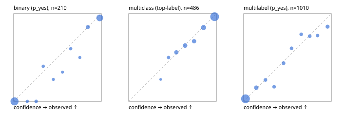

# Evaluation report

- model `Qwen/Qwen3-Reranker-4B` @ `22e683669b` (shared-prefix tree (tree-v1)), adapter/checkpoint `runs/tree_4b_ova/adapter`, prompt `tree-v1` (bc025ae9f6bc)
- data data/ova/hf.jsonl, data/ova/eval.jsonl; splits ['validation']; n=868; calibration `None`
- cuda / bfloat16; 2026-09-24T09:31:45+0000; wall 67.6s

## Overall

question accuracy 81.0%

**binary**: n 210, positives 79, accuracy 0.933, precision 0.874, recall 0.962, f1 0.916, auroc 0.985, brier 0.050, log_loss 0.167, ece 0.041

**multiclass**: n 486, accuracy 0.852, macro_f1 0.835, log_loss 0.413, brier 0.216, ece_top_label 0.019

**multilabel**: n 172, labels 1010, exact_match 0.541, micro_f1 0.720, macro_f1 0.638, label_auroc 0.923, brier 0.088, log_loss 0.287, ece 0.028

## By family

| family | n | question acc % | details |
|---|---|---|---|
| eval_adversarial | 14 | 100.0 | bin acc 100.0 F1 100.0 AUROC 1.000 ECE 0.070; mc acc 100.0 mF1 100.0 ECE 0.010; ml EM 100.0 µF1 100.0 ECE 0.007 |
| eval_agent_output | 20 | 70.0 | bin acc 83.3 F1 85.7 AUROC 0.889 ECE 0.144; mc acc 60.0 mF1 33.3 ECE 0.387; ml EM 33.3 µF1 0.0 ECE 0.346 |
| eval_evidence | 17 | 100.0 | bin acc 100.0 F1 100.0 AUROC 1.000 ECE 0.029; ml EM 100.0 µF1 100.0 ECE 0.056 |
| eval_multilabel | 12 | 58.3 | bin acc 0.0 F1 0.0 AUROC — ECE 0.932; mc acc 100.0 mF1 100.0 ECE 0.022; ml EM 55.6 µF1 91.7 ECE 0.107 |
| eval_policy | 24 | 66.7 | bin acc 75.0 F1 80.0 AUROC 0.886 ECE 0.118; mc acc 63.6 mF1 46.7 ECE 0.229; ml EM 0.0 µF1 50.0 ECE 0.529 |
| eval_routing | 16 | 87.5 | bin acc 100.0 F1 100.0 AUROC 1.000 ECE 0.062; mc acc 87.5 mF1 88.9 ECE 0.075; ml EM 0.0 µF1 0.0 ECE 0.360 |
| eval_urgency_sentiment | 15 | 100.0 | bin acc 100.0 F1 100.0 AUROC 1.000 ECE 0.031; mc acc 100.0 mF1 100.0 ECE 0.011; ml EM 100.0 µF1 100.0 ECE 0.036 |
| hf_emotions_multilabel | 150 | 52.7 | ml EM 52.7 µF1 69.2 ECE 0.026 |
| hf_intent_banking77 | 150 | 96.0 | mc acc 96.0 mF1 94.2 ECE 0.035 |
| hf_nli | 150 | 94.7 | bin acc 94.7 F1 91.8 AUROC 0.990 ECE 0.039 |
| hf_sentiment_tweets | 150 | 72.7 | mc acc 72.7 mF1 68.1 ECE 0.063 |
| hf_topic_agnews | 150 | 88.0 | mc acc 88.0 mF1 88.2 ECE 0.068 |

## by hard case

| slice | n | question acc % |
|---|---|---|
| (none) | 634 | 81.4 |
| contradiction | 63 | 95.2 |
| distractor | 20 | 80.0 |
| double_negation | 3 | 100.0 |
| evidence_end | 4 | 50.0 |
| evidence_middle | 7 | 100.0 |
| evidence_start | 3 | 66.7 |
| exception | 7 | 100.0 |
| hypothetical | 6 | 100.0 |
| injection | 16 | 87.5 |
| lexical_overlap | 13 | 100.0 |
| long_state | 26 | 73.1 |
| missing_evidence | 59 | 91.5 |
| multi_positive | 40 | 30.0 |
| multi_turn | 21 | 81.0 |
| negation | 9 | 77.8 |
| new_label_names | 5 | 60.0 |
| nota | 4 | 75.0 |
| numeric_reasoning | 13 | 76.9 |
| paraphrase | 10 | 80.0 |
| role_reversal | 7 | 57.1 |
| sarcasm | 5 | 80.0 |
| temporal_reasoning | 15 | 60.0 |
| zero_positive | 7 | 57.1 |

## by state tokens

| slice | n | question acc % |
|---|---|---|
| 00000-00127 | 796 | 81.2 |
| 00128-00511 | 46 | 82.6 |
| 00512-02047 | 26 | 73.1 |

## by candidates

| slice | n | question acc % |
|---|---|---|
| 01 | 210 | 93.3 |
| 03 | 162 | 74.1 |
| 04 | 174 | 86.2 |
| 05 | 13 | 61.5 |
| 06 | 159 | 53.5 |
| 08 | 150 | 96.0 |

## Paraphrase groups

5 groups; same prediction 40.0%; all correct 60.0%

## Multiclass abstention (coverage vs error on accepted)

| abstain_below | coverage % | error % |
|---|---|---|
| 0.0 | 100.0 | 14.8 |
| 0.4 | 99.2 | 14.3 |
| 0.5 | 96.3 | 13.2 |
| 0.6 | 89.3 | 10.8 |
| 0.7 | 80.2 | 7.9 |
| 0.8 | 73.0 | 5.6 |
| 0.9 | 60.1 | 3.4 |

## Reliability: binary

| bin | n | mean confidence | observed frequency |
|---|---|---|---|
| [0.0,0.1) | 102 | 0.010 | 0.000 |
| [0.1,0.2) | 5 | 0.155 | 0.000 |
| [0.2,0.3) | 7 | 0.257 | 0.000 |
| [0.3,0.4) | 5 | 0.337 | 0.400 |
| [0.4,0.5) | 4 | 0.453 | 0.250 |
| [0.5,0.6) | 3 | 0.556 | 0.333 |
| [0.6,0.7) | 5 | 0.651 | 0.600 |
| [0.7,0.8) | 4 | 0.754 | 0.500 |
| [0.8,0.9) | 13 | 0.846 | 0.846 |
| [0.9,1.0] | 62 | 0.982 | 0.952 |

## Reliability: multiclass

| bin | n | mean confidence | observed frequency |
|---|---|---|---|
| [0.3,0.4) | 4 | 0.365 | 0.250 |
| [0.4,0.5) | 14 | 0.455 | 0.500 |
| [0.5,0.6) | 34 | 0.544 | 0.559 |
| [0.6,0.7) | 44 | 0.643 | 0.636 |
| [0.7,0.8) | 35 | 0.746 | 0.686 |
| [0.8,0.9) | 63 | 0.854 | 0.841 |
| [0.9,1.0] | 292 | 0.980 | 0.966 |

## Reliability: multilabel

| bin | n | mean confidence | observed frequency |
|---|---|---|---|
| [0.0,0.1) | 613 | 0.021 | 0.029 |
| [0.1,0.2) | 77 | 0.145 | 0.156 |
| [0.2,0.3) | 41 | 0.248 | 0.244 |
| [0.3,0.4) | 36 | 0.347 | 0.167 |
| [0.4,0.5) | 46 | 0.454 | 0.435 |
| [0.5,0.6) | 38 | 0.546 | 0.605 |
| [0.6,0.7) | 34 | 0.656 | 0.765 |
| [0.7,0.8) | 39 | 0.754 | 0.744 |
| [0.8,0.9) | 32 | 0.843 | 0.750 |
| [0.9,1.0] | 54 | 0.957 | 0.852 |
