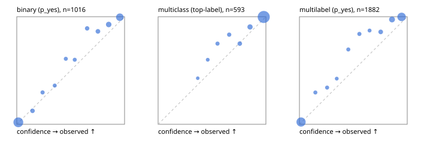

# Evaluation report

- model `Qwen/Qwen3-Reranker-4B` @ `22e683669b` (shared-prefix tree (tree-v1)), adapter/checkpoint `runs/tree_4b_ova_kd/adapter`, prompt `tree-v1` (bc025ae9f6bc)
- data data/ova/eval2.jsonl; splits ['test']; n=1991; calibration `None`
- cuda / bfloat16; 2026-09-24T13:14:39+0000; wall 251.9s

## Overall

question accuracy 91.0%

**binary**: n 1016, positives 435, accuracy 0.929, precision 0.935, recall 0.897, f1 0.915, auroc 0.979, brier 0.055, log_loss 0.196, ece 0.038

**multiclass**: n 593, accuracy 0.956, macro_f1 0.928, log_loss 0.151, brier 0.074, ece_top_label 0.032

**multilabel**: n 382, labels 1882, exact_match 0.785, micro_f1 0.939, macro_f1 0.891, label_auroc 0.987, brier 0.051, log_loss 0.182, ece 0.060

## By family

| family | n | question acc % | details |
|---|---|---|---|
| e2_hard | 673 | 89.7 | bin acc 93.1 F1 90.2 AUROC 0.971 ECE 0.056; mc acc 95.9 mF1 92.3 ECE 0.052; ml EM 72.0 µF1 91.9 ECE 0.050 |
| e2_simple | 664 | 95.3 | bin acc 95.9 F1 96.2 AUROC 0.991 ECE 0.040; mc acc 98.5 mF1 96.8 ECE 0.030; ml EM 88.3 µF1 97.2 ECE 0.069 |
| e2_very_hard | 654 | 87.8 | bin acc 89.5 F1 85.6 AUROC 0.967 ECE 0.045; mc acc 92.5 mF1 88.8 ECE 0.027; ml EM 76.2 µF1 92.6 ECE 0.065 |

## by hard case

| slice | n | question acc % |
|---|---|---|
| (none) | 569 | 96.1 |
| contradiction | 172 | 93.0 |
| distractor | 474 | 88.2 |
| double_negation | 126 | 88.9 |
| evidence_end | 57 | 93.0 |
| evidence_middle | 114 | 93.0 |
| evidence_start | 17 | 70.6 |
| exception | 213 | 88.7 |
| hypothetical | 128 | 95.3 |
| injection | 151 | 83.4 |
| lexical_overlap | 201 | 95.0 |
| long_state | 191 | 89.0 |
| missing_evidence | 141 | 94.3 |
| multi_positive | 322 | 78.3 |
| multi_turn | 149 | 92.6 |
| negation | 257 | 93.0 |
| nota | 118 | 86.4 |
| numeric_reasoning | 224 | 80.4 |
| paraphrase | 218 | 86.2 |
| role_reversal | 187 | 89.8 |
| sarcasm | 149 | 83.2 |
| temporal_reasoning | 203 | 80.3 |
| zero_positive | 73 | 93.2 |
| zero_positive_distractor | 1 | 100.0 |

## by state tokens

| slice | n | question acc % |
|---|---|---|
| 00000-00127 | 662 | 90.3 |
| 00128-00511 | 477 | 87.8 |
| 00512-02047 | 484 | 94.2 |
| 02048-08191 | 329 | 91.8 |
| 08192+ | 39 | 92.3 |

## by candidates

| slice | n | question acc % |
|---|---|---|
| 01 | 1016 | 92.9 |
| 03 | 128 | 93.0 |
| 04 | 515 | 93.8 |
| 05 | 224 | 81.2 |
| 06 | 86 | 75.6 |
| 07 | 18 | 83.3 |
| 08 | 4 | 75.0 |

## Paraphrase groups

76 groups; same prediction 76.3%; all correct 73.7%

## Multiclass abstention (coverage vs error on accepted)

| abstain_below | coverage % | error % |
|---|---|---|
| 0.0 | 100.0 | 4.4 |
| 0.4 | 98.8 | 3.8 |
| 0.5 | 97.1 | 3.1 |
| 0.6 | 94.4 | 2.5 |
| 0.7 | 91.4 | 2.0 |
| 0.8 | 87.4 | 1.0 |
| 0.9 | 80.3 | 0.2 |

## Reliability: binary

| bin | n | mean confidence | observed frequency |
|---|---|---|---|
| [0.0,0.1) | 484 | 0.015 | 0.019 |
| [0.1,0.2) | 40 | 0.146 | 0.125 |
| [0.2,0.3) | 27 | 0.239 | 0.296 |
| [0.3,0.4) | 25 | 0.352 | 0.360 |
| [0.4,0.5) | 23 | 0.455 | 0.609 |
| [0.5,0.6) | 25 | 0.538 | 0.600 |
| [0.6,0.7) | 37 | 0.653 | 0.892 |
| [0.7,0.8) | 44 | 0.753 | 0.864 |
| [0.8,0.9) | 83 | 0.853 | 0.928 |
| [0.9,1.0] | 228 | 0.956 | 0.996 |

## Reliability: multiclass

| bin | n | mean confidence | observed frequency |
|---|---|---|---|
| [0.3,0.4) | 7 | 0.368 | 0.429 |
| [0.4,0.5) | 10 | 0.461 | 0.600 |
| [0.5,0.6) | 16 | 0.551 | 0.750 |
| [0.6,0.7) | 18 | 0.659 | 0.833 |
| [0.7,0.8) | 24 | 0.758 | 0.750 |
| [0.8,0.9) | 42 | 0.853 | 0.905 |
| [0.9,1.0] | 476 | 0.980 | 0.998 |

## Reliability: multilabel

| bin | n | mean confidence | observed frequency |
|---|---|---|---|
| [0.0,0.1) | 749 | 0.015 | 0.021 |
| [0.1,0.2) | 44 | 0.148 | 0.295 |
| [0.2,0.3) | 44 | 0.257 | 0.341 |
| [0.3,0.4) | 33 | 0.346 | 0.424 |
| [0.4,0.5) | 46 | 0.454 | 0.696 |
| [0.5,0.6) | 50 | 0.556 | 0.840 |
| [0.6,0.7) | 39 | 0.650 | 0.872 |
| [0.7,0.8) | 85 | 0.754 | 0.859 |
| [0.8,0.9) | 195 | 0.859 | 0.974 |
| [0.9,1.0] | 597 | 0.948 | 0.998 |
