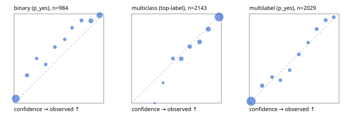

# Evaluation report

- model `Qwen/Qwen3-Reranker-4B` @ `22e683669b` (shared-prefix tree (tree-v1)), adapter/checkpoint `runs/tree_4b_ova_kd/adapter`, prompt `tree-v1` (bc025ae9f6bc)
- data data/ova/hf.jsonl, data/ova/eval.jsonl; splits ['test']; n=3471; calibration `None`
- cuda / bfloat16; 2026-09-24T13:10:19+0000; wall 264.3s

## Overall

question accuracy 82.5%

**binary**: n 984, positives 475, accuracy 0.881, precision 0.932, recall 0.813, f1 0.868, auroc 0.959, brier 0.088, log_loss 0.291, ece 0.072

**multiclass**: n 2143, accuracy 0.838, macro_f1 0.886, log_loss 0.456, brier 0.233, ece_top_label 0.024

**multilabel**: n 344, labels 2029, exact_match 0.584, micro_f1 0.770, macro_f1 0.808, label_auroc 0.948, brier 0.071, log_loss 0.234, ece 0.020

## By family

| family | n | question acc % | details |
|---|---|---|---|
| eval_adversarial | 27 | 96.3 | bin acc 100.0 F1 100.0 AUROC 1.000 ECE 0.062; mc acc 100.0 mF1 100.0 ECE 0.011; ml EM 80.0 µF1 94.7 ECE 0.093 |
| eval_agent_output | 26 | 65.4 | bin acc 92.9 F1 93.3 AUROC 0.939 ECE 0.123; mc acc 42.9 mF1 21.4 ECE 0.421; ml EM 20.0 µF1 75.0 ECE 0.176 |
| eval_evidence | 17 | 94.1 | bin acc 100.0 F1 100.0 AUROC 1.000 ECE 0.027; ml EM 50.0 µF1 66.7 ECE 0.165 |
| eval_multilabel | 32 | 93.8 | bin acc 100.0 F1 100.0 AUROC 1.000 ECE 0.040; mc acc 100.0 mF1 100.0 ECE 0.262; ml EM 91.7 µF1 97.0 ECE 0.050 |
| eval_policy | 22 | 63.6 | bin acc 69.2 F1 66.7 AUROC 0.738 ECE 0.219; mc acc 40.0 mF1 25.0 ECE 0.515; ml EM 75.0 µF1 94.1 ECE 0.111 |
| eval_routing | 25 | 92.0 | bin acc 90.0 F1 88.9 AUROC 0.917 ECE 0.140; mc acc 100.0 mF1 100.0 ECE 0.128; ml EM 50.0 µF1 80.0 ECE 0.149 |
| eval_urgency_sentiment | 22 | 86.4 | bin acc 80.0 F1 83.3 AUROC 0.958 ECE 0.172; mc acc 90.0 mF1 75.0 ECE 0.117; ml EM 100.0 µF1 100.0 ECE 0.041 |
| heldout_boolq | 300 | 82.3 | bin acc 82.3 F1 83.9 AUROC 0.928 ECE 0.113 |
| heldout_emotion_multiclass | 300 | 57.7 | mc acc 57.7 mF1 44.3 ECE 0.192 |
| heldout_intent_clinc | 300 | 90.3 | mc acc 90.3 mF1 92.4 ECE 0.051 |
| heldout_question_type_trec | 300 | 86.3 | mc acc 86.3 mF1 86.0 ECE 0.065 |
| heldout_sentiment_sst2 | 300 | 86.7 | bin acc 86.7 F1 84.8 AUROC 0.966 ECE 0.126 |
| heldout_topic_dbpedia | 300 | 97.0 | mc acc 97.0 mF1 96.7 ECE 0.015 |
| hf_emotions_multilabel | 300 | 55.7 | ml EM 55.7 µF1 72.8 ECE 0.019 |
| hf_intent_banking77 | 300 | 95.3 | mc acc 95.3 mF1 95.0 ECE 0.022 |
| hf_nli | 300 | 94.7 | bin acc 94.7 F1 92.7 AUROC 0.983 ECE 0.029 |
| hf_sentiment_tweets | 300 | 71.0 | mc acc 71.0 mF1 71.2 ECE 0.069 |
| hf_topic_agnews | 300 | 89.0 | mc acc 89.0 mF1 89.1 ECE 0.036 |

## by hard case

| slice | n | question acc % |
|---|---|---|
| (none) | 3042 | 82.3 |
| contradiction | 107 | 100.0 |
| distractor | 33 | 78.8 |
| double_negation | 6 | 100.0 |
| evidence_end | 13 | 92.3 |
| evidence_middle | 11 | 81.8 |
| evidence_start | 9 | 100.0 |
| exception | 7 | 57.1 |
| hypothetical | 7 | 100.0 |
| injection | 10 | 90.0 |
| lexical_overlap | 20 | 95.0 |
| long_state | 50 | 84.0 |
| missing_evidence | 104 | 90.4 |
| multi_positive | 81 | 44.4 |
| multi_turn | 9 | 88.9 |
| negation | 30 | 90.0 |
| new_label_names | 3 | 100.0 |
| nota | 46 | 97.8 |
| numeric_reasoning | 16 | 68.8 |
| paraphrase | 22 | 100.0 |
| role_reversal | 15 | 86.7 |
| sarcasm | 12 | 100.0 |
| temporal_reasoning | 29 | 55.2 |
| zero_positive | 6 | 66.7 |

## by state tokens

| slice | n | question acc % |
|---|---|---|
| 00000-00127 | 3211 | 82.4 |
| 00128-00511 | 208 | 83.7 |
| 00512-02047 | 52 | 84.6 |

## by candidates

| slice | n | question acc % |
|---|---|---|
| 01 | 984 | 88.1 |
| 03 | 310 | 71.6 |
| 04 | 333 | 87.1 |
| 05 | 22 | 81.8 |
| 06 | 1218 | 74.4 |
| 07 | 49 | 98.0 |
| 08 | 555 | 92.3 |

## Paraphrase groups

11 groups; same prediction 81.8%; all correct 100.0%

## Multiclass abstention (coverage vs error on accepted)

| abstain_below | coverage % | error % |
|---|---|---|
| 0.0 | 100.0 | 16.2 |
| 0.4 | 98.9 | 15.6 |
| 0.5 | 95.1 | 14.2 |
| 0.6 | 87.6 | 11.1 |
| 0.7 | 80.6 | 8.9 |
| 0.8 | 70.9 | 5.8 |
| 0.9 | 58.9 | 3.5 |

## Reliability: binary

| bin | n | mean confidence | observed frequency |
|---|---|---|---|
| [0.0,0.1) | 416 | 0.020 | 0.050 |
| [0.1,0.2) | 61 | 0.145 | 0.311 |
| [0.2,0.3) | 28 | 0.253 | 0.500 |
| [0.3,0.4) | 30 | 0.353 | 0.433 |
| [0.4,0.5) | 35 | 0.456 | 0.629 |
| [0.5,0.6) | 28 | 0.566 | 0.714 |
| [0.6,0.7) | 32 | 0.648 | 0.844 |
| [0.7,0.8) | 54 | 0.753 | 0.926 |
| [0.8,0.9) | 102 | 0.857 | 0.922 |
| [0.9,1.0] | 198 | 0.954 | 0.985 |

## Reliability: multiclass

| bin | n | mean confidence | observed frequency |
|---|---|---|---|
| [0.2,0.3) | 1 | 0.256 | 0.000 |
| [0.3,0.4) | 22 | 0.352 | 0.227 |
| [0.4,0.5) | 82 | 0.460 | 0.500 |
| [0.5,0.6) | 161 | 0.553 | 0.497 |
| [0.6,0.7) | 150 | 0.647 | 0.633 |
| [0.7,0.8) | 207 | 0.757 | 0.686 |
| [0.8,0.9) | 257 | 0.854 | 0.829 |
| [0.9,1.0] | 1263 | 0.974 | 0.965 |

## Reliability: multilabel

| bin | n | mean confidence | observed frequency |
|---|---|---|---|
| [0.0,0.1) | 1288 | 0.020 | 0.021 |
| [0.1,0.2) | 128 | 0.143 | 0.195 |
| [0.2,0.3) | 72 | 0.254 | 0.292 |
| [0.3,0.4) | 74 | 0.346 | 0.257 |
| [0.4,0.5) | 65 | 0.450 | 0.369 |
| [0.5,0.6) | 77 | 0.552 | 0.545 |
| [0.6,0.7) | 56 | 0.656 | 0.679 |
| [0.7,0.8) | 88 | 0.751 | 0.830 |
| [0.8,0.9) | 99 | 0.851 | 0.929 |
| [0.9,1.0] | 82 | 0.940 | 0.963 |
