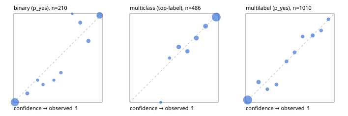

# Evaluation report

- model `Qwen/Qwen3-Reranker-4B` @ `22e683669b` (shared-prefix tree (tree-v1)), adapter/checkpoint `runs/tree_4b_ova_kd/adapter`, prompt `tree-v1` (bc025ae9f6bc)
- data data/ova/hf.jsonl, data/ova/eval.jsonl; splits ['validation']; n=868; calibration `None`
- cuda / bfloat16; 2026-09-24T13:05:46+0000; wall 67.9s

## Overall

question accuracy 81.1%

**binary**: n 210, positives 79, accuracy 0.933, precision 0.882, recall 0.949, f1 0.915, auroc 0.983, brier 0.050, log_loss 0.166, ece 0.042

**multiclass**: n 486, accuracy 0.852, macro_f1 0.849, log_loss 0.403, brier 0.214, ece_top_label 0.028

**multilabel**: n 172, labels 1010, exact_match 0.547, micro_f1 0.729, macro_f1 0.646, label_auroc 0.930, brier 0.083, log_loss 0.269, ece 0.023

## By family

| family | n | question acc % | details |
|---|---|---|---|
| eval_adversarial | 14 | 100.0 | bin acc 100.0 F1 100.0 AUROC 1.000 ECE 0.093; mc acc 100.0 mF1 100.0 ECE 0.019; ml EM 100.0 µF1 100.0 ECE 0.017 |
| eval_agent_output | 20 | 70.0 | bin acc 83.3 F1 85.7 AUROC 0.861 ECE 0.134; mc acc 60.0 mF1 33.3 ECE 0.306; ml EM 33.3 µF1 0.0 ECE 0.304 |
| eval_evidence | 17 | 100.0 | bin acc 100.0 F1 100.0 AUROC 1.000 ECE 0.021; ml EM 100.0 µF1 100.0 ECE 0.060 |
| eval_multilabel | 12 | 66.7 | bin acc 0.0 F1 0.0 AUROC — ECE 0.868; mc acc 100.0 mF1 100.0 ECE 0.025; ml EM 66.7 µF1 93.3 ECE 0.105 |
| eval_policy | 24 | 70.8 | bin acc 75.0 F1 76.9 AUROC 0.886 ECE 0.260; mc acc 72.7 mF1 57.1 ECE 0.262; ml EM 0.0 µF1 50.0 ECE 0.537 |
| eval_routing | 16 | 93.8 | bin acc 100.0 F1 100.0 AUROC 1.000 ECE 0.103; mc acc 100.0 mF1 100.0 ECE 0.049; ml EM 0.0 µF1 0.0 ECE 0.303 |
| eval_urgency_sentiment | 15 | 100.0 | bin acc 100.0 F1 100.0 AUROC 1.000 ECE 0.062; mc acc 100.0 mF1 100.0 ECE 0.033; ml EM 100.0 µF1 100.0 ECE 0.025 |
| hf_emotions_multilabel | 150 | 52.7 | ml EM 52.7 µF1 70.3 ECE 0.025 |
| hf_intent_banking77 | 150 | 94.7 | mc acc 94.7 mF1 92.9 ECE 0.034 |
| hf_nli | 150 | 94.7 | bin acc 94.7 F1 91.8 AUROC 0.992 ECE 0.061 |
| hf_sentiment_tweets | 150 | 72.7 | mc acc 72.7 mF1 68.5 ECE 0.061 |
| hf_topic_agnews | 150 | 88.0 | mc acc 88.0 mF1 88.2 ECE 0.067 |

## by hard case

| slice | n | question acc % |
|---|---|---|
| (none) | 634 | 80.9 |
| contradiction | 63 | 95.2 |
| distractor | 20 | 85.0 |
| double_negation | 3 | 100.0 |
| evidence_end | 4 | 75.0 |
| evidence_middle | 7 | 85.7 |
| evidence_start | 3 | 66.7 |
| exception | 7 | 100.0 |
| hypothetical | 6 | 100.0 |
| injection | 16 | 81.2 |
| lexical_overlap | 13 | 100.0 |
| long_state | 26 | 76.9 |
| missing_evidence | 59 | 91.5 |
| multi_positive | 40 | 35.0 |
| multi_turn | 21 | 81.0 |
| negation | 9 | 77.8 |
| new_label_names | 5 | 80.0 |
| nota | 4 | 100.0 |
| numeric_reasoning | 13 | 92.3 |
| paraphrase | 10 | 80.0 |
| role_reversal | 7 | 71.4 |
| sarcasm | 5 | 80.0 |
| temporal_reasoning | 15 | 60.0 |
| zero_positive | 7 | 57.1 |

## by state tokens

| slice | n | question acc % |
|---|---|---|
| 00000-00127 | 796 | 80.9 |
| 00128-00511 | 46 | 87.0 |
| 00512-02047 | 26 | 76.9 |

## by candidates

| slice | n | question acc % |
|---|---|---|
| 01 | 210 | 93.3 |
| 03 | 162 | 74.1 |
| 04 | 174 | 87.4 |
| 05 | 13 | 61.5 |
| 06 | 159 | 54.1 |
| 08 | 150 | 94.7 |

## Paraphrase groups

5 groups; same prediction 60.0%; all correct 80.0%

## Multiclass abstention (coverage vs error on accepted)

| abstain_below | coverage % | error % |
|---|---|---|
| 0.0 | 100.0 | 14.8 |
| 0.4 | 98.8 | 13.8 |
| 0.5 | 96.7 | 13.0 |
| 0.6 | 88.5 | 10.7 |
| 0.7 | 81.7 | 8.1 |
| 0.8 | 71.2 | 5.2 |
| 0.9 | 60.9 | 3.7 |

## Reliability: binary

| bin | n | mean confidence | observed frequency |
|---|---|---|---|
| [0.0,0.1) | 102 | 0.012 | 0.000 |
| [0.1,0.2) | 10 | 0.153 | 0.100 |
| [0.2,0.3) | 4 | 0.270 | 0.250 |
| [0.3,0.4) | 5 | 0.331 | 0.200 |
| [0.4,0.5) | 4 | 0.454 | 0.250 |
| [0.5,0.6) | 6 | 0.533 | 0.333 |
| [0.6,0.7) | 1 | 0.661 | 1.000 |
| [0.7,0.8) | 10 | 0.751 | 0.900 |
| [0.8,0.9) | 13 | 0.844 | 0.692 |
| [0.9,1.0] | 55 | 0.971 | 0.982 |

## Reliability: multiclass

| bin | n | mean confidence | observed frequency |
|---|---|---|---|
| [0.3,0.4) | 6 | 0.350 | 0.000 |
| [0.4,0.5) | 10 | 0.449 | 0.500 |
| [0.5,0.6) | 40 | 0.553 | 0.625 |
| [0.6,0.7) | 33 | 0.651 | 0.576 |
| [0.7,0.8) | 51 | 0.753 | 0.725 |
| [0.8,0.9) | 50 | 0.857 | 0.860 |
| [0.9,1.0] | 296 | 0.977 | 0.963 |

## Reliability: multilabel

| bin | n | mean confidence | observed frequency |
|---|---|---|---|
| [0.0,0.1) | 627 | 0.021 | 0.026 |
| [0.1,0.2) | 70 | 0.144 | 0.229 |
| [0.2,0.3) | 34 | 0.244 | 0.147 |
| [0.3,0.4) | 40 | 0.347 | 0.200 |
| [0.4,0.5) | 39 | 0.461 | 0.462 |
| [0.5,0.6) | 39 | 0.551 | 0.564 |
| [0.6,0.7) | 35 | 0.643 | 0.743 |
| [0.7,0.8) | 57 | 0.756 | 0.754 |
| [0.8,0.9) | 37 | 0.852 | 0.811 |
| [0.9,1.0] | 32 | 0.935 | 0.938 |
