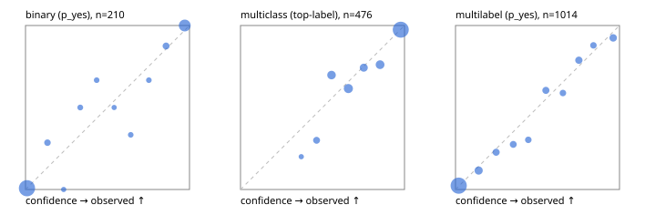

# Evaluation report

- model `Qwen/Qwen3-Reranker-4B` @ `22e683669b` (shared-prefix tree (tree-v1)), adapter/checkpoint `runs/tree_4b_r2/adapter`, prompt `tree-v1` (bc025ae9f6bc)
- data data/hf.jsonl, data/eval.jsonl; splits ['calibration']; n=859; calibration `None`
- cuda / bfloat16; 2026-09-24T03:13:53+0000; wall 21.8s

## Overall

question accuracy 80.2%

**binary**: n 210, positives 71, accuracy 0.943, precision 0.928, recall 0.901, f1 0.914, auroc 0.991, brier 0.037, log_loss 0.120, ece 0.028

**multiclass**: n 476, accuracy 0.836, macro_f1 0.867, log_loss 0.390, brier 0.228, ece_top_label 0.037

**multilabel**: n 173, labels 1014, exact_match 0.538, micro_f1 0.760, macro_f1 0.668, label_auroc 0.930, brier 0.079, log_loss 0.265, ece 0.022

## By family

| family | n | question acc % | details |
|---|---|---|---|
| eval_adversarial | 19 | 100.0 | bin acc 100.0 F1 100.0 AUROC 1.000 ECE 0.026; mc acc 100.0 mF1 100.0 ECE 0.017; ml EM 100.0 µF1 100.0 ECE 0.003 |
| eval_agent_output | 9 | 77.8 | bin acc 100.0 F1 100.0 AUROC 1.000 ECE 0.054; mc acc 50.0 mF1 33.3 ECE 0.255; ml EM 50.0 µF1 40.0 ECE 0.261 |
| eval_evidence | 19 | 89.5 | bin acc 93.8 F1 90.9 AUROC 1.000 ECE 0.054; ml EM 66.7 µF1 92.3 ECE 0.103 |
| eval_multilabel | 12 | 75.0 | bin acc 100.0 F1 100.0 AUROC — ECE 0.035; mc acc 100.0 mF1 100.0 ECE 0.079; ml EM 62.5 µF1 82.8 ECE 0.101 |
| eval_policy | 16 | 93.8 | bin acc 100.0 F1 100.0 AUROC 1.000 ECE 0.093; mc acc 75.0 mF1 66.7 ECE 0.518; ml EM 100.0 µF1 100.0 ECE 0.083 |
| eval_routing | 15 | 86.7 | bin acc 85.7 F1 80.0 AUROC 1.000 ECE 0.106; mc acc 85.7 mF1 71.4 ECE 0.098; ml EM 100.0 µF1 100.0 ECE 0.029 |
| eval_urgency_sentiment | 19 | 89.5 | bin acc 87.5 F1 80.0 AUROC 1.000 ECE 0.112; mc acc 87.5 mF1 83.3 ECE 0.037; ml EM 100.0 µF1 100.0 ECE 0.017 |
| hf_emotions_multilabel | 150 | 50.0 | ml EM 50.0 µF1 73.7 ECE 0.024 |
| hf_intent_banking77 | 150 | 94.0 | mc acc 94.0 mF1 89.9 ECE 0.036 |
| hf_nli | 150 | 94.0 | bin acc 94.0 F1 89.9 AUROC 0.990 ECE 0.034 |
| hf_sentiment_tweets | 150 | 70.0 | mc acc 70.0 mF1 67.2 ECE 0.130 |
| hf_topic_agnews | 150 | 86.7 | mc acc 86.7 mF1 86.9 ECE 0.040 |

## by hard case

| slice | n | question acc % |
|---|---|---|
| (none) | 624 | 78.7 |
| contradiction | 58 | 100.0 |
| distractor | 25 | 84.0 |
| double_negation | 3 | 100.0 |
| evidence_end | 11 | 72.7 |
| evidence_middle | 6 | 100.0 |
| evidence_start | 7 | 85.7 |
| exception | 4 | 75.0 |
| hypothetical | 7 | 71.4 |
| injection | 6 | 100.0 |
| lexical_overlap | 16 | 93.8 |
| long_state | 42 | 81.0 |
| missing_evidence | 62 | 93.5 |
| multi_positive | 42 | 40.5 |
| multi_turn | 12 | 83.3 |
| negation | 12 | 91.7 |
| new_label_names | 5 | 80.0 |
| nota | 4 | 100.0 |
| numeric_reasoning | 15 | 80.0 |
| paraphrase | 10 | 90.0 |
| role_reversal | 13 | 92.3 |
| sarcasm | 1 | 0.0 |
| temporal_reasoning | 14 | 92.9 |
| zero_positive | 4 | 75.0 |

## by state tokens

| slice | n | question acc % |
|---|---|---|
| 00000-00127 | 780 | 79.4 |
| 00128-00511 | 37 | 97.3 |
| 00512-02047 | 42 | 81.0 |

## by candidates

| slice | n | question acc % |
|---|---|---|
| 01 | 210 | 94.3 |
| 03 | 158 | 70.9 |
| 04 | 168 | 86.3 |
| 05 | 15 | 86.7 |
| 06 | 157 | 50.3 |
| 07 | 1 | 100.0 |
| 08 | 150 | 94.0 |

## Paraphrase groups

5 groups; same prediction 80.0%; all correct 80.0%

## Multiclass abstention (coverage vs error on accepted)

| abstain_below | coverage % | error % |
|---|---|---|
| 0.0 | 100.0 | 16.4 |
| 0.4 | 98.9 | 15.7 |
| 0.5 | 94.7 | 13.3 |
| 0.6 | 85.7 | 11.5 |
| 0.7 | 74.8 | 7.6 |
| 0.8 | 67.4 | 5.6 |
| 0.9 | 57.8 | 2.5 |

## Reliability: binary

| bin | n | mean confidence | observed frequency |
|---|---|---|---|
| [0.0,0.1) | 125 | 0.009 | 0.008 |
| [0.1,0.2) | 7 | 0.134 | 0.286 |
| [0.2,0.3) | 2 | 0.233 | 0.000 |
| [0.3,0.4) | 4 | 0.334 | 0.500 |
| [0.4,0.5) | 3 | 0.434 | 0.667 |
| [0.5,0.6) | 2 | 0.541 | 0.500 |
| [0.6,0.7) | 3 | 0.642 | 0.333 |
| [0.7,0.8) | 3 | 0.752 | 0.667 |
| [0.8,0.9) | 8 | 0.857 | 0.875 |
| [0.9,1.0] | 53 | 0.971 | 1.000 |

## Reliability: multiclass

| bin | n | mean confidence | observed frequency |
|---|---|---|---|
| [0.3,0.4) | 5 | 0.371 | 0.200 |
| [0.4,0.5) | 20 | 0.464 | 0.300 |
| [0.5,0.6) | 43 | 0.555 | 0.698 |
| [0.6,0.7) | 52 | 0.658 | 0.615 |
| [0.7,0.8) | 35 | 0.752 | 0.743 |
| [0.8,0.9) | 46 | 0.851 | 0.761 |
| [0.9,1.0] | 275 | 0.977 | 0.975 |

## Reliability: multilabel

| bin | n | mean confidence | observed frequency |
|---|---|---|---|
| [0.0,0.1) | 604 | 0.019 | 0.023 |
| [0.1,0.2) | 78 | 0.141 | 0.115 |
| [0.2,0.3) | 44 | 0.248 | 0.227 |
| [0.3,0.4) | 40 | 0.352 | 0.275 |
| [0.4,0.5) | 33 | 0.444 | 0.303 |
| [0.5,0.6) | 43 | 0.551 | 0.605 |
| [0.6,0.7) | 34 | 0.655 | 0.588 |
| [0.7,0.8) | 52 | 0.752 | 0.788 |
| [0.8,0.9) | 33 | 0.841 | 0.879 |
| [0.9,1.0] | 53 | 0.962 | 0.925 |
