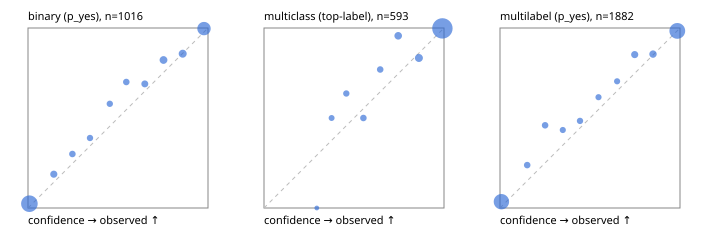

# Evaluation report

- model `Qwen/Qwen3-Reranker-4B` @ `22e683669b` (shared-prefix tree (tree-v1)), adapter/checkpoint `runs/tree_4b_r2/adapter`, prompt `tree-v1` (bc025ae9f6bc)
- data data/eval2.jsonl; splits ['test']; n=1991; calibration `None`
- mps / bfloat16; 2026-09-23T23:22:03-0700; wall 1358.1s

## Overall

question accuracy 90.4%

**binary**: n 1016, positives 435, accuracy 0.928, precision 0.927, recall 0.903, f1 0.915, auroc 0.980, brier 0.054, log_loss 0.186, ece 0.026

**multiclass**: n 593, accuracy 0.958, macro_f1 0.920, log_loss 0.139, brier 0.070, ece_top_label 0.025

**multilabel**: n 382, labels 1882, exact_match 0.754, micro_f1 0.935, macro_f1 0.884, label_auroc 0.983, brier 0.053, log_loss 0.184, ece 0.025

## By family

| family | n | question acc % | details |
|---|---|---|---|
| e2_hard | 673 | 89.3 | bin acc 91.7 F1 88.4 AUROC 0.975 ECE 0.029; mc acc 95.3 mF1 90.9 ECE 0.048; ml EM 74.2 µF1 92.4 ECE 0.022 |
| e2_simple | 664 | 94.6 | bin acc 96.2 F1 96.5 AUROC 0.990 ECE 0.026; mc acc 98.5 mF1 96.8 ECE 0.017; ml EM 83.3 µF1 96.4 ECE 0.035 |
| e2_very_hard | 654 | 87.2 | bin acc 90.4 F1 87.0 AUROC 0.968 ECE 0.052; mc acc 93.5 mF1 88.6 ECE 0.044; ml EM 69.2 µF1 91.7 ECE 0.040 |

## by hard case

| slice | n | question acc % |
|---|---|---|
| (none) | 569 | 96.5 |
| contradiction | 172 | 93.6 |
| distractor | 474 | 88.2 |
| double_negation | 126 | 87.3 |
| evidence_end | 57 | 93.0 |
| evidence_middle | 114 | 93.9 |
| evidence_start | 17 | 88.2 |
| exception | 213 | 85.9 |
| hypothetical | 128 | 92.2 |
| injection | 151 | 85.4 |
| lexical_overlap | 201 | 93.5 |
| long_state | 191 | 89.5 |
| missing_evidence | 141 | 96.5 |
| multi_positive | 322 | 75.2 |
| multi_turn | 149 | 92.6 |
| negation | 257 | 91.8 |
| nota | 118 | 91.5 |
| numeric_reasoning | 224 | 79.0 |
| paraphrase | 218 | 85.8 |
| role_reversal | 187 | 90.9 |
| sarcasm | 149 | 81.9 |
| temporal_reasoning | 203 | 79.8 |
| zero_positive | 73 | 87.7 |
| zero_positive_distractor | 1 | 100.0 |

## by state tokens

| slice | n | question acc % |
|---|---|---|
| 00000-00127 | 662 | 89.1 |
| 00128-00511 | 477 | 87.2 |
| 00512-02047 | 484 | 93.8 |
| 02048-08191 | 329 | 91.8 |
| 08192+ | 39 | 94.9 |

## by candidates

| slice | n | question acc % |
|---|---|---|
| 01 | 1016 | 92.8 |
| 03 | 128 | 93.0 |
| 04 | 515 | 93.4 |
| 05 | 224 | 77.2 |
| 06 | 86 | 75.6 |
| 07 | 18 | 83.3 |
| 08 | 4 | 75.0 |

## Paraphrase groups

76 groups; same prediction 69.7%; all correct 76.3%

## Multiclass abstention (coverage vs error on accepted)

| abstain_below | coverage % | error % |
|---|---|---|
| 0.0 | 100.0 | 4.2 |
| 0.4 | 98.5 | 3.4 |
| 0.5 | 96.6 | 2.8 |
| 0.6 | 94.6 | 1.8 |
| 0.7 | 92.4 | 1.3 |
| 0.8 | 88.5 | 1.1 |
| 0.9 | 83.5 | 0.2 |

## Reliability: binary

| bin | n | mean confidence | observed frequency |
|---|---|---|---|
| [0.0,0.1) | 503 | 0.008 | 0.024 |
| [0.1,0.2) | 32 | 0.144 | 0.188 |
| [0.2,0.3) | 20 | 0.246 | 0.300 |
| [0.3,0.4) | 18 | 0.345 | 0.389 |
| [0.4,0.5) | 19 | 0.454 | 0.579 |
| [0.5,0.6) | 20 | 0.546 | 0.700 |
| [0.6,0.7) | 29 | 0.649 | 0.690 |
| [0.7,0.8) | 45 | 0.753 | 0.822 |
| [0.8,0.9) | 49 | 0.859 | 0.857 |
| [0.9,1.0] | 281 | 0.978 | 0.996 |

## Reliability: multiclass

| bin | n | mean confidence | observed frequency |
|---|---|---|---|
| [0.2,0.3) | 1 | 0.293 | 0.000 |
| [0.3,0.4) | 8 | 0.376 | 0.500 |
| [0.4,0.5) | 11 | 0.457 | 0.636 |
| [0.5,0.6) | 12 | 0.552 | 0.500 |
| [0.6,0.7) | 13 | 0.646 | 0.769 |
| [0.7,0.8) | 23 | 0.745 | 0.957 |
| [0.8,0.9) | 30 | 0.861 | 0.833 |
| [0.9,1.0] | 495 | 0.991 | 0.998 |

## Reliability: multilabel

| bin | n | mean confidence | observed frequency |
|---|---|---|---|
| [0.0,0.1) | 748 | 0.008 | 0.035 |
| [0.1,0.2) | 42 | 0.151 | 0.238 |
| [0.2,0.3) | 37 | 0.251 | 0.459 |
| [0.3,0.4) | 30 | 0.349 | 0.433 |
| [0.4,0.5) | 31 | 0.444 | 0.484 |
| [0.5,0.6) | 26 | 0.547 | 0.615 |
| [0.6,0.7) | 27 | 0.651 | 0.704 |
| [0.7,0.8) | 61 | 0.748 | 0.852 |
| [0.8,0.9) | 69 | 0.850 | 0.855 |
| [0.9,1.0] | 811 | 0.985 | 0.984 |
