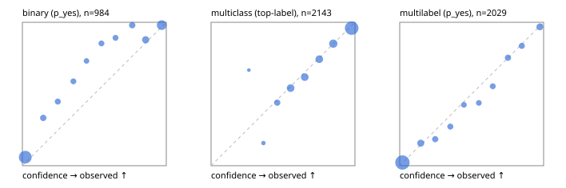

# Evaluation report

- model `Qwen/Qwen3-Reranker-4B` @ `22e683669b` (shared-prefix tree (tree-v1)), adapter/checkpoint `runs/tree_4b_r2/adapter`, prompt `tree-v1` (bc025ae9f6bc)
- data data/hf.jsonl, data/eval.jsonl; splits ['test']; n=3471; calibration `None`
- cuda / bfloat16; 2026-09-24T03:15:22+0000; wall 82.3s

## Overall

question accuracy 80.6%

**binary**: n 984, positives 475, accuracy 0.876, precision 0.942, recall 0.792, f1 0.860, auroc 0.956, brier 0.095, log_loss 0.313, ece 0.086

**multiclass**: n 2143, accuracy 0.822, macro_f1 0.832, log_loss 0.501, brier 0.256, ece_top_label 0.018

**multilabel**: n 344, labels 2029, exact_match 0.509, micro_f1 0.745, macro_f1 0.790, label_auroc 0.941, brier 0.077, log_loss 0.248, ece 0.017

## By family

| family | n | question acc % | details |
|---|---|---|---|
| eval_adversarial | 27 | 92.6 | bin acc 86.7 F1 83.3 AUROC 0.981 ECE 0.095; mc acc 100.0 mF1 100.0 ECE 0.005; ml EM 100.0 µF1 100.0 ECE 0.037 |
| eval_agent_output | 26 | 57.7 | bin acc 85.7 F1 85.7 AUROC 0.816 ECE 0.114; mc acc 14.3 mF1 6.2 ECE 0.621; ml EM 40.0 µF1 80.0 ECE 0.085 |
| eval_evidence | 17 | 94.1 | bin acc 100.0 F1 100.0 AUROC 1.000 ECE 0.035; ml EM 50.0 µF1 66.7 ECE 0.186 |
| eval_multilabel | 32 | 87.5 | bin acc 100.0 F1 100.0 AUROC 1.000 ECE 0.019; mc acc 100.0 mF1 100.0 ECE 0.236; ml EM 83.3 µF1 95.0 ECE 0.041 |
| eval_policy | 22 | 59.1 | bin acc 69.2 F1 60.0 AUROC 0.786 ECE 0.345; mc acc 20.0 mF1 11.1 ECE 0.481; ml EM 75.0 µF1 94.1 ECE 0.130 |
| eval_routing | 25 | 92.0 | bin acc 90.0 F1 88.9 AUROC 1.000 ECE 0.097; mc acc 100.0 mF1 100.0 ECE 0.111; ml EM 50.0 µF1 80.0 ECE 0.103 |
| eval_urgency_sentiment | 22 | 90.9 | bin acc 80.0 F1 83.3 AUROC 0.958 ECE 0.104; mc acc 100.0 mF1 100.0 ECE 0.092; ml EM 100.0 µF1 100.0 ECE 0.007 |
| heldout_boolq | 300 | 84.0 | bin acc 84.0 F1 85.4 AUROC 0.931 ECE 0.129 |
| heldout_emotion_multiclass | 300 | 55.0 | mc acc 55.0 mF1 42.0 ECE 0.198 |
| heldout_intent_clinc | 300 | 83.3 | mc acc 83.3 mF1 83.7 ECE 0.033 |
| heldout_question_type_trec | 300 | 88.0 | mc acc 88.0 mF1 87.2 ECE 0.124 |
| heldout_sentiment_sst2 | 300 | 84.3 | bin acc 84.3 F1 81.6 AUROC 0.971 ECE 0.156 |
| heldout_topic_dbpedia | 300 | 95.7 | mc acc 95.7 mF1 95.3 ECE 0.022 |
| hf_emotions_multilabel | 300 | 47.0 | ml EM 47.0 µF1 69.9 ECE 0.014 |
| hf_intent_banking77 | 300 | 95.3 | mc acc 95.3 mF1 94.4 ECE 0.016 |
| hf_nli | 300 | 94.7 | bin acc 94.7 F1 92.7 AUROC 0.984 ECE 0.025 |
| hf_sentiment_tweets | 300 | 69.7 | mc acc 69.7 mF1 69.5 ECE 0.057 |
| hf_topic_agnews | 300 | 89.0 | mc acc 89.0 mF1 89.1 ECE 0.041 |

## by hard case

| slice | n | question acc % |
|---|---|---|
| (none) | 3042 | 80.2 |
| contradiction | 107 | 100.0 |
| distractor | 33 | 78.8 |
| double_negation | 6 | 100.0 |
| evidence_end | 13 | 92.3 |
| evidence_middle | 11 | 81.8 |
| evidence_start | 9 | 88.9 |
| exception | 7 | 57.1 |
| hypothetical | 7 | 85.7 |
| injection | 10 | 90.0 |
| lexical_overlap | 20 | 85.0 |
| long_state | 50 | 82.0 |
| missing_evidence | 104 | 91.3 |
| multi_positive | 81 | 44.4 |
| multi_turn | 9 | 77.8 |
| negation | 30 | 86.7 |
| new_label_names | 3 | 33.3 |
| nota | 46 | 97.8 |
| numeric_reasoning | 16 | 68.8 |
| paraphrase | 22 | 90.9 |
| role_reversal | 15 | 86.7 |
| sarcasm | 12 | 100.0 |
| temporal_reasoning | 29 | 58.6 |
| zero_positive | 6 | 100.0 |

## by state tokens

| slice | n | question acc % |
|---|---|---|
| 00000-00127 | 3211 | 80.4 |
| 00128-00511 | 208 | 83.7 |
| 00512-02047 | 52 | 82.7 |

## by candidates

| slice | n | question acc % |
|---|---|---|
| 01 | 984 | 87.6 |
| 03 | 310 | 70.3 |
| 04 | 333 | 87.7 |
| 05 | 22 | 68.2 |
| 06 | 1218 | 71.5 |
| 07 | 49 | 100.0 |
| 08 | 555 | 88.5 |

## Paraphrase groups

11 groups; same prediction 81.8%; all correct 90.9%

## Multiclass abstention (coverage vs error on accepted)

| abstain_below | coverage % | error % |
|---|---|---|
| 0.0 | 100.0 | 17.8 |
| 0.4 | 99.0 | 17.2 |
| 0.5 | 94.7 | 15.5 |
| 0.6 | 85.1 | 12.0 |
| 0.7 | 75.5 | 8.7 |
| 0.8 | 65.7 | 6.2 |
| 0.9 | 52.9 | 4.1 |

## Reliability: binary

| bin | n | mean confidence | observed frequency |
|---|---|---|---|
| [0.0,0.1) | 436 | 0.020 | 0.060 |
| [0.1,0.2) | 51 | 0.145 | 0.333 |
| [0.2,0.3) | 38 | 0.246 | 0.447 |
| [0.3,0.4) | 34 | 0.354 | 0.588 |
| [0.4,0.5) | 26 | 0.445 | 0.731 |
| [0.5,0.6) | 34 | 0.550 | 0.853 |
| [0.6,0.7) | 37 | 0.647 | 0.892 |
| [0.7,0.8) | 50 | 0.763 | 0.980 |
| [0.8,0.9) | 74 | 0.857 | 0.878 |
| [0.9,1.0] | 204 | 0.968 | 0.980 |

## Reliability: multiclass

| bin | n | mean confidence | observed frequency |
|---|---|---|---|
| [0.2,0.3) | 3 | 0.263 | 0.667 |
| [0.3,0.4) | 19 | 0.364 | 0.158 |
| [0.4,0.5) | 91 | 0.460 | 0.440 |
| [0.5,0.6) | 207 | 0.553 | 0.541 |
| [0.6,0.7) | 204 | 0.651 | 0.618 |
| [0.7,0.8) | 210 | 0.752 | 0.743 |
| [0.8,0.9) | 275 | 0.849 | 0.851 |
| [0.9,1.0] | 1134 | 0.977 | 0.959 |

## Reliability: multilabel

| bin | n | mean confidence | observed frequency |
|---|---|---|---|
| [0.0,0.1) | 1221 | 0.019 | 0.022 |
| [0.1,0.2) | 140 | 0.146 | 0.157 |
| [0.2,0.3) | 92 | 0.247 | 0.185 |
| [0.3,0.4) | 77 | 0.352 | 0.273 |
| [0.4,0.5) | 66 | 0.446 | 0.424 |
| [0.5,0.6) | 64 | 0.550 | 0.438 |
| [0.6,0.7) | 74 | 0.646 | 0.554 |
| [0.7,0.8) | 89 | 0.752 | 0.753 |
| [0.8,0.9) | 79 | 0.848 | 0.835 |
| [0.9,1.0] | 127 | 0.974 | 0.969 |
