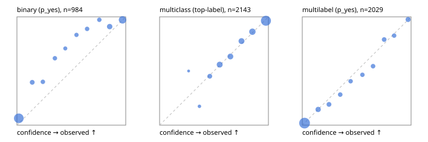

# Evaluation report

- model `Qwen/Qwen3-Reranker-4B` @ `22e683669b` (shared-prefix tree (tree-v1)), adapter/checkpoint `runs/tree_4b_r2/adapter`, prompt `tree-v1` (bc025ae9f6bc)
- data data/hf.jsonl, data/eval.jsonl; splits ['test']; n=3471; calibration `{'method': 'temperature scaling per output type, grid search on NLL', 'min_n': 30, 'model': 'Qwen/Qwen3-Reranker-4B', 'revision': '22e683669bc0f0bd69640a1354a6d0aebcfeede5', 'adapter': 'runs/tree_4b_r2/adapter', 'adapter_sha256': 'c3e3030607023fb267422fd21f830a9cf7902f06bb2b7b748fdfd13a8770bc59', 'prompt_sha': 'bc025ae9f6bc', 'fit_report': 'reports/tree_4b_r2/calibration/report.json', 'fit_report_sha256': 'c309d06c46c82244cf77ed1a80bace61c0e314235879533f4843b6ee529cc6b1', 'fit_data': [{'path': 'data/hf.jsonl', 'sha256': 'fe29b29286d5a372271e925825e8b9794f3f64be9a9fc04cad458b4b94ada510'}, {'path': 'data/eval.jsonl', 'sha256': 'be888eb38dcca063823924430e03985ddf2186b874e792d5734936ba93ba6910'}], 'created': '2026-09-24T03:15:26+0000', 'n': {'binary': 210, 'multiclass': 476, 'multilabel': 1014}, 'nll_before': {'binary': 0.11957451007582928, 'multiclass': 0.3900093907034316, 'multilabel': 0.2647637584293439}, 'nll_after': {'binary': 0.11907271903897182, 'multiclass': 0.3892102031833673, 'multilabel': 0.2644551998170451}, 'skipped': {}, 'threshold_report': 'reports/tree_4b_r2/validation/report.json', 'threshold_report_sha256': 'cd4f1792ba9d5d5d9f07de03886840ba643e1f9afe119c15e3e6d39405d7fcb5', 'threshold_rule': 'max F1 on validation after temperature scaling', 'file': 'calib/tree_4b_r2.json', 'file_sha256': '0275b72b52ad2af4e409c307fb5b87ee1809d636fbc178c532a8aef13d06d37c'}`
- cuda / bfloat16; 2026-09-24T03:16:55+0000; wall 82.1s

## Overall

question accuracy 80.7%

**binary**: n 984, positives 475, accuracy 0.892, precision 0.898, recall 0.876, f1 0.887, auroc 0.956, brier 0.096, log_loss 0.319, ece 0.085

**multiclass**: n 2143, accuracy 0.822, macro_f1 0.832, log_loss 0.496, brier 0.256, ece_top_label 0.016

**multilabel**: n 344, labels 2029, exact_match 0.471, micro_f1 0.734, macro_f1 0.732, label_auroc 0.941, brier 0.077, log_loss 0.248, ece 0.018

## By family

| family | n | question acc % | details |
|---|---|---|---|
| eval_adversarial | 27 | 85.2 | bin acc 86.7 F1 83.3 AUROC 0.981 ECE 0.096; mc acc 100.0 mF1 100.0 ECE 0.007; ml EM 60.0 µF1 90.0 ECE 0.040 |
| eval_agent_output | 26 | 57.7 | bin acc 85.7 F1 85.7 AUROC 0.816 ECE 0.120; mc acc 14.3 mF1 6.2 ECE 0.604; ml EM 40.0 µF1 77.8 ECE 0.124 |
| eval_evidence | 17 | 88.2 | bin acc 93.3 F1 90.9 AUROC 1.000 ECE 0.033; ml EM 50.0 µF1 66.7 ECE 0.184 |
| eval_multilabel | 32 | 78.1 | bin acc 100.0 F1 100.0 AUROC 1.000 ECE 0.016; mc acc 100.0 mF1 100.0 ECE 0.256; ml EM 70.8 µF1 91.4 ECE 0.041 |
| eval_policy | 22 | 50.0 | bin acc 61.5 F1 66.7 AUROC 0.786 ECE 0.390; mc acc 20.0 mF1 11.1 ECE 0.470; ml EM 50.0 µF1 84.2 ECE 0.134 |
| eval_routing | 25 | 92.0 | bin acc 90.0 F1 88.9 AUROC 1.000 ECE 0.096; mc acc 100.0 mF1 100.0 ECE 0.117; ml EM 50.0 µF1 80.0 ECE 0.104 |
| eval_urgency_sentiment | 22 | 95.5 | bin acc 90.0 F1 92.3 AUROC 0.958 ECE 0.103; mc acc 100.0 mF1 100.0 ECE 0.103; ml EM 100.0 µF1 100.0 ECE 0.009 |
| heldout_boolq | 300 | 84.7 | bin acc 84.7 F1 86.7 AUROC 0.931 ECE 0.122 |
| heldout_emotion_multiclass | 300 | 55.0 | mc acc 55.0 mF1 42.0 ECE 0.179 |
| heldout_intent_clinc | 300 | 83.3 | mc acc 83.3 mF1 83.7 ECE 0.027 |
| heldout_question_type_trec | 300 | 88.0 | mc acc 88.0 mF1 87.2 ECE 0.143 |
| heldout_sentiment_sst2 | 300 | 90.0 | bin acc 90.0 F1 89.4 AUROC 0.971 ECE 0.157 |
| heldout_topic_dbpedia | 300 | 95.7 | mc acc 95.7 mF1 95.3 ECE 0.016 |
| hf_emotions_multilabel | 300 | 44.7 | ml EM 44.7 µF1 70.2 ECE 0.018 |
| hf_intent_banking77 | 300 | 95.3 | mc acc 95.3 mF1 94.4 ECE 0.022 |
| hf_nli | 300 | 94.0 | bin acc 94.0 F1 92.1 AUROC 0.984 ECE 0.022 |
| hf_sentiment_tweets | 300 | 69.7 | mc acc 69.7 mF1 69.5 ECE 0.048 |
| hf_topic_agnews | 300 | 89.0 | mc acc 89.0 mF1 89.1 ECE 0.029 |

## by hard case

| slice | n | question acc % |
|---|---|---|
| (none) | 3042 | 80.3 |
| contradiction | 107 | 99.1 |
| distractor | 33 | 78.8 |
| double_negation | 6 | 100.0 |
| evidence_end | 13 | 84.6 |
| evidence_middle | 11 | 90.9 |
| evidence_start | 9 | 88.9 |
| exception | 7 | 57.1 |
| hypothetical | 7 | 85.7 |
| injection | 10 | 70.0 |
| lexical_overlap | 20 | 75.0 |
| long_state | 50 | 80.0 |
| missing_evidence | 104 | 85.6 |
| multi_positive | 81 | 58.0 |
| multi_turn | 9 | 77.8 |
| negation | 30 | 80.0 |
| new_label_names | 3 | 33.3 |
| nota | 46 | 97.8 |
| numeric_reasoning | 16 | 68.8 |
| paraphrase | 22 | 90.9 |
| role_reversal | 15 | 66.7 |
| sarcasm | 12 | 91.7 |
| temporal_reasoning | 29 | 58.6 |
| zero_positive | 6 | 66.7 |

## by state tokens

| slice | n | question acc % |
|---|---|---|
| 00000-00127 | 3211 | 80.6 |
| 00128-00511 | 208 | 82.2 |
| 00512-02047 | 52 | 80.8 |

## by candidates

| slice | n | question acc % |
|---|---|---|
| 01 | 984 | 89.2 |
| 03 | 310 | 70.0 |
| 04 | 333 | 87.4 |
| 05 | 22 | 54.5 |
| 06 | 1218 | 70.9 |
| 07 | 49 | 100.0 |
| 08 | 555 | 88.5 |

## Paraphrase groups

11 groups; same prediction 81.8%; all correct 90.9%

## Multiclass abstention (coverage vs error on accepted)

| abstain_below | coverage % | error % |
|---|---|---|
| 0.0 | 100.0 | 17.8 |
| 0.4 | 98.7 | 17.1 |
| 0.5 | 93.9 | 15.1 |
| 0.6 | 83.6 | 11.6 |
| 0.7 | 73.7 | 8.2 |
| 0.8 | 63.0 | 5.8 |
| 0.9 | 49.5 | 3.6 |

## Reliability: binary

| bin | n | mean confidence | observed frequency |
|---|---|---|---|
| [0.0,0.1) | 444 | 0.017 | 0.063 |
| [0.1,0.2) | 48 | 0.140 | 0.396 |
| [0.2,0.3) | 35 | 0.238 | 0.400 |
| [0.3,0.4) | 34 | 0.349 | 0.618 |
| [0.4,0.5) | 24 | 0.444 | 0.708 |
| [0.5,0.6) | 30 | 0.547 | 0.833 |
| [0.6,0.7) | 36 | 0.645 | 0.889 |
| [0.7,0.8) | 37 | 0.757 | 0.973 |
| [0.8,0.9) | 78 | 0.852 | 0.910 |
| [0.9,1.0] | 218 | 0.971 | 0.972 |

## Reliability: multiclass

| bin | n | mean confidence | observed frequency |
|---|---|---|---|
| [0.2,0.3) | 4 | 0.267 | 0.500 |
| [0.3,0.4) | 23 | 0.366 | 0.174 |
| [0.4,0.5) | 104 | 0.461 | 0.452 |
| [0.5,0.6) | 220 | 0.552 | 0.559 |
| [0.6,0.7) | 213 | 0.650 | 0.634 |
| [0.7,0.8) | 228 | 0.753 | 0.776 |
| [0.8,0.9) | 291 | 0.853 | 0.863 |
| [0.9,1.0] | 1060 | 0.977 | 0.964 |

## Reliability: multilabel

| bin | n | mean confidence | observed frequency |
|---|---|---|---|
| [0.0,0.1) | 1200 | 0.021 | 0.019 |
| [0.1,0.2) | 145 | 0.146 | 0.145 |
| [0.2,0.3) | 99 | 0.246 | 0.192 |
| [0.3,0.4) | 78 | 0.349 | 0.282 |
| [0.4,0.5) | 74 | 0.444 | 0.405 |
| [0.5,0.6) | 71 | 0.553 | 0.465 |
| [0.6,0.7) | 79 | 0.651 | 0.544 |
| [0.7,0.8) | 86 | 0.753 | 0.791 |
| [0.8,0.9) | 75 | 0.845 | 0.827 |
| [0.9,1.0] | 122 | 0.973 | 0.975 |
