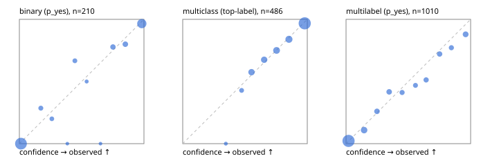

# Evaluation report

- model `Qwen/Qwen3-Reranker-4B` @ `22e683669b` (shared-prefix tree (tree-v1)), adapter/checkpoint `runs/tree_4b_r2/adapter`, prompt `tree-v1` (bc025ae9f6bc)
- data data/hf.jsonl, data/eval.jsonl; splits ['validation']; n=868; calibration `None`
- cuda / bfloat16; 2026-09-24T03:13:24+0000; wall 21.3s

## Overall

question accuracy 79.1%

**binary**: n 210, positives 79, accuracy 0.929, precision 0.900, recall 0.911, f1 0.906, auroc 0.983, brier 0.049, log_loss 0.161, ece 0.032

**multiclass**: n 486, accuracy 0.850, macro_f1 0.853, log_loss 0.424, brier 0.219, ece_top_label 0.016

**multilabel**: n 172, labels 1010, exact_match 0.459, micro_f1 0.684, macro_f1 0.617, label_auroc 0.921, brier 0.090, log_loss 0.285, ece 0.026

## By family

| family | n | question acc % | details |
|---|---|---|---|
| eval_adversarial | 14 | 100.0 | bin acc 100.0 F1 100.0 AUROC 1.000 ECE 0.083; mc acc 100.0 mF1 100.0 ECE 0.013; ml EM 100.0 µF1 100.0 ECE 0.005 |
| eval_agent_output | 20 | 70.0 | bin acc 83.3 F1 85.7 AUROC 0.861 ECE 0.130; mc acc 60.0 mF1 33.3 ECE 0.427; ml EM 33.3 µF1 0.0 ECE 0.346 |
| eval_evidence | 17 | 100.0 | bin acc 100.0 F1 100.0 AUROC 1.000 ECE 0.009; ml EM 100.0 µF1 100.0 ECE 0.030 |
| eval_multilabel | 12 | 66.7 | bin acc 0.0 F1 0.0 AUROC — ECE 0.949; mc acc 100.0 mF1 100.0 ECE 0.022; ml EM 66.7 µF1 93.3 ECE 0.066 |
| eval_policy | 24 | 66.7 | bin acc 66.7 F1 60.0 AUROC 0.800 ECE 0.188; mc acc 72.7 mF1 57.1 ECE 0.212; ml EM 0.0 µF1 50.0 ECE 0.451 |
| eval_routing | 16 | 93.8 | bin acc 100.0 F1 100.0 AUROC 1.000 ECE 0.083; mc acc 100.0 mF1 100.0 ECE 0.039; ml EM 0.0 µF1 0.0 ECE 0.267 |
| eval_urgency_sentiment | 15 | 100.0 | bin acc 100.0 F1 100.0 AUROC 1.000 ECE 0.029; mc acc 100.0 mF1 100.0 ECE 0.123; ml EM 100.0 µF1 100.0 ECE 0.016 |
| hf_emotions_multilabel | 150 | 42.7 | ml EM 42.7 µF1 65.1 ECE 0.025 |
| hf_intent_banking77 | 150 | 94.7 | mc acc 94.7 mF1 93.6 ECE 0.036 |
| hf_nli | 150 | 94.7 | bin acc 94.7 F1 91.7 AUROC 0.991 ECE 0.040 |
| hf_sentiment_tweets | 150 | 72.0 | mc acc 72.0 mF1 69.4 ECE 0.049 |
| hf_topic_agnews | 150 | 88.0 | mc acc 88.0 mF1 88.2 ECE 0.078 |

## by hard case

| slice | n | question acc % |
|---|---|---|
| (none) | 634 | 78.5 |
| contradiction | 63 | 96.8 |
| distractor | 20 | 85.0 |
| double_negation | 3 | 100.0 |
| evidence_end | 4 | 50.0 |
| evidence_middle | 7 | 85.7 |
| evidence_start | 3 | 66.7 |
| exception | 7 | 100.0 |
| hypothetical | 6 | 100.0 |
| injection | 16 | 81.2 |
| lexical_overlap | 13 | 92.3 |
| long_state | 26 | 73.1 |
| missing_evidence | 59 | 94.9 |
| multi_positive | 40 | 27.5 |
| multi_turn | 21 | 85.7 |
| negation | 9 | 77.8 |
| new_label_names | 5 | 60.0 |
| nota | 4 | 100.0 |
| numeric_reasoning | 13 | 84.6 |
| paraphrase | 10 | 60.0 |
| role_reversal | 7 | 85.7 |
| sarcasm | 5 | 80.0 |
| temporal_reasoning | 15 | 53.3 |
| zero_positive | 7 | 71.4 |

## by state tokens

| slice | n | question acc % |
|---|---|---|
| 00000-00127 | 796 | 78.9 |
| 00128-00511 | 46 | 87.0 |
| 00512-02047 | 26 | 73.1 |

## by candidates

| slice | n | question acc % |
|---|---|---|
| 01 | 210 | 92.9 |
| 03 | 162 | 73.5 |
| 04 | 174 | 87.4 |
| 05 | 13 | 69.2 |
| 06 | 159 | 44.0 |
| 08 | 150 | 94.7 |

## Paraphrase groups

5 groups; same prediction 60.0%; all correct 40.0%

## Multiclass abstention (coverage vs error on accepted)

| abstain_below | coverage % | error % |
|---|---|---|
| 0.0 | 100.0 | 15.0 |
| 0.4 | 99.2 | 14.3 |
| 0.5 | 96.3 | 13.0 |
| 0.6 | 88.1 | 10.3 |
| 0.7 | 79.8 | 8.0 |
| 0.8 | 69.1 | 5.4 |
| 0.9 | 57.6 | 3.2 |

## Reliability: binary

| bin | n | mean confidence | observed frequency |
|---|---|---|---|
| [0.0,0.1) | 111 | 0.013 | 0.000 |
| [0.1,0.2) | 7 | 0.172 | 0.286 |
| [0.2,0.3) | 5 | 0.261 | 0.200 |
| [0.3,0.4) | 1 | 0.385 | 0.000 |
| [0.4,0.5) | 6 | 0.446 | 0.667 |
| [0.5,0.6) | 2 | 0.540 | 0.500 |
| [0.6,0.7) | 1 | 0.651 | 0.000 |
| [0.7,0.8) | 9 | 0.751 | 0.778 |
| [0.8,0.9) | 10 | 0.851 | 0.800 |
| [0.9,1.0] | 58 | 0.983 | 0.966 |

## Reliability: multiclass

| bin | n | mean confidence | observed frequency |
|---|---|---|---|
| [0.3,0.4) | 4 | 0.346 | 0.000 |
| [0.4,0.5) | 14 | 0.473 | 0.429 |
| [0.5,0.6) | 40 | 0.552 | 0.575 |
| [0.6,0.7) | 40 | 0.654 | 0.675 |
| [0.7,0.8) | 52 | 0.753 | 0.750 |
| [0.8,0.9) | 56 | 0.853 | 0.839 |
| [0.9,1.0] | 280 | 0.979 | 0.968 |

## Reliability: multilabel

| bin | n | mean confidence | observed frequency |
|---|---|---|---|
| [0.0,0.1) | 579 | 0.020 | 0.022 |
| [0.1,0.2) | 92 | 0.145 | 0.109 |
| [0.2,0.3) | 50 | 0.248 | 0.260 |
| [0.3,0.4) | 48 | 0.346 | 0.417 |
| [0.4,0.5) | 34 | 0.450 | 0.412 |
| [0.5,0.6) | 32 | 0.557 | 0.469 |
| [0.6,0.7) | 39 | 0.643 | 0.513 |
| [0.7,0.8) | 43 | 0.751 | 0.721 |
| [0.8,0.9) | 35 | 0.845 | 0.771 |
| [0.9,1.0] | 58 | 0.960 | 0.879 |
