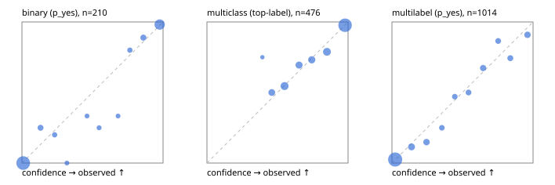

# Evaluation report

- model `Qwen/Qwen3-Reranker-4B` @ `22e683669b` (shared-prefix tree (tree-v1)), adapter/checkpoint `runs/tree_4b_r2b/adapter`, prompt `tree-v1` (bc025ae9f6bc)
- data data/hf.jsonl, data/eval.jsonl; splits ['calibration']; n=859; calibration `None`
- cuda / bfloat16; 2026-09-24T04:13:31+0000; wall 21.6s

## Overall

question accuracy 79.9%

**binary**: n 210, positives 71, accuracy 0.943, precision 0.893, recall 0.944, f1 0.918, auroc 0.990, brier 0.039, log_loss 0.128, ece 0.031

**multiclass**: n 476, accuracy 0.832, macro_f1 0.847, log_loss 0.402, brier 0.234, ece_top_label 0.018

**multilabel**: n 173, labels 1014, exact_match 0.532, micro_f1 0.749, macro_f1 0.671, label_auroc 0.928, brier 0.080, log_loss 0.271, ece 0.026

## By family

| family | n | question acc % | details |
|---|---|---|---|
| eval_adversarial | 19 | 100.0 | bin acc 100.0 F1 100.0 AUROC 1.000 ECE 0.032; mc acc 100.0 mF1 100.0 ECE 0.053; ml EM 100.0 µF1 100.0 ECE 0.005 |
| eval_agent_output | 9 | 77.8 | bin acc 100.0 F1 100.0 AUROC 1.000 ECE 0.110; mc acc 50.0 mF1 33.3 ECE 0.197; ml EM 50.0 µF1 40.0 ECE 0.325 |
| eval_evidence | 19 | 89.5 | bin acc 93.8 F1 90.9 AUROC 1.000 ECE 0.058; ml EM 66.7 µF1 92.3 ECE 0.113 |
| eval_multilabel | 12 | 75.0 | bin acc 100.0 F1 100.0 AUROC — ECE 0.017; mc acc 100.0 mF1 100.0 ECE 0.153; ml EM 62.5 µF1 86.7 ECE 0.101 |
| eval_policy | 16 | 81.2 | bin acc 87.5 F1 85.7 AUROC 1.000 ECE 0.158; mc acc 50.0 mF1 33.3 ECE 0.474; ml EM 100.0 µF1 100.0 ECE 0.089 |
| eval_routing | 15 | 93.3 | bin acc 100.0 F1 100.0 AUROC 1.000 ECE 0.041; mc acc 85.7 mF1 71.4 ECE 0.105; ml EM 100.0 µF1 100.0 ECE 0.017 |
| eval_urgency_sentiment | 19 | 94.7 | bin acc 100.0 F1 100.0 AUROC 1.000 ECE 0.097; mc acc 87.5 mF1 83.3 ECE 0.122; ml EM 100.0 µF1 100.0 ECE 0.023 |
| hf_emotions_multilabel | 150 | 49.3 | ml EM 49.3 µF1 72.0 ECE 0.023 |
| hf_intent_banking77 | 150 | 94.0 | mc acc 94.0 mF1 91.0 ECE 0.021 |
| hf_nli | 150 | 93.3 | bin acc 93.3 F1 89.4 AUROC 0.986 ECE 0.028 |
| hf_sentiment_tweets | 150 | 70.0 | mc acc 70.0 mF1 68.3 ECE 0.065 |
| hf_topic_agnews | 150 | 86.0 | mc acc 86.0 mF1 86.1 ECE 0.050 |

## by hard case

| slice | n | question acc % |
|---|---|---|
| (none) | 624 | 78.7 |
| contradiction | 58 | 100.0 |
| distractor | 25 | 88.0 |
| double_negation | 3 | 100.0 |
| evidence_end | 11 | 90.9 |
| evidence_middle | 6 | 83.3 |
| evidence_start | 7 | 100.0 |
| exception | 4 | 100.0 |
| hypothetical | 7 | 85.7 |
| injection | 6 | 83.3 |
| lexical_overlap | 16 | 81.2 |
| long_state | 42 | 85.7 |
| missing_evidence | 62 | 88.7 |
| multi_positive | 42 | 42.9 |
| multi_turn | 12 | 83.3 |
| negation | 12 | 83.3 |
| new_label_names | 5 | 80.0 |
| nota | 4 | 100.0 |
| numeric_reasoning | 15 | 80.0 |
| paraphrase | 10 | 80.0 |
| role_reversal | 13 | 76.9 |
| sarcasm | 1 | 0.0 |
| temporal_reasoning | 14 | 92.9 |
| zero_positive | 4 | 75.0 |

## by state tokens

| slice | n | question acc % |
|---|---|---|
| 00000-00127 | 780 | 78.8 |
| 00128-00511 | 37 | 94.6 |
| 00512-02047 | 42 | 85.7 |

## by candidates

| slice | n | question acc % |
|---|---|---|
| 01 | 210 | 94.3 |
| 03 | 158 | 70.9 |
| 04 | 168 | 85.1 |
| 05 | 15 | 86.7 |
| 06 | 157 | 50.3 |
| 07 | 1 | 0.0 |
| 08 | 150 | 94.0 |

## Paraphrase groups

5 groups; same prediction 60.0%; all correct 60.0%

## Multiclass abstention (coverage vs error on accepted)

| abstain_below | coverage % | error % |
|---|---|---|
| 0.0 | 100.0 | 16.8 |
| 0.4 | 99.2 | 16.7 |
| 0.5 | 92.9 | 14.5 |
| 0.6 | 81.3 | 10.1 |
| 0.7 | 73.7 | 8.0 |
| 0.8 | 65.1 | 5.5 |
| 0.9 | 54.2 | 2.3 |

## Reliability: binary

| bin | n | mean confidence | observed frequency |
|---|---|---|---|
| [0.0,0.1) | 116 | 0.009 | 0.000 |
| [0.1,0.2) | 8 | 0.131 | 0.250 |
| [0.2,0.3) | 5 | 0.232 | 0.200 |
| [0.3,0.4) | 3 | 0.319 | 0.000 |
| [0.4,0.5) | 3 | 0.461 | 0.333 |
| [0.5,0.6) | 4 | 0.547 | 0.250 |
| [0.6,0.7) | 3 | 0.681 | 0.333 |
| [0.7,0.8) | 5 | 0.765 | 0.800 |
| [0.8,0.9) | 9 | 0.860 | 0.889 |
| [0.9,1.0] | 54 | 0.976 | 0.981 |

## Reliability: multiclass

| bin | n | mean confidence | observed frequency |
|---|---|---|---|
| [0.3,0.4) | 4 | 0.393 | 0.750 |
| [0.4,0.5) | 30 | 0.460 | 0.500 |
| [0.5,0.6) | 55 | 0.550 | 0.545 |
| [0.6,0.7) | 36 | 0.653 | 0.694 |
| [0.7,0.8) | 41 | 0.743 | 0.732 |
| [0.8,0.9) | 52 | 0.851 | 0.788 |
| [0.9,1.0] | 258 | 0.979 | 0.977 |

## Reliability: multilabel

| bin | n | mean confidence | observed frequency |
|---|---|---|---|
| [0.0,0.1) | 605 | 0.023 | 0.025 |
| [0.1,0.2) | 70 | 0.139 | 0.114 |
| [0.2,0.3) | 54 | 0.245 | 0.148 |
| [0.3,0.4) | 32 | 0.354 | 0.250 |
| [0.4,0.5) | 34 | 0.446 | 0.471 |
| [0.5,0.6) | 36 | 0.543 | 0.500 |
| [0.6,0.7) | 52 | 0.646 | 0.673 |
| [0.7,0.8) | 37 | 0.753 | 0.865 |
| [0.8,0.9) | 39 | 0.839 | 0.744 |
| [0.9,1.0] | 55 | 0.961 | 0.909 |
