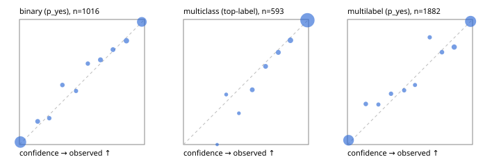

# Evaluation report

- model `Qwen/Qwen3-Reranker-4B` @ `22e683669b` (shared-prefix tree (tree-v1)), adapter/checkpoint `runs/tree_4b_r2b/adapter`, prompt `tree-v1` (bc025ae9f6bc)
- data data/eval2.jsonl; splits ['test']; n=1991; calibration `None`
- mps / bfloat16; 2026-09-23T22:59:16-0700; wall 1304.7s

## Overall

question accuracy 90.6%

**binary**: n 1016, positives 435, accuracy 0.929, precision 0.915, recall 0.920, f1 0.917, auroc 0.978, brier 0.054, log_loss 0.191, ece 0.016

**multiclass**: n 593, accuracy 0.941, macro_f1 0.893, log_loss 0.158, brier 0.081, ece_top_label 0.010

**multilabel**: n 382, labels 1882, exact_match 0.788, micro_f1 0.937, macro_f1 0.885, label_auroc 0.982, brier 0.052, log_loss 0.182, ece 0.023

## By family

| family | n | question acc % | details |
|---|---|---|---|
| e2_hard | 673 | 89.9 | bin acc 92.8 F1 90.3 AUROC 0.971 ECE 0.032; mc acc 93.3 mF1 87.3 ECE 0.027; ml EM 77.3 µF1 92.8 ECE 0.030 |
| e2_simple | 664 | 95.2 | bin acc 96.2 F1 96.5 AUROC 0.989 ECE 0.021; mc acc 97.0 mF1 93.6 ECE 0.023; ml EM 89.2 µF1 97.4 ECE 0.025 |
| e2_very_hard | 654 | 86.5 | bin acc 89.5 F1 86.0 AUROC 0.967 ECE 0.040; mc acc 92.0 mF1 86.6 ECE 0.033; ml EM 70.8 µF1 91.0 ECE 0.046 |

## by hard case

| slice | n | question acc % |
|---|---|---|
| (none) | 569 | 96.1 |
| contradiction | 172 | 92.4 |
| distractor | 474 | 88.2 |
| double_negation | 126 | 87.3 |
| evidence_end | 57 | 89.5 |
| evidence_middle | 114 | 94.7 |
| evidence_start | 17 | 82.4 |
| exception | 213 | 87.3 |
| hypothetical | 128 | 92.2 |
| injection | 151 | 82.1 |
| lexical_overlap | 201 | 93.0 |
| long_state | 191 | 89.0 |
| missing_evidence | 141 | 94.3 |
| multi_positive | 322 | 79.5 |
| multi_turn | 149 | 91.3 |
| negation | 257 | 92.2 |
| nota | 118 | 89.0 |
| numeric_reasoning | 224 | 78.6 |
| paraphrase | 218 | 83.9 |
| role_reversal | 187 | 93.0 |
| sarcasm | 149 | 82.6 |
| temporal_reasoning | 203 | 77.8 |
| zero_positive | 73 | 86.3 |
| zero_positive_distractor | 1 | 100.0 |

## by state tokens

| slice | n | question acc % |
|---|---|---|
| 00000-00127 | 662 | 89.4 |
| 00128-00511 | 477 | 86.4 |
| 00512-02047 | 484 | 95.0 |
| 02048-08191 | 329 | 91.5 |
| 08192+ | 39 | 97.4 |

## by candidates

| slice | n | question acc % |
|---|---|---|
| 01 | 1016 | 92.9 |
| 03 | 128 | 91.4 |
| 04 | 515 | 92.2 |
| 05 | 224 | 80.4 |
| 06 | 86 | 79.1 |
| 07 | 18 | 88.9 |
| 08 | 4 | 75.0 |

## Paraphrase groups

76 groups; same prediction 72.4%; all correct 76.3%

## Multiclass abstention (coverage vs error on accepted)

| abstain_below | coverage % | error % |
|---|---|---|
| 0.0 | 100.0 | 5.9 |
| 0.4 | 99.0 | 5.3 |
| 0.5 | 98.3 | 4.8 |
| 0.6 | 95.6 | 3.4 |
| 0.7 | 92.9 | 2.4 |
| 0.8 | 89.7 | 1.5 |
| 0.9 | 84.7 | 0.6 |

## Reliability: binary

| bin | n | mean confidence | observed frequency |
|---|---|---|---|
| [0.0,0.1) | 498 | 0.008 | 0.020 |
| [0.1,0.2) | 27 | 0.146 | 0.185 |
| [0.2,0.3) | 19 | 0.239 | 0.211 |
| [0.3,0.4) | 21 | 0.343 | 0.476 |
| [0.4,0.5) | 14 | 0.452 | 0.429 |
| [0.5,0.6) | 17 | 0.547 | 0.647 |
| [0.6,0.7) | 31 | 0.648 | 0.677 |
| [0.7,0.8) | 29 | 0.748 | 0.759 |
| [0.8,0.9) | 47 | 0.855 | 0.830 |
| [0.9,1.0] | 313 | 0.978 | 0.981 |

## Reliability: multiclass

| bin | n | mean confidence | observed frequency |
|---|---|---|---|
| [0.2,0.3) | 1 | 0.269 | 0.000 |
| [0.3,0.4) | 5 | 0.341 | 0.400 |
| [0.4,0.5) | 4 | 0.443 | 0.250 |
| [0.5,0.6) | 16 | 0.550 | 0.438 |
| [0.6,0.7) | 16 | 0.657 | 0.625 |
| [0.7,0.8) | 19 | 0.758 | 0.737 |
| [0.8,0.9) | 30 | 0.855 | 0.833 |
| [0.9,1.0] | 502 | 0.991 | 0.994 |

## Reliability: multilabel

| bin | n | mean confidence | observed frequency |
|---|---|---|---|
| [0.0,0.1) | 749 | 0.009 | 0.035 |
| [0.1,0.2) | 37 | 0.147 | 0.324 |
| [0.2,0.3) | 25 | 0.247 | 0.320 |
| [0.3,0.4) | 32 | 0.348 | 0.406 |
| [0.4,0.5) | 30 | 0.453 | 0.433 |
| [0.5,0.6) | 21 | 0.540 | 0.476 |
| [0.6,0.7) | 28 | 0.658 | 0.857 |
| [0.7,0.8) | 42 | 0.756 | 0.738 |
| [0.8,0.9) | 77 | 0.853 | 0.779 |
| [0.9,1.0] | 841 | 0.984 | 0.985 |
