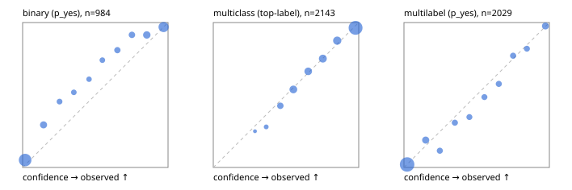

# Evaluation report

- model `Qwen/Qwen3-Reranker-4B` @ `22e683669b` (shared-prefix tree (tree-v1)), adapter/checkpoint `runs/tree_4b_r2b/adapter`, prompt `tree-v1` (bc025ae9f6bc)
- data data/hf.jsonl, data/eval.jsonl; splits ['test']; n=3471; calibration `None`
- cuda / bfloat16; 2026-09-24T04:14:59+0000; wall 81.6s

## Overall

question accuracy 81.2%

**binary**: n 984, positives 475, accuracy 0.881, precision 0.922, recall 0.823, f1 0.870, auroc 0.955, brier 0.091, log_loss 0.299, ece 0.064

**multiclass**: n 2143, accuracy 0.828, macro_f1 0.890, log_loss 0.485, brier 0.245, ece_top_label 0.016

**multilabel**: n 344, labels 2029, exact_match 0.517, micro_f1 0.753, macro_f1 0.777, label_auroc 0.939, brier 0.077, log_loss 0.251, ece 0.021

## By family

| family | n | question acc % | details |
|---|---|---|---|
| eval_adversarial | 27 | 96.3 | bin acc 93.3 F1 90.9 AUROC 0.963 ECE 0.098; mc acc 100.0 mF1 100.0 ECE 0.004; ml EM 100.0 µF1 100.0 ECE 0.020 |
| eval_agent_output | 26 | 57.7 | bin acc 85.7 F1 85.7 AUROC 0.878 ECE 0.167; mc acc 14.3 mF1 6.2 ECE 0.693; ml EM 40.0 µF1 80.0 ECE 0.173 |
| eval_evidence | 17 | 94.1 | bin acc 100.0 F1 100.0 AUROC 1.000 ECE 0.035; ml EM 50.0 µF1 66.7 ECE 0.208 |
| eval_multilabel | 32 | 87.5 | bin acc 100.0 F1 100.0 AUROC 1.000 ECE 0.025; mc acc 100.0 mF1 100.0 ECE 0.209; ml EM 83.3 µF1 96.0 ECE 0.026 |
| eval_policy | 22 | 63.6 | bin acc 69.2 F1 71.4 AUROC 0.762 ECE 0.334; mc acc 60.0 mF1 42.9 ECE 0.529; ml EM 50.0 µF1 80.0 ECE 0.238 |
| eval_routing | 25 | 92.0 | bin acc 90.0 F1 88.9 AUROC 1.000 ECE 0.104; mc acc 100.0 mF1 100.0 ECE 0.142; ml EM 50.0 µF1 80.0 ECE 0.124 |
| eval_urgency_sentiment | 22 | 90.9 | bin acc 80.0 F1 83.3 AUROC 0.917 ECE 0.184; mc acc 100.0 mF1 100.0 ECE 0.075; ml EM 100.0 µF1 100.0 ECE 0.009 |
| heldout_boolq | 300 | 83.7 | bin acc 83.7 F1 85.5 AUROC 0.929 ECE 0.086 |
| heldout_emotion_multiclass | 300 | 55.3 | mc acc 55.3 mF1 41.7 ECE 0.189 |
| heldout_intent_clinc | 300 | 92.0 | mc acc 92.0 mF1 92.7 ECE 0.052 |
| heldout_question_type_trec | 300 | 84.7 | mc acc 84.7 mF1 85.0 ECE 0.104 |
| heldout_sentiment_sst2 | 300 | 85.7 | bin acc 85.7 F1 83.5 AUROC 0.974 ECE 0.145 |
| heldout_topic_dbpedia | 300 | 96.3 | mc acc 96.3 mF1 95.9 ECE 0.020 |
| hf_emotions_multilabel | 300 | 48.3 | ml EM 48.3 µF1 71.1 ECE 0.023 |
| hf_intent_banking77 | 300 | 96.0 | mc acc 96.0 mF1 95.2 ECE 0.030 |
| hf_nli | 300 | 95.0 | bin acc 95.0 F1 93.3 AUROC 0.982 ECE 0.030 |
| hf_sentiment_tweets | 300 | 66.3 | mc acc 66.3 mF1 66.4 ECE 0.037 |
| hf_topic_agnews | 300 | 89.3 | mc acc 89.3 mF1 89.4 ECE 0.024 |

## by hard case

| slice | n | question acc % |
|---|---|---|
| (none) | 3042 | 80.8 |
| contradiction | 107 | 100.0 |
| distractor | 33 | 78.8 |
| double_negation | 6 | 100.0 |
| evidence_end | 13 | 92.3 |
| evidence_middle | 11 | 81.8 |
| evidence_start | 9 | 88.9 |
| exception | 7 | 57.1 |
| hypothetical | 7 | 100.0 |
| injection | 10 | 90.0 |
| lexical_overlap | 20 | 90.0 |
| long_state | 50 | 84.0 |
| missing_evidence | 104 | 89.4 |
| multi_positive | 81 | 50.6 |
| multi_turn | 9 | 77.8 |
| negation | 30 | 93.3 |
| new_label_names | 3 | 33.3 |
| nota | 46 | 97.8 |
| numeric_reasoning | 16 | 68.8 |
| paraphrase | 22 | 90.9 |
| role_reversal | 15 | 73.3 |
| sarcasm | 12 | 100.0 |
| temporal_reasoning | 29 | 69.0 |
| zero_positive | 6 | 83.3 |

## by state tokens

| slice | n | question acc % |
|---|---|---|
| 00000-00127 | 3211 | 81.0 |
| 00128-00511 | 208 | 84.6 |
| 00512-02047 | 52 | 84.6 |

## by candidates

| slice | n | question acc % |
|---|---|---|
| 01 | 984 | 88.1 |
| 03 | 310 | 67.1 |
| 04 | 333 | 88.0 |
| 05 | 22 | 72.7 |
| 06 | 1218 | 71.3 |
| 07 | 49 | 100.0 |
| 08 | 555 | 93.5 |

## Paraphrase groups

11 groups; same prediction 81.8%; all correct 90.9%

## Multiclass abstention (coverage vs error on accepted)

| abstain_below | coverage % | error % |
|---|---|---|
| 0.0 | 100.0 | 17.2 |
| 0.4 | 98.6 | 16.4 |
| 0.5 | 93.9 | 14.4 |
| 0.6 | 84.2 | 10.7 |
| 0.7 | 75.2 | 7.9 |
| 0.8 | 65.1 | 5.3 |
| 0.9 | 53.1 | 3.7 |

## Reliability: binary

| bin | n | mean confidence | observed frequency |
|---|---|---|---|
| [0.0,0.1) | 409 | 0.017 | 0.051 |
| [0.1,0.2) | 68 | 0.144 | 0.294 |
| [0.2,0.3) | 33 | 0.254 | 0.455 |
| [0.3,0.4) | 27 | 0.352 | 0.519 |
| [0.4,0.5) | 23 | 0.457 | 0.609 |
| [0.5,0.6) | 27 | 0.549 | 0.741 |
| [0.6,0.7) | 42 | 0.652 | 0.810 |
| [0.7,0.8) | 47 | 0.751 | 0.915 |
| [0.8,0.9) | 82 | 0.854 | 0.915 |
| [0.9,1.0] | 226 | 0.969 | 0.969 |

## Reliability: multiclass

| bin | n | mean confidence | observed frequency |
|---|---|---|---|
| [0.2,0.3) | 4 | 0.287 | 0.250 |
| [0.3,0.4) | 25 | 0.364 | 0.280 |
| [0.4,0.5) | 101 | 0.461 | 0.426 |
| [0.5,0.6) | 208 | 0.550 | 0.538 |
| [0.6,0.7) | 193 | 0.653 | 0.663 |
| [0.7,0.8) | 217 | 0.753 | 0.751 |
| [0.8,0.9) | 256 | 0.852 | 0.875 |
| [0.9,1.0] | 1139 | 0.978 | 0.963 |

## Reliability: multilabel

| bin | n | mean confidence | observed frequency |
|---|---|---|---|
| [0.0,0.1) | 1221 | 0.021 | 0.020 |
| [0.1,0.2) | 143 | 0.150 | 0.189 |
| [0.2,0.3) | 78 | 0.247 | 0.115 |
| [0.3,0.4) | 81 | 0.350 | 0.309 |
| [0.4,0.5) | 69 | 0.450 | 0.348 |
| [0.5,0.6) | 70 | 0.553 | 0.486 |
| [0.6,0.7) | 85 | 0.652 | 0.576 |
| [0.7,0.8) | 83 | 0.751 | 0.771 |
| [0.8,0.9) | 72 | 0.846 | 0.819 |
| [0.9,1.0] | 127 | 0.973 | 0.976 |
