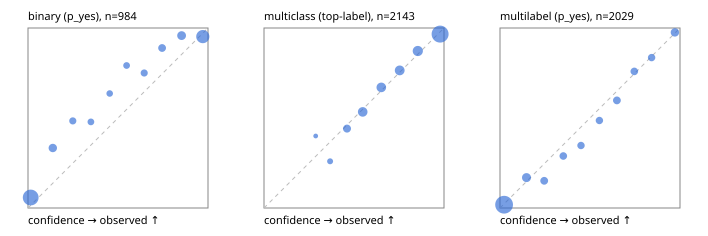

# Evaluation report

- model `Qwen/Qwen3-Reranker-4B` @ `22e683669b` (shared-prefix tree (tree-v1)), adapter/checkpoint `runs/tree_4b_r2b/adapter`, prompt `tree-v1` (bc025ae9f6bc)
- data data/hf.jsonl, data/eval.jsonl; splits ['test']; n=3471; calibration `{'method': 'temperature scaling per output type, grid search on NLL', 'min_n': 30, 'model': 'Qwen/Qwen3-Reranker-4B', 'revision': '22e683669bc0f0bd69640a1354a6d0aebcfeede5', 'adapter': 'runs/tree_4b_r2b/adapter', 'adapter_sha256': '2a73e5f707e9d8bfdcad440d5c7c66f106f9cb3b0028851dfb5b6a3bf3f0ad86', 'prompt_sha': 'bc025ae9f6bc', 'fit_report': 'reports/tree_4b_r2b/calibration/report.json', 'fit_report_sha256': 'ff63c2521173aec394e577eeb967d87efd3c7cfdaf93d613c0e5f972c3a8f724', 'fit_data': [{'path': 'data/hf.jsonl', 'sha256': 'fe29b29286d5a372271e925825e8b9794f3f64be9a9fc04cad458b4b94ada510'}, {'path': 'data/eval.jsonl', 'sha256': 'be888eb38dcca063823924430e03985ddf2186b874e792d5734936ba93ba6910'}], 'created': '2026-09-24T04:15:04+0000', 'n': {'binary': 210, 'multiclass': 476, 'multilabel': 1014}, 'nll_before': {'binary': 0.12799114148519103, 'multiclass': 0.4016098562281788, 'multilabel': 0.27056187481897265}, 'nll_after': {'binary': 0.12692342089821781, 'multiclass': 0.40147531013975923, 'multilabel': 0.27032397785676926}, 'skipped': {}, 'threshold_report': 'reports/tree_4b_r2b/validation/report.json', 'threshold_report_sha256': '3454b0480817c3f49d7203b9150f9182508e3e97e352a4c68ffc6a8e05e5de5d', 'threshold_rule': 'max F1 on validation after temperature scaling', 'file': 'calib/tree_4b_r2b.json', 'file_sha256': 'a66262bc3255263b8046341657f14884cbf05bb215723e7867188886f1cbe6db'}`
- cuda / bfloat16; 2026-09-24T04:16:33+0000; wall 82.0s

## Overall

question accuracy 80.9%

**binary**: n 984, positives 475, accuracy 0.879, precision 0.928, recall 0.813, f1 0.866, auroc 0.955, brier 0.092, log_loss 0.307, ece 0.073

**multiclass**: n 2143, accuracy 0.828, macro_f1 0.890, log_loss 0.484, brier 0.245, ece_top_label 0.015

**multilabel**: n 344, labels 2029, exact_match 0.491, micro_f1 0.746, macro_f1 0.769, label_auroc 0.939, brier 0.077, log_loss 0.251, ece 0.020

## By family

| family | n | question acc % | details |
|---|---|---|---|
| eval_adversarial | 27 | 96.3 | bin acc 93.3 F1 90.9 AUROC 0.963 ECE 0.096; mc acc 100.0 mF1 100.0 ECE 0.005; ml EM 100.0 µF1 100.0 ECE 0.022 |
| eval_agent_output | 26 | 57.7 | bin acc 85.7 F1 85.7 AUROC 0.878 ECE 0.155; mc acc 14.3 mF1 6.2 ECE 0.688; ml EM 40.0 µF1 80.0 ECE 0.097 |
| eval_evidence | 17 | 94.1 | bin acc 100.0 F1 100.0 AUROC 1.000 ECE 0.032; ml EM 50.0 µF1 66.7 ECE 0.209 |
| eval_multilabel | 32 | 84.4 | bin acc 100.0 F1 100.0 AUROC 1.000 ECE 0.020; mc acc 100.0 mF1 100.0 ECE 0.217; ml EM 79.2 µF1 94.1 ECE 0.027 |
| eval_policy | 22 | 63.6 | bin acc 69.2 F1 66.7 AUROC 0.762 ECE 0.207; mc acc 60.0 mF1 42.9 ECE 0.528; ml EM 50.0 µF1 80.0 ECE 0.240 |
| eval_routing | 25 | 92.0 | bin acc 90.0 F1 88.9 AUROC 1.000 ECE 0.090; mc acc 100.0 mF1 100.0 ECE 0.144; ml EM 50.0 µF1 80.0 ECE 0.125 |
| eval_urgency_sentiment | 22 | 90.9 | bin acc 80.0 F1 83.3 AUROC 0.917 ECE 0.180; mc acc 100.0 mF1 100.0 ECE 0.078; ml EM 100.0 µF1 100.0 ECE 0.010 |
| heldout_boolq | 300 | 84.3 | bin acc 84.3 F1 86.1 AUROC 0.929 ECE 0.094 |
| heldout_emotion_multiclass | 300 | 55.3 | mc acc 55.3 mF1 41.7 ECE 0.188 |
| heldout_intent_clinc | 300 | 92.0 | mc acc 92.0 mF1 92.7 ECE 0.052 |
| heldout_question_type_trec | 300 | 84.7 | mc acc 84.7 mF1 85.0 ECE 0.101 |
| heldout_sentiment_sst2 | 300 | 84.7 | bin acc 84.7 F1 82.2 AUROC 0.974 ECE 0.145 |
| heldout_topic_dbpedia | 300 | 96.3 | mc acc 96.3 mF1 95.9 ECE 0.021 |
| hf_emotions_multilabel | 300 | 45.7 | ml EM 45.7 µF1 71.1 ECE 0.022 |
| hf_intent_banking77 | 300 | 96.0 | mc acc 96.0 mF1 95.2 ECE 0.032 |
| hf_nli | 300 | 94.7 | bin acc 94.7 F1 92.8 AUROC 0.982 ECE 0.031 |
| hf_sentiment_tweets | 300 | 66.3 | mc acc 66.3 mF1 66.4 ECE 0.039 |
| hf_topic_agnews | 300 | 89.3 | mc acc 89.3 mF1 89.4 ECE 0.024 |

## by hard case

| slice | n | question acc % |
|---|---|---|
| (none) | 3042 | 80.2 |
| contradiction | 107 | 100.0 |
| distractor | 33 | 78.8 |
| double_negation | 6 | 100.0 |
| evidence_end | 13 | 92.3 |
| evidence_middle | 11 | 81.8 |
| evidence_start | 9 | 88.9 |
| exception | 7 | 57.1 |
| hypothetical | 7 | 100.0 |
| injection | 10 | 90.0 |
| lexical_overlap | 20 | 90.0 |
| long_state | 50 | 82.0 |
| missing_evidence | 104 | 89.4 |
| multi_positive | 81 | 60.5 |
| multi_turn | 9 | 77.8 |
| negation | 30 | 93.3 |
| new_label_names | 3 | 33.3 |
| nota | 46 | 97.8 |
| numeric_reasoning | 16 | 68.8 |
| paraphrase | 22 | 90.9 |
| role_reversal | 15 | 80.0 |
| sarcasm | 12 | 100.0 |
| temporal_reasoning | 29 | 65.5 |
| zero_positive | 6 | 83.3 |

## by state tokens

| slice | n | question acc % |
|---|---|---|
| 00000-00127 | 3211 | 80.7 |
| 00128-00511 | 208 | 84.6 |
| 00512-02047 | 52 | 82.7 |

## by candidates

| slice | n | question acc % |
|---|---|---|
| 01 | 984 | 87.9 |
| 03 | 310 | 67.1 |
| 04 | 333 | 87.7 |
| 05 | 22 | 72.7 |
| 06 | 1218 | 70.6 |
| 07 | 49 | 100.0 |
| 08 | 555 | 93.5 |

## Paraphrase groups

11 groups; same prediction 81.8%; all correct 90.9%

## Multiclass abstention (coverage vs error on accepted)

| abstain_below | coverage % | error % |
|---|---|---|
| 0.0 | 100.0 | 17.2 |
| 0.4 | 98.5 | 16.3 |
| 0.5 | 93.7 | 14.3 |
| 0.6 | 84.0 | 10.6 |
| 0.7 | 74.6 | 7.8 |
| 0.8 | 64.1 | 5.2 |
| 0.9 | 52.0 | 3.4 |

## Reliability: binary

| bin | n | mean confidence | observed frequency |
|---|---|---|---|
| [0.0,0.1) | 427 | 0.015 | 0.059 |
| [0.1,0.2) | 57 | 0.138 | 0.333 |
| [0.2,0.3) | 31 | 0.249 | 0.484 |
| [0.3,0.4) | 23 | 0.349 | 0.478 |
| [0.4,0.5) | 22 | 0.454 | 0.636 |
| [0.5,0.6) | 24 | 0.548 | 0.792 |
| [0.6,0.7) | 32 | 0.646 | 0.750 |
| [0.7,0.8) | 45 | 0.745 | 0.889 |
| [0.8,0.9) | 71 | 0.853 | 0.958 |
| [0.9,1.0] | 252 | 0.971 | 0.952 |

## Reliability: multiclass

| bin | n | mean confidence | observed frequency |
|---|---|---|---|
| [0.2,0.3) | 5 | 0.287 | 0.400 |
| [0.3,0.4) | 27 | 0.367 | 0.259 |
| [0.4,0.5) | 102 | 0.461 | 0.441 |
| [0.5,0.6) | 208 | 0.548 | 0.534 |
| [0.6,0.7) | 203 | 0.652 | 0.670 |
| [0.7,0.8) | 225 | 0.754 | 0.764 |
| [0.8,0.9) | 258 | 0.855 | 0.872 |
| [0.9,1.0] | 1115 | 0.978 | 0.966 |

## Reliability: multilabel

| bin | n | mean confidence | observed frequency |
|---|---|---|---|
| [0.0,0.1) | 1197 | 0.023 | 0.018 |
| [0.1,0.2) | 154 | 0.147 | 0.169 |
| [0.2,0.3) | 86 | 0.246 | 0.151 |
| [0.3,0.4) | 83 | 0.352 | 0.289 |
| [0.4,0.5) | 72 | 0.450 | 0.347 |
| [0.5,0.6) | 72 | 0.552 | 0.486 |
| [0.6,0.7) | 87 | 0.649 | 0.598 |
| [0.7,0.8) | 83 | 0.746 | 0.759 |
| [0.8,0.9) | 73 | 0.842 | 0.836 |
| [0.9,1.0] | 122 | 0.972 | 0.975 |
