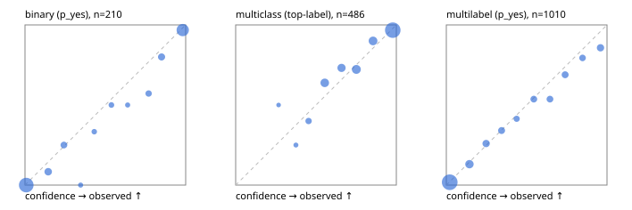

# Evaluation report

- model `Qwen/Qwen3-Reranker-4B` @ `22e683669b` (shared-prefix tree (tree-v1)), adapter/checkpoint `runs/tree_4b_r2b/adapter`, prompt `tree-v1` (bc025ae9f6bc)
- data data/hf.jsonl, data/eval.jsonl; splits ['validation']; n=868; calibration `None`
- cuda / bfloat16; 2026-09-24T04:13:03+0000; wall 21.0s

## Overall

question accuracy 79.8%

**binary**: n 210, positives 79, accuracy 0.933, precision 0.882, recall 0.949, f1 0.915, auroc 0.985, brier 0.049, log_loss 0.161, ece 0.027

**multiclass**: n 486, accuracy 0.856, macro_f1 0.836, log_loss 0.423, brier 0.216, ece_top_label 0.032

**multilabel**: n 172, labels 1010, exact_match 0.471, micro_f1 0.696, macro_f1 0.616, label_auroc 0.922, brier 0.090, log_loss 0.286, ece 0.019

## By family

| family | n | question acc % | details |
|---|---|---|---|
| eval_adversarial | 14 | 100.0 | bin acc 100.0 F1 100.0 AUROC 1.000 ECE 0.067; mc acc 100.0 mF1 100.0 ECE 0.014; ml EM 100.0 µF1 100.0 ECE 0.008 |
| eval_agent_output | 20 | 70.0 | bin acc 83.3 F1 85.7 AUROC 0.889 ECE 0.129; mc acc 60.0 mF1 33.3 ECE 0.329; ml EM 33.3 µF1 0.0 ECE 0.346 |
| eval_evidence | 17 | 100.0 | bin acc 100.0 F1 100.0 AUROC 1.000 ECE 0.016; ml EM 100.0 µF1 100.0 ECE 0.020 |
| eval_multilabel | 12 | 58.3 | bin acc 0.0 F1 0.0 AUROC — ECE 0.783; mc acc 100.0 mF1 100.0 ECE 0.043; ml EM 55.6 µF1 91.3 ECE 0.080 |
| eval_policy | 24 | 70.8 | bin acc 75.0 F1 76.9 AUROC 0.800 ECE 0.282; mc acc 72.7 mF1 57.1 ECE 0.216; ml EM 0.0 µF1 50.0 ECE 0.518 |
| eval_routing | 16 | 93.8 | bin acc 100.0 F1 100.0 AUROC 1.000 ECE 0.051; mc acc 100.0 mF1 100.0 ECE 0.057; ml EM 0.0 µF1 0.0 ECE 0.305 |
| eval_urgency_sentiment | 15 | 93.3 | bin acc 100.0 F1 100.0 AUROC 1.000 ECE 0.048; mc acc 80.0 mF1 66.7 ECE 0.173; ml EM 100.0 µF1 100.0 ECE 0.008 |
| hf_emotions_multilabel | 150 | 44.7 | ml EM 44.7 µF1 66.9 ECE 0.021 |
| hf_intent_banking77 | 150 | 94.7 | mc acc 94.7 mF1 93.6 ECE 0.024 |
| hf_nli | 150 | 94.7 | bin acc 94.7 F1 91.8 AUROC 0.993 ECE 0.035 |
| hf_sentiment_tweets | 150 | 73.3 | mc acc 73.3 mF1 69.9 ECE 0.046 |
| hf_topic_agnews | 150 | 89.3 | mc acc 89.3 mF1 89.5 ECE 0.071 |

## by hard case

| slice | n | question acc % |
|---|---|---|
| (none) | 634 | 79.8 |
| contradiction | 63 | 95.2 |
| distractor | 20 | 75.0 |
| double_negation | 3 | 100.0 |
| evidence_end | 4 | 75.0 |
| evidence_middle | 7 | 71.4 |
| evidence_start | 3 | 66.7 |
| exception | 7 | 100.0 |
| hypothetical | 6 | 100.0 |
| injection | 16 | 81.2 |
| lexical_overlap | 13 | 92.3 |
| long_state | 26 | 69.2 |
| missing_evidence | 59 | 93.2 |
| multi_positive | 40 | 27.5 |
| multi_turn | 21 | 85.7 |
| negation | 9 | 77.8 |
| new_label_names | 5 | 60.0 |
| nota | 4 | 100.0 |
| numeric_reasoning | 13 | 84.6 |
| paraphrase | 10 | 60.0 |
| role_reversal | 7 | 85.7 |
| sarcasm | 5 | 80.0 |
| temporal_reasoning | 15 | 60.0 |
| zero_positive | 7 | 57.1 |

## by state tokens

| slice | n | question acc % |
|---|---|---|
| 00000-00127 | 796 | 79.6 |
| 00128-00511 | 46 | 89.1 |
| 00512-02047 | 26 | 69.2 |

## by candidates

| slice | n | question acc % |
|---|---|---|
| 01 | 210 | 93.3 |
| 03 | 162 | 74.7 |
| 04 | 174 | 87.9 |
| 05 | 13 | 61.5 |
| 06 | 159 | 45.9 |
| 08 | 150 | 94.7 |

## Paraphrase groups

5 groups; same prediction 60.0%; all correct 40.0%

## Multiclass abstention (coverage vs error on accepted)

| abstain_below | coverage % | error % |
|---|---|---|
| 0.0 | 100.0 | 14.4 |
| 0.4 | 98.8 | 13.8 |
| 0.5 | 95.7 | 12.3 |
| 0.6 | 86.0 | 9.6 |
| 0.7 | 77.6 | 7.7 |
| 0.8 | 66.5 | 4.3 |
| 0.9 | 56.2 | 3.3 |

## Reliability: binary

| bin | n | mean confidence | observed frequency |
|---|---|---|---|
| [0.0,0.1) | 100 | 0.008 | 0.000 |
| [0.1,0.2) | 12 | 0.144 | 0.083 |
| [0.2,0.3) | 8 | 0.242 | 0.250 |
| [0.3,0.4) | 2 | 0.346 | 0.000 |
| [0.4,0.5) | 3 | 0.431 | 0.333 |
| [0.5,0.6) | 4 | 0.538 | 0.500 |
| [0.6,0.7) | 2 | 0.639 | 0.500 |
| [0.7,0.8) | 7 | 0.769 | 0.571 |
| [0.8,0.9) | 10 | 0.850 | 0.800 |
| [0.9,1.0] | 62 | 0.982 | 0.968 |

## Reliability: multiclass

| bin | n | mean confidence | observed frequency |
|---|---|---|---|
| [0.2,0.3) | 2 | 0.267 | 0.500 |
| [0.3,0.4) | 4 | 0.375 | 0.250 |
| [0.4,0.5) | 15 | 0.454 | 0.400 |
| [0.5,0.6) | 47 | 0.555 | 0.638 |
| [0.6,0.7) | 41 | 0.659 | 0.732 |
| [0.7,0.8) | 54 | 0.751 | 0.722 |
| [0.8,0.9) | 50 | 0.855 | 0.900 |
| [0.9,1.0] | 273 | 0.978 | 0.967 |

## Reliability: multilabel

| bin | n | mean confidence | observed frequency |
|---|---|---|---|
| [0.0,0.1) | 571 | 0.021 | 0.018 |
| [0.1,0.2) | 92 | 0.144 | 0.130 |
| [0.2,0.3) | 54 | 0.248 | 0.259 |
| [0.3,0.4) | 47 | 0.344 | 0.340 |
| [0.4,0.5) | 29 | 0.438 | 0.414 |
| [0.5,0.6) | 41 | 0.545 | 0.537 |
| [0.6,0.7) | 41 | 0.645 | 0.537 |
| [0.7,0.8) | 45 | 0.739 | 0.689 |
| [0.8,0.9) | 34 | 0.848 | 0.794 |
| [0.9,1.0] | 56 | 0.959 | 0.857 |
