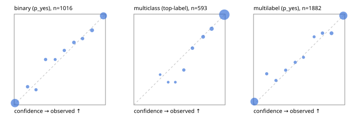

# Evaluation report

- model `Qwen/Qwen3-Reranker-4B` @ `22e683669b` (shared-prefix tree (tree-v1)), adapter/checkpoint `runs/tree_4b_r2b/adapter`, prompt `tree-v1` (bc025ae9f6bc)
- data data/eval2.jsonl; splits ['test']; n=1991; calibration `None`
- cuda / bfloat16; 2026-09-24T08:59:44+0000; wall 237.7s

## Overall

question accuracy 90.4%

**binary**: n 1016, positives 435, accuracy 0.927, precision 0.911, recall 0.920, f1 0.915, auroc 0.978, brier 0.054, log_loss 0.191, ece 0.017

**multiclass**: n 593, accuracy 0.941, macro_f1 0.895, log_loss 0.157, brier 0.080, ece_top_label 0.010

**multilabel**: n 382, labels 1882, exact_match 0.785, micro_f1 0.936, macro_f1 0.884, label_auroc 0.982, brier 0.053, log_loss 0.182, ece 0.021

## By family

| family | n | question acc % | details |
|---|---|---|---|
| e2_hard | 673 | 89.6 | bin acc 92.5 F1 89.9 AUROC 0.971 ECE 0.031; mc acc 93.3 mF1 87.3 ECE 0.023; ml EM 76.5 µF1 92.6 ECE 0.026 |
| e2_simple | 664 | 95.2 | bin acc 96.2 F1 96.5 AUROC 0.990 ECE 0.020; mc acc 97.0 mF1 93.6 ECE 0.024; ml EM 89.2 µF1 97.4 ECE 0.024 |
| e2_very_hard | 654 | 86.4 | bin acc 89.2 F1 85.6 AUROC 0.967 ECE 0.042; mc acc 92.0 mF1 87.2 ECE 0.034; ml EM 70.8 µF1 91.0 ECE 0.042 |

## by hard case

| slice | n | question acc % |
|---|---|---|
| (none) | 569 | 96.1 |
| contradiction | 172 | 92.4 |
| distractor | 474 | 88.0 |
| double_negation | 126 | 87.3 |
| evidence_end | 57 | 89.5 |
| evidence_middle | 114 | 94.7 |
| evidence_start | 17 | 82.4 |
| exception | 213 | 86.4 |
| hypothetical | 128 | 92.2 |
| injection | 151 | 82.1 |
| lexical_overlap | 201 | 93.0 |
| long_state | 191 | 88.5 |
| missing_evidence | 141 | 93.6 |
| multi_positive | 322 | 79.2 |
| multi_turn | 149 | 91.3 |
| negation | 257 | 91.4 |
| nota | 118 | 89.0 |
| numeric_reasoning | 224 | 78.6 |
| paraphrase | 218 | 83.9 |
| role_reversal | 187 | 93.0 |
| sarcasm | 149 | 82.6 |
| temporal_reasoning | 203 | 77.3 |
| zero_positive | 73 | 86.3 |
| zero_positive_distractor | 1 | 100.0 |

## by state tokens

| slice | n | question acc % |
|---|---|---|
| 00000-00127 | 662 | 89.4 |
| 00128-00511 | 477 | 86.2 |
| 00512-02047 | 484 | 94.8 |
| 02048-08191 | 329 | 91.2 |
| 08192+ | 39 | 97.4 |

## by candidates

| slice | n | question acc % |
|---|---|---|
| 01 | 1016 | 92.7 |
| 03 | 128 | 91.4 |
| 04 | 515 | 92.2 |
| 05 | 224 | 80.4 |
| 06 | 86 | 79.1 |
| 07 | 18 | 83.3 |
| 08 | 4 | 75.0 |

## Paraphrase groups

76 groups; same prediction 73.7%; all correct 76.3%

## Multiclass abstention (coverage vs error on accepted)

| abstain_below | coverage % | error % |
|---|---|---|
| 0.0 | 100.0 | 5.9 |
| 0.4 | 98.8 | 5.1 |
| 0.5 | 98.1 | 4.6 |
| 0.6 | 96.0 | 3.3 |
| 0.7 | 93.3 | 2.4 |
| 0.8 | 89.9 | 1.5 |
| 0.9 | 84.7 | 0.6 |

## Reliability: binary

| bin | n | mean confidence | observed frequency |
|---|---|---|---|
| [0.0,0.1) | 500 | 0.008 | 0.020 |
| [0.1,0.2) | 25 | 0.146 | 0.200 |
| [0.2,0.3) | 18 | 0.239 | 0.167 |
| [0.3,0.4) | 22 | 0.344 | 0.500 |
| [0.4,0.5) | 12 | 0.449 | 0.500 |
| [0.5,0.6) | 20 | 0.549 | 0.600 |
| [0.6,0.7) | 32 | 0.654 | 0.688 |
| [0.7,0.8) | 26 | 0.749 | 0.731 |
| [0.8,0.9) | 45 | 0.853 | 0.822 |
| [0.9,1.0] | 316 | 0.978 | 0.981 |

## Reliability: multiclass

| bin | n | mean confidence | observed frequency |
|---|---|---|---|
| [0.2,0.3) | 3 | 0.288 | 0.333 |
| [0.3,0.4) | 4 | 0.376 | 0.250 |
| [0.4,0.5) | 4 | 0.455 | 0.250 |
| [0.5,0.6) | 13 | 0.547 | 0.385 |
| [0.6,0.7) | 16 | 0.642 | 0.625 |
| [0.7,0.8) | 20 | 0.759 | 0.750 |
| [0.8,0.9) | 31 | 0.852 | 0.839 |
| [0.9,1.0] | 502 | 0.991 | 0.994 |

## Reliability: multilabel

| bin | n | mean confidence | observed frequency |
|---|---|---|---|
| [0.0,0.1) | 749 | 0.009 | 0.036 |
| [0.1,0.2) | 35 | 0.144 | 0.343 |
| [0.2,0.3) | 26 | 0.245 | 0.269 |
| [0.3,0.4) | 34 | 0.352 | 0.382 |
| [0.4,0.5) | 32 | 0.457 | 0.469 |
| [0.5,0.6) | 21 | 0.547 | 0.524 |
| [0.6,0.7) | 24 | 0.664 | 0.750 |
| [0.7,0.8) | 43 | 0.756 | 0.791 |
| [0.8,0.9) | 76 | 0.854 | 0.789 |
| [0.9,1.0] | 842 | 0.984 | 0.983 |
