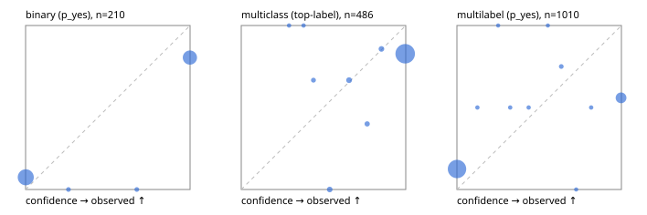

# Evaluation report

- model `Qwen/Qwen3-4B-Instruct-2507` @ `cdbee75f17` (shared-prefix tree (tree-v1)), adapter/checkpoint `None`, prompt `tree-v1` (c8963d819128)
- data data/hf.jsonl, data/eval.jsonl; splits ['validation']; n=868; calibration `None`
- cuda / bfloat16; 2026-09-23T23:01:32+0000; wall 57.5s

## Overall

question accuracy 72.0%

**binary**: n 210, positives 79, accuracy 0.871, precision 0.795, recall 0.886, f1 0.838, auroc 0.940, brier 0.125, log_loss 1.854, ece 0.127

**multiclass**: n 486, accuracy 0.809, macro_f1 0.757, log_loss 3.208, brier 0.356, ece_top_label 0.173

**multilabel**: n 172, labels 1010, exact_match 0.285, micro_f1 0.534, macro_f1 0.564, label_auroc 0.839, brier 0.185, log_loss 2.675, ece 0.184

## By family

| family | n | question acc % | details |
|---|---|---|---|
| eval_adversarial | 14 | 100.0 | bin acc 100.0 F1 100.0 AUROC 1.000 ECE 0.000; mc acc 100.0 mF1 100.0 ECE 0.000; ml EM 100.0 µF1 100.0 ECE 0.000 |
| eval_agent_output | 20 | 65.0 | bin acc 66.7 F1 71.4 AUROC 0.861 ECE 0.333; mc acc 60.0 mF1 46.7 ECE 0.398; ml EM 66.7 µF1 0.0 ECE 0.249 |
| eval_evidence | 17 | 94.1 | bin acc 92.9 F1 90.9 AUROC 1.000 ECE 0.071; ml EM 100.0 µF1 100.0 ECE 0.000 |
| eval_multilabel | 12 | 50.0 | bin acc 0.0 F1 0.0 AUROC — ECE 1.000; mc acc 100.0 mF1 100.0 ECE 0.000; ml EM 44.4 µF1 87.8 ECE 0.091 |
| eval_policy | 24 | 54.2 | bin acc 66.7 F1 66.7 AUROC 0.629 ECE 0.330; mc acc 45.5 mF1 29.4 ECE 0.573; ml EM 0.0 µF1 0.0 ECE 0.750 |
| eval_routing | 16 | 93.8 | bin acc 100.0 F1 100.0 AUROC 1.000 ECE 0.001; mc acc 100.0 mF1 100.0 ECE 0.001; ml EM 0.0 µF1 0.0 ECE 0.250 |
| eval_urgency_sentiment | 15 | 86.7 | bin acc 85.7 F1 88.9 AUROC 1.000 ECE 0.143; mc acc 80.0 mF1 66.7 ECE 0.200; ml EM 100.0 µF1 100.0 ECE 0.000 |
| hf_emotions_multilabel | 150 | 23.3 | ml EM 23.3 µF1 48.3 ECE 0.194 |
| hf_intent_banking77 | 150 | 90.7 | mc acc 90.7 mF1 87.4 ECE 0.083 |
| hf_nli | 150 | 89.3 | bin acc 89.3 F1 84.0 AUROC 0.958 ECE 0.105 |
| hf_sentiment_tweets | 150 | 70.0 | mc acc 70.0 mF1 67.7 ECE 0.295 |
| hf_topic_agnews | 150 | 83.3 | mc acc 83.3 mF1 83.6 ECE 0.162 |

## by hard case

| slice | n | question acc % |
|---|---|---|
| (none) | 634 | 71.5 |
| contradiction | 63 | 93.7 |
| distractor | 20 | 75.0 |
| double_negation | 3 | 100.0 |
| evidence_end | 4 | 50.0 |
| evidence_middle | 7 | 100.0 |
| evidence_start | 3 | 66.7 |
| exception | 7 | 85.7 |
| hypothetical | 6 | 100.0 |
| injection | 16 | 68.8 |
| lexical_overlap | 13 | 92.3 |
| long_state | 26 | 65.4 |
| missing_evidence | 59 | 81.4 |
| multi_positive | 40 | 22.5 |
| multi_turn | 21 | 66.7 |
| negation | 9 | 55.6 |
| new_label_names | 5 | 20.0 |
| nota | 4 | 100.0 |
| numeric_reasoning | 13 | 53.8 |
| paraphrase | 10 | 50.0 |
| role_reversal | 7 | 57.1 |
| sarcasm | 5 | 80.0 |
| temporal_reasoning | 15 | 46.7 |
| zero_positive | 7 | 71.4 |

## by state tokens

| slice | n | question acc % |
|---|---|---|
| 00000-00127 | 796 | 72.1 |
| 00128-00511 | 46 | 73.9 |
| 00512-02047 | 26 | 65.4 |

## by candidates

| slice | n | question acc % |
|---|---|---|
| 01 | 210 | 87.1 |
| 03 | 162 | 71.0 |
| 04 | 174 | 82.2 |
| 05 | 13 | 61.5 |
| 06 | 159 | 25.2 |
| 08 | 150 | 90.7 |

## Paraphrase groups

5 groups; same prediction 60.0%; all correct 40.0%

## Multiclass abstention (coverage vs error on accepted)

| abstain_below | coverage % | error % |
|---|---|---|
| 0.0 | 100.0 | 19.1 |
| 0.4 | 99.6 | 19.2 |
| 0.5 | 99.0 | 19.1 |
| 0.6 | 97.5 | 17.9 |
| 0.7 | 95.7 | 17.6 |
| 0.8 | 94.7 | 17.2 |
| 0.9 | 93.2 | 17.2 |

## Reliability: binary

| bin | n | mean confidence | observed frequency |
|---|---|---|---|
| [0.0,0.1) | 121 | 0.001 | 0.074 |
| [0.2,0.3) | 1 | 0.261 | 0.000 |
| [0.6,0.7) | 1 | 0.676 | 0.000 |
| [0.9,1.0] | 87 | 0.999 | 0.805 |

## Reliability: multiclass

| bin | n | mean confidence | observed frequency |
|---|---|---|---|
| [0.2,0.3) | 1 | 0.290 | 1.000 |
| [0.3,0.4) | 1 | 0.379 | 1.000 |
| [0.4,0.5) | 3 | 0.439 | 0.667 |
| [0.5,0.6) | 7 | 0.538 | 0.000 |
| [0.6,0.7) | 9 | 0.656 | 0.667 |
| [0.7,0.8) | 5 | 0.766 | 0.400 |
| [0.8,0.9) | 7 | 0.852 | 0.857 |
| [0.9,1.0] | 453 | 0.997 | 0.828 |

## Reliability: multilabel

| bin | n | mean confidence | observed frequency |
|---|---|---|---|
| [0.0,0.1) | 809 | 0.001 | 0.125 |
| [0.1,0.2) | 2 | 0.125 | 0.500 |
| [0.2,0.3) | 1 | 0.251 | 1.000 |
| [0.3,0.4) | 2 | 0.324 | 0.500 |
| [0.4,0.5) | 2 | 0.436 | 0.500 |
| [0.5,0.6) | 1 | 0.553 | 1.000 |
| [0.6,0.7) | 4 | 0.634 | 0.750 |
| [0.7,0.8) | 1 | 0.725 | 0.000 |
| [0.8,0.9) | 2 | 0.816 | 0.500 |
| [0.9,1.0] | 186 | 0.998 | 0.559 |
