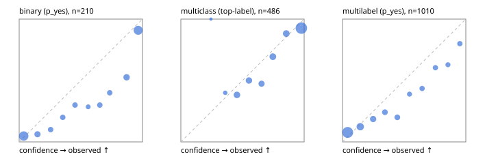

# Evaluation report

- model `Qwen/Qwen3-Reranker-4B` @ `22e683669b` (shared-prefix tree (tree-v1)), adapter/checkpoint `None`, prompt `tree-v1` (bc025ae9f6bc)
- data data/hf.jsonl, data/eval.jsonl; splits ['validation']; n=868; calibration `None`
- cuda / bfloat16; 2026-09-23T22:59:11+0000; wall 70.4s

## Overall

question accuracy 66.9%

**binary**: n 210, positives 79, accuracy 0.800, precision 0.683, recall 0.873, f1 0.767, auroc 0.912, brier 0.139, log_loss 0.437, ece 0.120

**multiclass**: n 486, accuracy 0.761, macro_f1 0.691, log_loss 0.620, brier 0.317, ece_top_label 0.062

**multilabel**: n 172, labels 1010, exact_match 0.250, micro_f1 0.563, macro_f1 0.518, label_auroc 0.794, brier 0.138, log_loss 0.447, ece 0.081

## By family

| family | n | question acc % | details |
|---|---|---|---|
| eval_adversarial | 14 | 71.4 | bin acc 57.1 F1 72.7 AUROC 0.800 ECE 0.290; mc acc 100.0 mF1 100.0 ECE 0.008; ml EM 50.0 µF1 85.7 ECE 0.097 |
| eval_agent_output | 20 | 60.0 | bin acc 66.7 F1 66.7 AUROC 0.750 ECE 0.226; mc acc 60.0 mF1 33.3 ECE 0.380; ml EM 33.3 µF1 0.0 ECE 0.476 |
| eval_evidence | 17 | 82.4 | bin acc 85.7 F1 83.3 AUROC 1.000 ECE 0.115; ml EM 66.7 µF1 88.9 ECE 0.088 |
| eval_multilabel | 12 | 33.3 | bin acc 0.0 F1 0.0 AUROC — ECE 0.633; mc acc 50.0 mF1 33.3 ECE 0.368; ml EM 33.3 µF1 81.8 ECE 0.106 |
| eval_policy | 24 | 41.7 | bin acc 58.3 F1 66.7 AUROC 0.686 ECE 0.336; mc acc 27.3 mF1 16.7 ECE 0.457; ml EM 0.0 µF1 80.0 ECE 0.280 |
| eval_routing | 16 | 75.0 | bin acc 85.7 F1 90.9 AUROC 0.900 ECE 0.200; mc acc 75.0 mF1 71.4 ECE 0.188; ml EM 0.0 µF1 0.0 ECE 0.545 |
| eval_urgency_sentiment | 15 | 66.7 | bin acc 71.4 F1 75.0 AUROC 0.917 ECE 0.302; mc acc 60.0 mF1 42.9 ECE 0.308; ml EM 66.7 µF1 66.7 ECE 0.159 |
| hf_emotions_multilabel | 150 | 22.7 | ml EM 22.7 µF1 52.3 ECE 0.077 |
| hf_intent_banking77 | 150 | 90.7 | mc acc 90.7 mF1 88.2 ECE 0.047 |
| hf_nli | 150 | 84.0 | bin acc 84.0 F1 78.2 AUROC 0.949 ECE 0.135 |
| hf_sentiment_tweets | 150 | 57.3 | mc acc 57.3 mF1 54.9 ECE 0.080 |
| hf_topic_agnews | 150 | 84.7 | mc acc 84.7 mF1 85.0 ECE 0.090 |

## by hard case

| slice | n | question acc % |
|---|---|---|
| (none) | 634 | 68.5 |
| contradiction | 63 | 87.3 |
| distractor | 20 | 55.0 |
| double_negation | 3 | 100.0 |
| evidence_end | 4 | 75.0 |
| evidence_middle | 7 | 57.1 |
| evidence_start | 3 | 66.7 |
| exception | 7 | 71.4 |
| hypothetical | 6 | 50.0 |
| injection | 16 | 62.5 |
| lexical_overlap | 13 | 76.9 |
| long_state | 26 | 50.0 |
| missing_evidence | 59 | 66.1 |
| multi_positive | 40 | 20.0 |
| multi_turn | 21 | 66.7 |
| negation | 9 | 55.6 |
| new_label_names | 5 | 20.0 |
| nota | 4 | 25.0 |
| numeric_reasoning | 13 | 53.8 |
| paraphrase | 10 | 40.0 |
| role_reversal | 7 | 28.6 |
| sarcasm | 5 | 40.0 |
| temporal_reasoning | 15 | 40.0 |
| zero_positive | 7 | 42.9 |

## by state tokens

| slice | n | question acc % |
|---|---|---|
| 00000-00127 | 796 | 67.3 |
| 00128-00511 | 46 | 69.6 |
| 00512-02047 | 26 | 50.0 |

## by candidates

| slice | n | question acc % |
|---|---|---|
| 01 | 210 | 80.0 |
| 03 | 162 | 57.4 |
| 04 | 174 | 80.5 |
| 05 | 13 | 46.2 |
| 06 | 159 | 23.9 |
| 08 | 150 | 90.7 |

## Paraphrase groups

5 groups; same prediction 60.0%; all correct 40.0%

## Multiclass abstention (coverage vs error on accepted)

| abstain_below | coverage % | error % |
|---|---|---|
| 0.0 | 100.0 | 23.9 |
| 0.4 | 97.7 | 23.2 |
| 0.5 | 88.1 | 18.9 |
| 0.6 | 79.0 | 15.4 |
| 0.7 | 71.2 | 11.3 |
| 0.8 | 61.1 | 8.1 |
| 0.9 | 50.6 | 7.3 |

## Reliability: binary

| bin | n | mean confidence | observed frequency |
|---|---|---|---|
| [0.0,0.1) | 63 | 0.037 | 0.048 |
| [0.1,0.2) | 16 | 0.149 | 0.062 |
| [0.2,0.3) | 10 | 0.255 | 0.100 |
| [0.3,0.4) | 10 | 0.354 | 0.200 |
| [0.4,0.5) | 10 | 0.453 | 0.300 |
| [0.5,0.6) | 7 | 0.560 | 0.286 |
| [0.6,0.7) | 10 | 0.654 | 0.300 |
| [0.7,0.8) | 10 | 0.735 | 0.400 |
| [0.8,0.9) | 19 | 0.871 | 0.526 |
| [0.9,1.0] | 55 | 0.965 | 0.909 |

## Reliability: multiclass

| bin | n | mean confidence | observed frequency |
|---|---|---|---|
| [0.2,0.3) | 1 | 0.244 | 1.000 |
| [0.3,0.4) | 10 | 0.360 | 0.400 |
| [0.4,0.5) | 47 | 0.455 | 0.383 |
| [0.5,0.6) | 44 | 0.552 | 0.500 |
| [0.6,0.7) | 38 | 0.655 | 0.474 |
| [0.7,0.8) | 49 | 0.746 | 0.694 |
| [0.8,0.9) | 51 | 0.855 | 0.882 |
| [0.9,1.0] | 246 | 0.977 | 0.927 |

## Reliability: multilabel

| bin | n | mean confidence | observed frequency |
|---|---|---|---|
| [0.0,0.1) | 452 | 0.041 | 0.077 |
| [0.1,0.2) | 145 | 0.144 | 0.124 |
| [0.2,0.3) | 86 | 0.248 | 0.186 |
| [0.3,0.4) | 62 | 0.344 | 0.242 |
| [0.4,0.5) | 60 | 0.444 | 0.200 |
| [0.5,0.6) | 36 | 0.543 | 0.389 |
| [0.6,0.7) | 46 | 0.646 | 0.435 |
| [0.7,0.8) | 43 | 0.753 | 0.605 |
| [0.8,0.9) | 35 | 0.855 | 0.629 |
| [0.9,1.0] | 45 | 0.952 | 0.800 |
