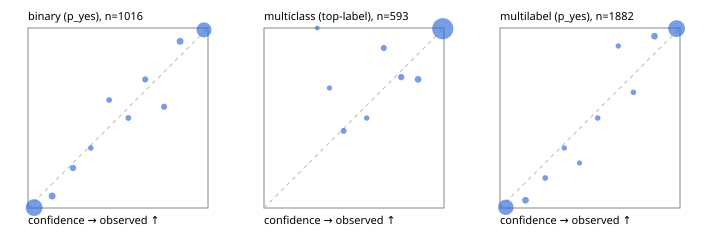

# Evaluation report

- model `Qwen/Qwen3.5-4B` @ `851bf6e806` (shared-prefix tree, forward only: text once per request, each question once, then each candidate), adapter/checkpoint `runs/verdict_json_only_v1/run/adapter`, prompt `challenger-state-first-v1` (6c9d8459ac44)
- data data/ova/eval2.jsonl; splits ['test']; n=1991; calibration `None`
- cuda / bfloat16; 2026-10-01T21:45:11+0000; wall 687.2s

## Overall

question accuracy 95.8%

**binary**: n 1016, positives 435, accuracy 0.963, precision 0.950, recall 0.963, f1 0.957, auroc 0.995, brier 0.027, log_loss 0.105, ece 0.031

**multiclass**: n 593, accuracy 0.971, macro_f1 0.949, log_loss 0.093, brier 0.047, ece_top_label 0.014

**multilabel**: n 382, labels 1882, exact_match 0.927, micro_f1 0.984, macro_f1 0.969, label_auroc 0.998, brier 0.014, log_loss 0.067, ece 0.028

## By family

| family | n | question acc % | details |
|---|---|---|---|
| e2_hard | 673 | 93.9 | bin acc 94.5 F1 92.4 AUROC 0.993 ECE 0.044; mc acc 95.9 mF1 91.0 ECE 0.036; ml EM 89.4 µF1 97.3 ECE 0.030 |
| e2_simple | 664 | 98.5 | bin acc 97.7 F1 97.9 AUROC 0.996 ECE 0.022; mc acc 100.0 mF1 100.0 ECE 0.007; ml EM 98.3 µF1 99.7 ECE 0.029 |
| e2_very_hard | 654 | 95.1 | bin acc 96.6 F1 95.6 AUROC 0.994 ECE 0.045; mc acc 95.5 mF1 93.7 ECE 0.013; ml EM 90.8 µF1 98.3 ECE 0.035 |

## by hard case

| slice | n | question acc % |
|---|---|---|
| (none) | 569 | 98.4 |
| contradiction | 172 | 97.7 |
| distractor | 474 | 95.4 |
| double_negation | 126 | 100.0 |
| evidence_end | 57 | 100.0 |
| evidence_middle | 114 | 98.2 |
| evidence_start | 17 | 100.0 |
| exception | 213 | 95.3 |
| hypothetical | 128 | 95.3 |
| injection | 151 | 98.0 |
| lexical_overlap | 201 | 98.0 |
| long_state | 191 | 98.4 |
| missing_evidence | 141 | 97.2 |
| multi_positive | 322 | 92.9 |
| multi_turn | 149 | 93.3 |
| negation | 257 | 97.7 |
| nota | 118 | 94.9 |
| numeric_reasoning | 224 | 88.4 |
| paraphrase | 218 | 94.5 |
| role_reversal | 187 | 95.2 |
| sarcasm | 149 | 97.3 |
| temporal_reasoning | 203 | 84.2 |
| zero_positive | 73 | 94.5 |
| zero_positive_distractor | 1 | 100.0 |

## by state tokens

| slice | n | question acc % |
|---|---|---|
| 00000-00127 | 666 | 94.4 |
| 00128-00511 | 469 | 94.2 |
| 00512-02047 | 488 | 97.1 |
| 02048-08191 | 329 | 98.5 |
| 08192+ | 39 | 100.0 |

## by candidates

| slice | n | question acc % |
|---|---|---|
| 01 | 1016 | 96.3 |
| 03 | 128 | 96.9 |
| 04 | 515 | 95.5 |
| 05 | 224 | 94.2 |
| 06 | 86 | 96.5 |
| 07 | 18 | 94.4 |
| 08 | 4 | 75.0 |

## Paraphrase groups

76 groups; same prediction 82.9%; all correct 89.5%

## Multiclass abstention (coverage vs error on accepted)

| abstain_below | coverage % | error % |
|---|---|---|
| 0.0 | 100.0 | 2.9 |
| 0.4 | 99.3 | 2.7 |
| 0.5 | 98.1 | 2.1 |
| 0.6 | 97.5 | 1.7 |
| 0.7 | 96.0 | 1.6 |
| 0.8 | 94.1 | 1.1 |
| 0.9 | 91.7 | 0.4 |

## Reliability: binary

| bin | n | mean confidence | observed frequency |
|---|---|---|---|
| [0.0,0.1) | 508 | 0.034 | 0.002 |
| [0.1,0.2) | 30 | 0.134 | 0.067 |
| [0.2,0.3) | 18 | 0.250 | 0.222 |
| [0.3,0.4) | 9 | 0.349 | 0.333 |
| [0.4,0.5) | 10 | 0.451 | 0.600 |
| [0.5,0.6) | 10 | 0.558 | 0.500 |
| [0.6,0.7) | 14 | 0.651 | 0.714 |
| [0.7,0.8) | 16 | 0.756 | 0.562 |
| [0.8,0.9) | 27 | 0.845 | 0.926 |
| [0.9,1.0] | 374 | 0.978 | 0.989 |

## Reliability: multiclass

| bin | n | mean confidence | observed frequency |
|---|---|---|---|
| [0.2,0.3) | 1 | 0.295 | 1.000 |
| [0.3,0.4) | 3 | 0.364 | 0.667 |
| [0.4,0.5) | 7 | 0.443 | 0.429 |
| [0.5,0.6) | 4 | 0.571 | 0.500 |
| [0.6,0.7) | 9 | 0.665 | 0.889 |
| [0.7,0.8) | 11 | 0.762 | 0.727 |
| [0.8,0.9) | 14 | 0.856 | 0.714 |
| [0.9,1.0] | 544 | 0.993 | 0.996 |

## Reliability: multilabel

| bin | n | mean confidence | observed frequency |
|---|---|---|---|
| [0.0,0.1) | 768 | 0.032 | 0.004 |
| [0.1,0.2) | 47 | 0.142 | 0.043 |
| [0.2,0.3) | 18 | 0.251 | 0.167 |
| [0.3,0.4) | 12 | 0.357 | 0.333 |
| [0.4,0.5) | 8 | 0.442 | 0.250 |
| [0.5,0.6) | 14 | 0.543 | 0.500 |
| [0.6,0.7) | 10 | 0.657 | 0.900 |
| [0.7,0.8) | 14 | 0.741 | 0.643 |
| [0.8,0.9) | 44 | 0.858 | 0.955 |
| [0.9,1.0] | 947 | 0.981 | 0.997 |
