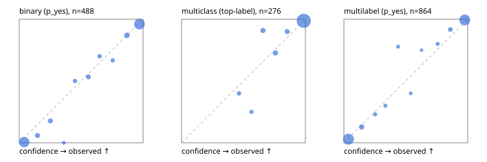

# Evaluation report

- model `Qwen/Qwen3.5-4B` @ `851bf6e806` (shared-prefix tree, forward only: text once per request, each question once, then each candidate), adapter/checkpoint `runs/verdict_json_only_v1/run/adapter`, prompt `challenger-state-first-v1` (6c9d8459ac44)
- data data/ova/eval_llm.jsonl; splits ['test']; n=946; calibration `None`
- cuda / bfloat16; 2026-10-01T21:49:17+0000; wall 234.7s

## Overall

question accuracy 92.2%

**binary**: n 488, positives 245, accuracy 0.932, precision 0.908, recall 0.963, f1 0.935, auroc 0.981, brier 0.051, log_loss 0.184, ece 0.030

**multiclass**: n 276, accuracy 0.949, macro_f1 0.929, log_loss 0.151, brier 0.076, ece_top_label 0.019

**multilabel**: n 182, labels 864, exact_match 0.852, micro_f1 0.953, macro_f1 0.915, label_auroc 0.989, brier 0.034, log_loss 0.130, ece 0.020

## By family

| family | n | question acc % | details |
|---|---|---|---|
| tllm_guardrail_hard | 60 | 93.3 | bin acc 93.8 F1 93.3 AUROC 0.996 ECE 0.100; mc acc 100.0 mF1 100.0 ECE 0.046; ml EM 81.8 µF1 95.0 ECE 0.082 |
| tllm_guardrail_simple | 67 | 98.5 | bin acc 100.0 F1 100.0 AUROC 1.000 ECE 0.029; mc acc 100.0 mF1 100.0 ECE 0.028; ml EM 92.9 µF1 98.5 ECE 0.047 |
| tllm_guardrail_very_hard | 43 | 95.3 | bin acc 95.0 F1 95.7 AUROC 1.000 ECE 0.113; mc acc 92.9 mF1 83.3 ECE 0.062; ml EM 100.0 µF1 100.0 ECE 0.048 |
| tllm_jailbreak_hard | 59 | 100.0 | bin acc 100.0 F1 100.0 AUROC 1.000 ECE 0.067; mc acc 100.0 mF1 100.0 ECE 0.059; ml EM 100.0 µF1 100.0 ECE 0.049 |
| tllm_jailbreak_simple | 70 | 97.1 | bin acc 100.0 F1 100.0 AUROC 1.000 ECE 0.035; mc acc 95.5 mF1 92.5 ECE 0.056; ml EM 90.9 µF1 98.6 ECE 0.035 |
| tllm_jailbreak_very_hard | 60 | 88.3 | bin acc 87.5 F1 85.7 AUROC 0.976 ECE 0.104; mc acc 94.4 mF1 91.7 ECE 0.067; ml EM 80.0 µF1 96.3 ECE 0.061 |
| tllm_judge_hard | 86 | 96.5 | bin acc 95.0 F1 93.3 AUROC 0.965 ECE 0.087; mc acc 100.0 mF1 100.0 ECE 0.022; ml EM 95.2 µF1 96.2 ECE 0.029 |
| tllm_judge_simple | 72 | 97.2 | bin acc 97.4 F1 97.9 AUROC 0.997 ECE 0.045; mc acc 100.0 mF1 100.0 ECE 0.037; ml EM 92.9 µF1 98.8 ECE 0.046 |
| tllm_judge_very_hard | 64 | 92.2 | bin acc 96.9 F1 97.3 AUROC 0.996 ECE 0.047; mc acc 95.2 mF1 96.7 ECE 0.048; ml EM 72.7 µF1 94.3 ECE 0.056 |
| tllm_score_hard | 62 | 93.5 | bin acc 94.1 F1 94.1 AUROC 1.000 ECE 0.104; mc acc 100.0 mF1 100.0 ECE 0.064; ml EM 83.3 µF1 96.0 ECE 0.074 |
| tllm_score_simple | 62 | 96.8 | bin acc 97.1 F1 98.0 AUROC 1.000 ECE 0.048; mc acc 100.0 mF1 100.0 ECE 0.047; ml EM 91.7 µF1 98.5 ECE 0.045 |
| tllm_score_very_hard | 76 | 77.6 | bin acc 81.6 F1 72.0 AUROC 0.960 ECE 0.151; mc acc 81.8 mF1 70.0 ECE 0.093; ml EM 62.5 µF1 82.5 ECE 0.078 |
| tllm_verify_hard | 50 | 76.0 | bin acc 80.8 F1 80.0 AUROC 0.885 ECE 0.166; mc acc 75.0 mF1 64.7 ECE 0.213; ml EM 62.5 µF1 74.1 ECE 0.158 |
| tllm_verify_simple | 60 | 96.7 | bin acc 100.0 F1 100.0 AUROC 1.000 ECE 0.046; mc acc 100.0 mF1 100.0 ECE 0.005; ml EM 83.3 µF1 97.0 ECE 0.050 |
| tllm_verify_very_hard | 55 | 80.0 | bin acc 77.4 F1 74.1 AUROC 0.855 ECE 0.196; mc acc 86.7 mF1 82.2 ECE 0.155; ml EM 77.8 µF1 88.9 ECE 0.042 |

## by hard case

| slice | n | question acc % |
|---|---|---|
| (none) | 265 | 97.4 |
| answer_trace_mismatch | 45 | 88.9 |
| benign_lookalike | 88 | 90.9 |
| confident_wrong | 39 | 69.2 |
| contradiction | 22 | 95.5 |
| distractor | 117 | 88.9 |
| double_negation | 3 | 100.0 |
| evidence_end | 11 | 100.0 |
| evidence_middle | 20 | 80.0 |
| evidence_start | 2 | 50.0 |
| exception | 20 | 95.0 |
| fake_authority | 1 | 100.0 |
| flawed_step | 44 | 56.8 |
| format_near_miss | 46 | 82.6 |
| gradual_escalation | 1 | 100.0 |
| hypothetical | 7 | 100.0 |
| indirect_injection | 25 | 96.0 |
| injection | 22 | 100.0 |
| judge_injection | 112 | 92.0 |
| length_bias | 7 | 100.0 |
| lexical_overlap | 103 | 88.3 |
| long_state | 74 | 90.5 |
| missing_evidence | 35 | 94.3 |
| multi_positive | 124 | 83.1 |
| multi_turn | 44 | 84.1 |
| negation | 62 | 93.5 |
| nota | 55 | 90.9 |
| numeric_reasoning | 109 | 76.1 |
| obfuscation | 1 | 100.0 |
| over_refusal | 50 | 90.0 |
| paraphrase | 73 | 90.4 |
| partial_compliance | 31 | 80.6 |
| role_reversal | 6 | 66.7 |
| sarcasm | 8 | 87.5 |
| speaker_confusion | 58 | 93.1 |
| subtle_violation | 16 | 100.0 |
| sycophancy | 13 | 100.0 |
| temporal_reasoning | 20 | 85.0 |
| tool_misuse | 6 | 83.3 |
| unsupported_claim | 96 | 90.6 |
| zero_positive | 55 | 94.5 |
| zero_positive_partial | 1 | 100.0 |

## by state tokens

| slice | n | question acc % |
|---|---|---|
| 00000-00127 | 308 | 89.3 |
| 00128-00511 | 284 | 96.1 |
| 00512-02047 | 222 | 92.8 |
| 02048-08191 | 125 | 88.8 |
| 08192+ | 7 | 100.0 |

## by candidates

| slice | n | question acc % |
|---|---|---|
| 01 | 488 | 93.2 |
| 03 | 82 | 93.9 |
| 04 | 239 | 94.1 |
| 05 | 98 | 83.7 |
| 06 | 33 | 84.8 |
| 07 | 3 | 100.0 |
| 08 | 3 | 66.7 |

## Paraphrase groups

29 groups; same prediction 96.6%; all correct 89.7%

## Multiclass abstention (coverage vs error on accepted)

| abstain_below | coverage % | error % |
|---|---|---|
| 0.0 | 100.0 | 5.1 |
| 0.4 | 100.0 | 5.1 |
| 0.5 | 98.2 | 4.1 |
| 0.6 | 96.7 | 3.0 |
| 0.7 | 92.8 | 2.7 |
| 0.8 | 88.8 | 1.6 |
| 0.9 | 85.1 | 1.3 |

## Reliability: binary

| bin | n | mean confidence | observed frequency |
|---|---|---|---|
| [0.0,0.1) | 182 | 0.040 | 0.005 |
| [0.1,0.2) | 17 | 0.147 | 0.059 |
| [0.2,0.3) | 17 | 0.251 | 0.176 |
| [0.3,0.4) | 4 | 0.360 | 0.000 |
| [0.4,0.5) | 8 | 0.450 | 0.500 |
| [0.5,0.6) | 15 | 0.558 | 0.533 |
| [0.6,0.7) | 10 | 0.649 | 0.700 |
| [0.7,0.8) | 9 | 0.755 | 0.667 |
| [0.8,0.9) | 23 | 0.869 | 0.870 |
| [0.9,1.0] | 203 | 0.970 | 0.961 |

## Reliability: multiclass

| bin | n | mean confidence | observed frequency |
|---|---|---|---|
| [0.4,0.5) | 5 | 0.464 | 0.400 |
| [0.5,0.6) | 4 | 0.564 | 0.250 |
| [0.6,0.7) | 11 | 0.657 | 0.909 |
| [0.7,0.8) | 11 | 0.758 | 0.727 |
| [0.8,0.9) | 10 | 0.853 | 0.900 |
| [0.9,1.0] | 235 | 0.987 | 0.987 |

## Reliability: multilabel

| bin | n | mean confidence | observed frequency |
|---|---|---|---|
| [0.0,0.1) | 384 | 0.036 | 0.029 |
| [0.1,0.2) | 39 | 0.143 | 0.128 |
| [0.2,0.3) | 13 | 0.252 | 0.231 |
| [0.3,0.4) | 10 | 0.335 | 0.300 |
| [0.4,0.5) | 9 | 0.438 | 0.778 |
| [0.5,0.6) | 5 | 0.539 | 0.400 |
| [0.6,0.7) | 4 | 0.627 | 0.750 |
| [0.7,0.8) | 10 | 0.757 | 0.800 |
| [0.8,0.9) | 24 | 0.859 | 0.917 |
| [0.9,1.0] | 366 | 0.976 | 0.995 |
