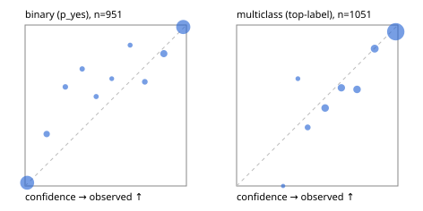

# Evaluation report

- model `Qwen/Qwen3.5-4B` @ `851bf6e806` (shared-prefix tree, forward only: text once per request, each question once, then each candidate), adapter/checkpoint `runs/verdict_json_only_v1/run/adapter`, prompt `challenger-state-first-v1` (6c9d8459ac44)
- data data/ova/eval_images_v1.jsonl; splits ['test']; n=2002; calibration `None`
- cuda / bfloat16; 2026-10-01T21:52:31+0000; wall 183.2s

## Overall

question accuracy 89.9%

**binary**: n 951, positives 508, accuracy 0.936, precision 0.955, recall 0.923, f1 0.939, auroc 0.986, brier 0.047, log_loss 0.160, ece 0.029

**multiclass**: n 1051, accuracy 0.866, macro_f1 0.930, log_loss 0.360, brier 0.191, ece_top_label 0.039

## By family

| family | n | question acc % | details |
|---|---|---|---|
| img_beans | 204 | 96.1 | bin acc 97.1 F1 97.1 AUROC 0.993 ECE 0.030; mc acc 95.1 mF1 95.1 ECE 0.025 |
| img_eurosat | 200 | 88.5 | bin acc 92.0 F1 92.0 AUROC 0.980 ECE 0.049; mc acc 85.0 mF1 84.4 ECE 0.039 |
| img_fashion | 200 | 87.0 | bin acc 93.0 F1 92.9 AUROC 0.979 ECE 0.054; mc acc 81.0 mF1 81.0 ECE 0.084 |
| img_hurricane | 100 | 60.0 | mc acc 60.0 mF1 59.2 ECE 0.258 |
| img_indoor | 268 | 95.5 | bin acc 95.5 F1 95.4 AUROC 0.996 ECE 0.045; mc acc 95.5 mF1 95.3 ECE 0.014 |
| img_painting | 204 | 71.1 | bin acc 79.4 F1 77.4 AUROC 0.928 ECE 0.140; mc acc 62.7 mF1 57.6 ECE 0.121 |
| img_pets | 222 | 97.3 | bin acc 96.4 F1 97.3 AUROC 0.999 ECE 0.036; mc acc 98.2 mF1 98.1 ECE 0.020 |
| img_rice | 200 | 95.0 | bin acc 95.0 F1 95.1 AUROC 0.988 ECE 0.055; mc acc 95.0 mF1 95.0 ECE 0.046 |
| img_snacks | 200 | 95.5 | bin acc 96.0 F1 96.6 AUROC 0.995 ECE 0.067; mc acc 95.0 mF1 95.0 ECE 0.065 |
| img_trash | 204 | 95.6 | bin acc 97.1 F1 97.2 AUROC 0.998 ECE 0.046; mc acc 94.1 mF1 94.1 ECE 0.034 |

## by hard case

| slice | n | question acc % |
|---|---|---|
| (none) | 2002 | 89.9 |

## by state tokens

| slice | n | question acc % |
|---|---|---|
| 00000-00127 | 2002 | 89.9 |

## by candidates

| slice | n | question acc % |
|---|---|---|
| 01 | 951 | 93.6 |
| 02 | 100 | 60.0 |
| 03 | 102 | 95.1 |
| 05 | 100 | 95.0 |
| 06 | 102 | 94.1 |
| 10 | 200 | 83.0 |
| 12 | 447 | 88.6 |

## Paraphrase groups

0 groups; same prediction —%; all correct —%

## Multiclass abstention (coverage vs error on accepted)

| abstain_below | coverage % | error % |
|---|---|---|
| 0.0 | 100.0 | 13.4 |
| 0.4 | 99.2 | 13.1 |
| 0.5 | 97.1 | 12.0 |
| 0.6 | 91.1 | 9.4 |
| 0.7 | 85.4 | 7.5 |
| 0.8 | 79.7 | 5.1 |
| 0.9 | 72.6 | 4.2 |

## Reliability: binary

| bin | n | mean confidence | observed frequency |
|---|---|---|---|
| [0.0,0.1) | 396 | 0.013 | 0.020 |
| [0.1,0.2) | 31 | 0.134 | 0.323 |
| [0.2,0.3) | 13 | 0.249 | 0.615 |
| [0.3,0.4) | 11 | 0.354 | 0.727 |
| [0.4,0.5) | 9 | 0.440 | 0.556 |
| [0.5,0.6) | 6 | 0.537 | 0.667 |
| [0.6,0.7) | 8 | 0.651 | 0.875 |
| [0.7,0.8) | 17 | 0.742 | 0.647 |
| [0.8,0.9) | 45 | 0.860 | 0.822 |
| [0.9,1.0] | 415 | 0.981 | 0.988 |

## Reliability: multiclass

| bin | n | mean confidence | observed frequency |
|---|---|---|---|
| [0.2,0.3) | 2 | 0.288 | 0.000 |
| [0.3,0.4) | 6 | 0.380 | 0.667 |
| [0.4,0.5) | 22 | 0.441 | 0.364 |
| [0.5,0.6) | 64 | 0.549 | 0.484 |
| [0.6,0.7) | 59 | 0.649 | 0.610 |
| [0.7,0.8) | 60 | 0.747 | 0.600 |
| [0.8,0.9) | 75 | 0.856 | 0.853 |
| [0.9,1.0] | 763 | 0.987 | 0.958 |
