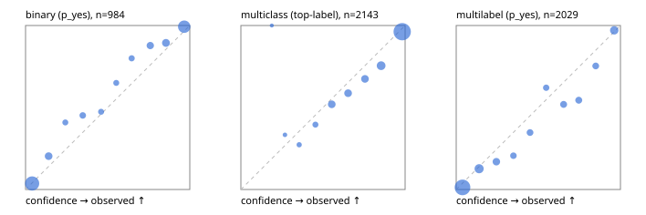

# Evaluation report

- model `Qwen/Qwen3.5-4B` @ `851bf6e806` (shared-prefix tree, forward only: text once per request, each question once, then each candidate), adapter/checkpoint `runs/verdict_json_only_v1/run/adapter`, prompt `challenger-state-first-v1` (6c9d8459ac44)
- data data/ova/hf.jsonl, data/ova/eval.jsonl; splits ['test']; n=3471; calibration `None`
- cuda / bfloat16; 2026-10-01T21:56:31+0000; wall 228.2s

## Overall

question accuracy 83.8%

**binary**: n 984, positives 475, accuracy 0.913, precision 0.939, recall 0.876, f1 0.906, auroc 0.971, brier 0.067, log_loss 0.229, ece 0.034

**multiclass**: n 2143, accuracy 0.855, macro_f1 0.943, log_loss 0.425, brier 0.211, ece_top_label 0.037

**multilabel**: n 344, labels 2029, exact_match 0.512, micro_f1 0.755, macro_f1 0.848, label_auroc 0.941, brier 0.079, log_loss 0.258, ece 0.047

## By family

| family | n | question acc % | details |
|---|---|---|---|
| eval_adversarial | 27 | 96.3 | bin acc 93.3 F1 90.9 AUROC 0.963 ECE 0.050; mc acc 100.0 mF1 100.0 ECE 0.002; ml EM 100.0 µF1 100.0 ECE 0.040 |
| eval_agent_output | 26 | 96.2 | bin acc 100.0 F1 100.0 AUROC 1.000 ECE 0.072; mc acc 100.0 mF1 100.0 ECE 0.110; ml EM 80.0 µF1 94.1 ECE 0.084 |
| eval_evidence | 17 | 88.2 | bin acc 100.0 F1 100.0 AUROC 1.000 ECE 0.026; ml EM 0.0 µF1 57.1 ECE 0.274 |
| eval_multilabel | 32 | 93.8 | bin acc 85.7 F1 80.0 AUROC 1.000 ECE 0.104; mc acc 100.0 mF1 100.0 ECE 0.063; ml EM 95.8 µF1 99.0 ECE 0.035 |
| eval_policy | 22 | 72.7 | bin acc 76.9 F1 76.9 AUROC 0.881 ECE 0.178; mc acc 60.0 mF1 42.9 ECE 0.312; ml EM 75.0 µF1 94.1 ECE 0.100 |
| eval_routing | 25 | 96.0 | bin acc 100.0 F1 100.0 AUROC 1.000 ECE 0.023; mc acc 100.0 mF1 100.0 ECE 0.053; ml EM 50.0 µF1 80.0 ECE 0.145 |
| eval_urgency_sentiment | 22 | 95.5 | bin acc 90.0 F1 92.3 AUROC 0.958 ECE 0.152; mc acc 100.0 mF1 100.0 ECE 0.042; ml EM 100.0 µF1 100.0 ECE 0.028 |
| heldout_boolq | 300 | 87.7 | bin acc 87.7 F1 89.2 AUROC 0.953 ECE 0.063 |
| heldout_emotion_multiclass | 300 | 57.0 | mc acc 57.0 mF1 46.8 ECE 0.175 |
| heldout_intent_clinc | 300 | 97.3 | mc acc 97.3 mF1 97.4 ECE 0.014 |
| heldout_question_type_trec | 300 | 90.3 | mc acc 90.3 mF1 90.5 ECE 0.043 |
| heldout_sentiment_sst2 | 300 | 91.7 | bin acc 91.7 F1 91.2 AUROC 0.982 ECE 0.081 |
| heldout_topic_dbpedia | 300 | 98.3 | mc acc 98.3 mF1 98.2 ECE 0.013 |
| hf_emotions_multilabel | 300 | 46.0 | ml EM 46.0 µF1 70.6 ECE 0.049 |
| hf_intent_banking77 | 300 | 96.7 | mc acc 96.7 mF1 96.6 ECE 0.023 |
| hf_nli | 300 | 94.0 | bin acc 94.0 F1 91.7 AUROC 0.981 ECE 0.046 |
| hf_sentiment_tweets | 300 | 67.3 | mc acc 67.3 mF1 68.5 ECE 0.095 |
| hf_topic_agnews | 300 | 90.3 | mc acc 90.3 mF1 90.3 ECE 0.051 |

## by hard case

| slice | n | question acc % |
|---|---|---|
| (none) | 3042 | 83.3 |
| contradiction | 107 | 99.1 |
| distractor | 33 | 78.8 |
| double_negation | 6 | 83.3 |
| evidence_end | 13 | 92.3 |
| evidence_middle | 11 | 81.8 |
| evidence_start | 9 | 100.0 |
| exception | 7 | 57.1 |
| hypothetical | 7 | 100.0 |
| injection | 10 | 100.0 |
| lexical_overlap | 20 | 100.0 |
| long_state | 50 | 88.0 |
| missing_evidence | 104 | 91.3 |
| multi_positive | 81 | 53.1 |
| multi_turn | 9 | 88.9 |
| negation | 30 | 100.0 |
| new_label_names | 3 | 100.0 |
| nota | 46 | 100.0 |
| numeric_reasoning | 16 | 75.0 |
| paraphrase | 22 | 95.5 |
| role_reversal | 15 | 93.3 |
| sarcasm | 12 | 100.0 |
| temporal_reasoning | 29 | 72.4 |
| zero_positive | 6 | 83.3 |

## by state tokens

| slice | n | question acc % |
|---|---|---|
| 00000-00127 | 3213 | 83.3 |
| 00128-00511 | 206 | 88.8 |
| 00512-02047 | 52 | 88.5 |

## by candidates

| slice | n | question acc % |
|---|---|---|
| 01 | 984 | 91.3 |
| 03 | 310 | 68.4 |
| 04 | 333 | 89.8 |
| 05 | 22 | 95.5 |
| 06 | 1218 | 73.2 |
| 07 | 49 | 100.0 |
| 08 | 555 | 96.8 |

## Paraphrase groups

11 groups; same prediction 72.7%; all correct 90.9%

## Multiclass abstention (coverage vs error on accepted)

| abstain_below | coverage % | error % |
|---|---|---|
| 0.0 | 100.0 | 14.5 |
| 0.4 | 98.6 | 13.7 |
| 0.5 | 96.4 | 12.6 |
| 0.6 | 90.5 | 10.3 |
| 0.7 | 84.6 | 8.2 |
| 0.8 | 78.7 | 6.3 |
| 0.9 | 69.0 | 3.8 |

## Reliability: binary

| bin | n | mean confidence | observed frequency |
|---|---|---|---|
| [0.0,0.1) | 410 | 0.040 | 0.037 |
| [0.1,0.2) | 59 | 0.141 | 0.203 |
| [0.2,0.3) | 22 | 0.242 | 0.409 |
| [0.3,0.4) | 31 | 0.348 | 0.452 |
| [0.4,0.5) | 19 | 0.460 | 0.474 |
| [0.5,0.6) | 20 | 0.552 | 0.650 |
| [0.6,0.7) | 25 | 0.646 | 0.800 |
| [0.7,0.8) | 49 | 0.759 | 0.878 |
| [0.8,0.9) | 66 | 0.855 | 0.894 |
| [0.9,1.0] | 283 | 0.966 | 0.993 |

## Reliability: multiclass

| bin | n | mean confidence | observed frequency |
|---|---|---|---|
| [0.1,0.2) | 1 | 0.188 | 1.000 |
| [0.2,0.3) | 6 | 0.268 | 0.333 |
| [0.3,0.4) | 22 | 0.355 | 0.273 |
| [0.4,0.5) | 48 | 0.454 | 0.396 |
| [0.5,0.6) | 127 | 0.553 | 0.520 |
| [0.6,0.7) | 126 | 0.653 | 0.587 |
| [0.7,0.8) | 126 | 0.756 | 0.675 |
| [0.8,0.9) | 208 | 0.854 | 0.755 |
| [0.9,1.0] | 1479 | 0.982 | 0.962 |

## Reliability: multilabel

| bin | n | mean confidence | observed frequency |
|---|---|---|---|
| [0.0,0.1) | 1090 | 0.039 | 0.013 |
| [0.1,0.2) | 229 | 0.140 | 0.127 |
| [0.2,0.3) | 112 | 0.244 | 0.170 |
| [0.3,0.4) | 68 | 0.348 | 0.206 |
| [0.4,0.5) | 72 | 0.450 | 0.347 |
| [0.5,0.6) | 58 | 0.548 | 0.621 |
| [0.6,0.7) | 79 | 0.654 | 0.519 |
| [0.7,0.8) | 79 | 0.746 | 0.544 |
| [0.8,0.9) | 73 | 0.849 | 0.753 |
| [0.9,1.0] | 169 | 0.962 | 0.970 |
