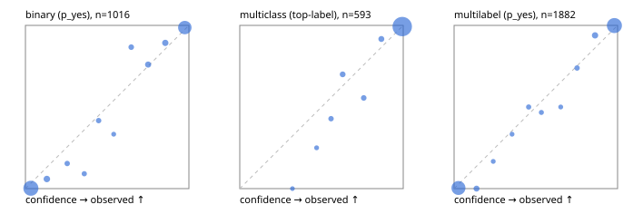

# Evaluation report

- model `Qwen/Qwen3.5-4B` @ `851bf6e806` (shared-prefix tree, forward only: text once per request, each question once, then each candidate), adapter/checkpoint `runs/verdict_json_v1/run/adapter`, prompt `challenger-state-first-v1` (6c9d8459ac44)
- data data/ova/eval2.jsonl; splits ['test']; n=1991; calibration `None`
- cuda / bfloat16; 2026-10-01T13:36:26+0000; wall 328.1s

## Overall

question accuracy 95.6%

**binary**: n 1016, positives 435, accuracy 0.969, precision 0.955, recall 0.975, f1 0.965, auroc 0.995, brier 0.026, log_loss 0.105, ece 0.032

**multiclass**: n 593, accuracy 0.963, macro_f1 0.939, log_loss 0.096, brier 0.050, ece_top_label 0.011

**multilabel**: n 382, labels 1882, exact_match 0.908, micro_f1 0.980, macro_f1 0.960, label_auroc 0.998, brier 0.016, log_loss 0.069, ece 0.026

## By family

| family | n | question acc % | details |
|---|---|---|---|
| e2_hard | 673 | 94.2 | bin acc 97.1 F1 96.1 AUROC 0.995 ECE 0.054; mc acc 94.8 mF1 89.3 ECE 0.023; ml EM 85.6 µF1 96.2 ECE 0.028 |
| e2_simple | 664 | 98.2 | bin acc 97.1 F1 97.3 AUROC 0.996 ECE 0.020; mc acc 100.0 mF1 100.0 ECE 0.006; ml EM 98.3 µF1 99.7 ECE 0.024 |
| e2_very_hard | 654 | 94.3 | bin acc 96.6 F1 95.6 AUROC 0.996 ECE 0.044; mc acc 94.0 mF1 92.4 ECE 0.026; ml EM 89.2 µF1 97.9 ECE 0.031 |

## by hard case

| slice | n | question acc % |
|---|---|---|
| (none) | 569 | 98.1 |
| contradiction | 172 | 97.7 |
| distractor | 474 | 94.1 |
| double_negation | 126 | 99.2 |
| evidence_end | 57 | 100.0 |
| evidence_middle | 114 | 99.1 |
| evidence_start | 17 | 100.0 |
| exception | 213 | 94.4 |
| hypothetical | 128 | 95.3 |
| injection | 151 | 94.7 |
| lexical_overlap | 201 | 98.5 |
| long_state | 191 | 99.0 |
| missing_evidence | 141 | 98.6 |
| multi_positive | 322 | 91.0 |
| multi_turn | 149 | 91.9 |
| negation | 257 | 97.3 |
| nota | 118 | 92.4 |
| numeric_reasoning | 224 | 87.9 |
| paraphrase | 218 | 94.5 |
| role_reversal | 187 | 95.2 |
| sarcasm | 149 | 96.0 |
| temporal_reasoning | 203 | 86.2 |
| zero_positive | 73 | 95.9 |
| zero_positive_distractor | 1 | 100.0 |

## by state tokens

| slice | n | question acc % |
|---|---|---|
| 00000-00127 | 666 | 94.3 |
| 00128-00511 | 469 | 93.4 |
| 00512-02047 | 488 | 96.7 |
| 02048-08191 | 329 | 99.1 |
| 08192+ | 39 | 100.0 |

## by candidates

| slice | n | question acc % |
|---|---|---|
| 01 | 1016 | 96.9 |
| 03 | 128 | 96.1 |
| 04 | 515 | 94.8 |
| 05 | 224 | 91.1 |
| 06 | 86 | 95.3 |
| 07 | 18 | 100.0 |
| 08 | 4 | 75.0 |

## Paraphrase groups

76 groups; same prediction 80.3%; all correct 89.5%

## Multiclass abstention (coverage vs error on accepted)

| abstain_below | coverage % | error % |
|---|---|---|
| 0.0 | 100.0 | 3.7 |
| 0.4 | 99.5 | 3.2 |
| 0.5 | 98.8 | 2.7 |
| 0.6 | 97.6 | 2.1 |
| 0.7 | 96.0 | 1.6 |
| 0.8 | 94.4 | 0.9 |
| 0.9 | 92.4 | 0.7 |

## Reliability: binary

| bin | n | mean confidence | observed frequency |
|---|---|---|---|
| [0.0,0.1) | 502 | 0.033 | 0.002 |
| [0.1,0.2) | 34 | 0.131 | 0.059 |
| [0.2,0.3) | 13 | 0.256 | 0.154 |
| [0.3,0.4) | 11 | 0.360 | 0.091 |
| [0.4,0.5) | 12 | 0.448 | 0.417 |
| [0.5,0.6) | 6 | 0.540 | 0.333 |
| [0.6,0.7) | 15 | 0.647 | 0.867 |
| [0.7,0.8) | 25 | 0.751 | 0.760 |
| [0.8,0.9) | 28 | 0.856 | 0.893 |
| [0.9,1.0] | 370 | 0.975 | 0.986 |

## Reliability: multiclass

| bin | n | mean confidence | observed frequency |
|---|---|---|---|
| [0.3,0.4) | 3 | 0.322 | 0.000 |
| [0.4,0.5) | 4 | 0.470 | 0.250 |
| [0.5,0.6) | 7 | 0.558 | 0.429 |
| [0.6,0.7) | 10 | 0.630 | 0.700 |
| [0.7,0.8) | 9 | 0.758 | 0.556 |
| [0.8,0.9) | 12 | 0.866 | 0.917 |
| [0.9,1.0] | 548 | 0.994 | 0.993 |

## Reliability: multilabel

| bin | n | mean confidence | observed frequency |
|---|---|---|---|
| [0.0,0.1) | 767 | 0.027 | 0.004 |
| [0.1,0.2) | 42 | 0.137 | 0.000 |
| [0.2,0.3) | 12 | 0.240 | 0.167 |
| [0.3,0.4) | 12 | 0.355 | 0.333 |
| [0.4,0.5) | 20 | 0.456 | 0.500 |
| [0.5,0.6) | 15 | 0.534 | 0.467 |
| [0.6,0.7) | 10 | 0.652 | 0.500 |
| [0.7,0.8) | 23 | 0.752 | 0.739 |
| [0.8,0.9) | 49 | 0.862 | 0.939 |
| [0.9,1.0] | 932 | 0.980 | 0.999 |
