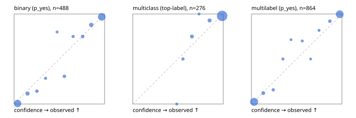

# Evaluation report

- model `Qwen/Qwen3.5-4B` @ `851bf6e806` (shared-prefix tree, forward only: text once per request, each question once, then each candidate), adapter/checkpoint `runs/verdict_json_v1/run/adapter`, prompt `challenger-state-first-v1` (6c9d8459ac44)
- data data/ova/eval_llm.jsonl; splits ['test']; n=946; calibration `None`
- cuda / bfloat16; 2026-10-01T13:38:25+0000; wall 109.6s

## Overall

question accuracy 91.5%

**binary**: n 488, positives 245, accuracy 0.924, precision 0.903, recall 0.951, f1 0.926, auroc 0.980, brier 0.051, log_loss 0.185, ece 0.031

**multiclass**: n 276, accuracy 0.946, macro_f1 0.906, log_loss 0.157, brier 0.081, ece_top_label 0.025

**multilabel**: n 182, labels 864, exact_match 0.846, micro_f1 0.955, macro_f1 0.913, label_auroc 0.990, brier 0.033, log_loss 0.125, ece 0.023

## By family

| family | n | question acc % | details |
|---|---|---|---|
| tllm_guardrail_hard | 60 | 86.7 | bin acc 87.5 F1 87.5 AUROC 1.000 ECE 0.161; mc acc 94.1 mF1 87.5 ECE 0.061; ml EM 72.7 µF1 92.7 ECE 0.068 |
| tllm_guardrail_simple | 67 | 98.5 | bin acc 100.0 F1 100.0 AUROC 1.000 ECE 0.030; mc acc 100.0 mF1 100.0 ECE 0.019; ml EM 92.9 µF1 98.5 ECE 0.039 |
| tllm_guardrail_very_hard | 43 | 97.7 | bin acc 100.0 F1 100.0 AUROC 1.000 ECE 0.088; mc acc 92.9 mF1 83.3 ECE 0.051; ml EM 100.0 µF1 100.0 ECE 0.049 |
| tllm_jailbreak_hard | 59 | 98.3 | bin acc 96.3 F1 96.6 AUROC 1.000 ECE 0.090; mc acc 100.0 mF1 100.0 ECE 0.051; ml EM 100.0 µF1 100.0 ECE 0.045 |
| tllm_jailbreak_simple | 70 | 98.6 | bin acc 100.0 F1 100.0 AUROC 1.000 ECE 0.040; mc acc 100.0 mF1 100.0 ECE 0.046; ml EM 90.9 µF1 98.6 ECE 0.032 |
| tllm_jailbreak_very_hard | 60 | 88.3 | bin acc 87.5 F1 86.7 AUROC 0.972 ECE 0.105; mc acc 94.4 mF1 91.7 ECE 0.039; ml EM 80.0 µF1 96.3 ECE 0.052 |
| tllm_judge_hard | 86 | 94.2 | bin acc 95.0 F1 93.3 AUROC 0.963 ECE 0.093; mc acc 96.0 mF1 90.9 ECE 0.032; ml EM 90.5 µF1 94.3 ECE 0.025 |
| tllm_judge_simple | 72 | 95.8 | bin acc 97.4 F1 97.9 AUROC 0.988 ECE 0.042; mc acc 100.0 mF1 100.0 ECE 0.034; ml EM 85.7 µF1 97.6 ECE 0.061 |
| tllm_judge_very_hard | 64 | 92.2 | bin acc 96.9 F1 97.3 AUROC 1.000 ECE 0.079; mc acc 95.2 mF1 96.7 ECE 0.028; ml EM 72.7 µF1 95.8 ECE 0.083 |
| tllm_score_hard | 62 | 95.2 | bin acc 97.1 F1 97.0 AUROC 1.000 ECE 0.111; mc acc 93.8 mF1 85.7 ECE 0.071; ml EM 91.7 µF1 98.0 ECE 0.113 |
| tllm_score_simple | 62 | 98.4 | bin acc 97.1 F1 98.0 AUROC 0.988 ECE 0.042; mc acc 100.0 mF1 100.0 ECE 0.036; ml EM 100.0 µF1 100.0 ECE 0.032 |
| tllm_score_very_hard | 76 | 81.6 | bin acc 84.2 F1 75.0 AUROC 0.973 ECE 0.147; mc acc 86.4 mF1 75.0 ECE 0.053; ml EM 68.8 µF1 85.7 ECE 0.069 |
| tllm_verify_hard | 50 | 70.0 | bin acc 69.2 F1 69.2 AUROC 0.848 ECE 0.212; mc acc 75.0 mF1 61.1 ECE 0.167; ml EM 62.5 µF1 74.1 ECE 0.124 |
| tllm_verify_simple | 60 | 95.0 | bin acc 93.9 F1 95.0 AUROC 1.000 ECE 0.086; mc acc 100.0 mF1 100.0 ECE 0.005; ml EM 91.7 µF1 98.5 ECE 0.044 |
| tllm_verify_very_hard | 55 | 78.2 | bin acc 80.6 F1 75.0 AUROC 0.859 ECE 0.172; mc acc 86.7 mF1 82.2 ECE 0.129; ml EM 55.6 µF1 81.5 ECE 0.058 |

## by hard case

| slice | n | question acc % |
|---|---|---|
| (none) | 265 | 97.7 |
| answer_trace_mismatch | 45 | 86.7 |
| benign_lookalike | 88 | 90.9 |
| confident_wrong | 39 | 76.9 |
| contradiction | 22 | 95.5 |
| distractor | 117 | 87.2 |
| double_negation | 3 | 100.0 |
| evidence_end | 11 | 90.9 |
| evidence_middle | 20 | 75.0 |
| evidence_start | 2 | 50.0 |
| exception | 20 | 95.0 |
| fake_authority | 1 | 100.0 |
| flawed_step | 44 | 63.6 |
| format_near_miss | 46 | 82.6 |
| gradual_escalation | 1 | 100.0 |
| hypothetical | 7 | 100.0 |
| indirect_injection | 25 | 92.0 |
| injection | 22 | 95.5 |
| judge_injection | 112 | 92.0 |
| length_bias | 7 | 100.0 |
| lexical_overlap | 103 | 92.2 |
| long_state | 74 | 93.2 |
| missing_evidence | 35 | 94.3 |
| multi_positive | 124 | 83.1 |
| multi_turn | 44 | 86.4 |
| negation | 62 | 95.2 |
| nota | 55 | 90.9 |
| numeric_reasoning | 109 | 79.8 |
| obfuscation | 1 | 100.0 |
| over_refusal | 50 | 90.0 |
| paraphrase | 73 | 89.0 |
| partial_compliance | 31 | 74.2 |
| role_reversal | 6 | 66.7 |
| sarcasm | 8 | 87.5 |
| speaker_confusion | 58 | 89.7 |
| subtle_violation | 16 | 93.8 |
| sycophancy | 13 | 100.0 |
| temporal_reasoning | 20 | 90.0 |
| tool_misuse | 6 | 83.3 |
| unsupported_claim | 96 | 85.4 |
| zero_positive | 55 | 92.7 |
| zero_positive_partial | 1 | 100.0 |

## by state tokens

| slice | n | question acc % |
|---|---|---|
| 00000-00127 | 308 | 88.3 |
| 00128-00511 | 284 | 96.8 |
| 00512-02047 | 222 | 92.3 |
| 02048-08191 | 125 | 85.6 |
| 08192+ | 7 | 100.0 |

## by candidates

| slice | n | question acc % |
|---|---|---|
| 01 | 488 | 92.4 |
| 03 | 82 | 93.9 |
| 04 | 239 | 93.7 |
| 05 | 98 | 82.7 |
| 06 | 33 | 84.8 |
| 07 | 3 | 100.0 |
| 08 | 3 | 66.7 |

## Paraphrase groups

29 groups; same prediction 93.1%; all correct 82.8%

## Multiclass abstention (coverage vs error on accepted)

| abstain_below | coverage % | error % |
|---|---|---|
| 0.0 | 100.0 | 5.4 |
| 0.4 | 100.0 | 5.4 |
| 0.5 | 98.9 | 4.4 |
| 0.6 | 96.7 | 3.4 |
| 0.7 | 92.4 | 2.4 |
| 0.8 | 91.3 | 2.4 |
| 0.9 | 86.2 | 2.1 |

## Reliability: binary

| bin | n | mean confidence | observed frequency |
|---|---|---|---|
| [0.0,0.1) | 178 | 0.038 | 0.006 |
| [0.1,0.2) | 26 | 0.149 | 0.115 |
| [0.2,0.3) | 14 | 0.252 | 0.143 |
| [0.3,0.4) | 7 | 0.348 | 0.286 |
| [0.4,0.5) | 5 | 0.475 | 0.800 |
| [0.5,0.6) | 13 | 0.555 | 0.308 |
| [0.6,0.7) | 8 | 0.652 | 0.750 |
| [0.7,0.8) | 16 | 0.758 | 0.750 |
| [0.8,0.9) | 33 | 0.853 | 0.879 |
| [0.9,1.0] | 188 | 0.968 | 0.968 |

## Reliability: multiclass

| bin | n | mean confidence | observed frequency |
|---|---|---|---|
| [0.4,0.5) | 3 | 0.485 | 0.000 |
| [0.5,0.6) | 6 | 0.554 | 0.500 |
| [0.6,0.7) | 12 | 0.654 | 0.750 |
| [0.7,0.8) | 3 | 0.733 | 1.000 |
| [0.8,0.9) | 14 | 0.849 | 0.929 |
| [0.9,1.0] | 238 | 0.988 | 0.979 |

## Reliability: multilabel

| bin | n | mean confidence | observed frequency |
|---|---|---|---|
| [0.0,0.1) | 381 | 0.030 | 0.024 |
| [0.1,0.2) | 33 | 0.131 | 0.121 |
| [0.2,0.3) | 19 | 0.241 | 0.158 |
| [0.3,0.4) | 12 | 0.348 | 0.500 |
| [0.4,0.5) | 7 | 0.437 | 0.714 |
| [0.5,0.6) | 10 | 0.562 | 0.700 |
| [0.6,0.7) | 6 | 0.655 | 0.500 |
| [0.7,0.8) | 11 | 0.747 | 0.818 |
| [0.8,0.9) | 25 | 0.867 | 0.920 |
| [0.9,1.0] | 360 | 0.976 | 0.997 |
