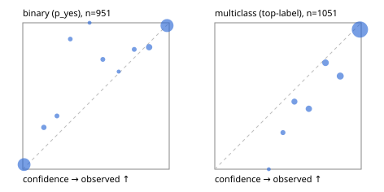

# Evaluation report

- model `Qwen/Qwen3.5-4B` @ `851bf6e806` (shared-prefix tree, forward only: text once per request, each question once, then each candidate), adapter/checkpoint `runs/verdict_json_v1/run/adapter`, prompt `challenger-state-first-v1` (6c9d8459ac44)
- data data/ova/eval_images_v1.jsonl; splits ['test']; n=2002; calibration `None`
- cuda / bfloat16; 2026-10-01T13:40:18+0000; wall 104.3s

## Overall

question accuracy 90.4%

**binary**: n 951, positives 508, accuracy 0.943, precision 0.958, recall 0.935, f1 0.946, auroc 0.986, brier 0.044, log_loss 0.160, ece 0.027

**multiclass**: n 1051, accuracy 0.868, macro_f1 0.930, log_loss 0.381, brier 0.189, ece_top_label 0.061

## By family

| family | n | question acc % | details |
|---|---|---|---|
| img_beans | 204 | 98.0 | bin acc 98.0 F1 98.1 AUROC 1.000 ECE 0.024; mc acc 98.0 mF1 98.0 ECE 0.021 |
| img_eurosat | 200 | 91.5 | bin acc 95.0 F1 95.0 AUROC 0.980 ECE 0.044; mc acc 88.0 mF1 87.8 ECE 0.031 |
| img_fashion | 200 | 89.0 | bin acc 96.0 F1 96.0 AUROC 0.982 ECE 0.048; mc acc 82.0 mF1 82.3 ECE 0.092 |
| img_hurricane | 100 | 58.0 | mc acc 58.0 mF1 56.2 ECE 0.315 |
| img_indoor | 268 | 95.1 | bin acc 95.5 F1 95.4 AUROC 0.995 ECE 0.039; mc acc 94.8 mF1 94.5 ECE 0.026 |
| img_painting | 204 | 71.1 | bin acc 79.4 F1 77.4 AUROC 0.924 ECE 0.169; mc acc 62.7 mF1 61.8 ECE 0.174 |
| img_pets | 222 | 98.2 | bin acc 98.2 F1 98.6 AUROC 0.999 ECE 0.015; mc acc 98.2 mF1 98.1 ECE 0.023 |
| img_rice | 200 | 93.0 | bin acc 92.0 F1 92.5 AUROC 0.984 ECE 0.080; mc acc 94.0 mF1 94.0 ECE 0.034 |
| img_snacks | 200 | 96.0 | bin acc 96.0 F1 96.6 AUROC 0.996 ECE 0.056; mc acc 96.0 mF1 96.0 ECE 0.046 |
| img_trash | 204 | 95.1 | bin acc 98.0 F1 98.1 AUROC 1.000 ECE 0.033; mc acc 92.2 mF1 92.1 ECE 0.048 |

## by hard case

| slice | n | question acc % |
|---|---|---|
| (none) | 2002 | 90.4 |

## by state tokens

| slice | n | question acc % |
|---|---|---|
| 00000-00127 | 2002 | 90.4 |

## by candidates

| slice | n | question acc % |
|---|---|---|
| 01 | 951 | 94.3 |
| 02 | 100 | 58.0 |
| 03 | 102 | 98.0 |
| 05 | 100 | 94.0 |
| 06 | 102 | 92.2 |
| 10 | 200 | 85.0 |
| 12 | 447 | 88.6 |

## Paraphrase groups

0 groups; same prediction —%; all correct —%

## Multiclass abstention (coverage vs error on accepted)

| abstain_below | coverage % | error % |
|---|---|---|
| 0.0 | 100.0 | 13.2 |
| 0.4 | 99.8 | 13.1 |
| 0.5 | 98.3 | 12.1 |
| 0.6 | 94.6 | 10.5 |
| 0.7 | 90.2 | 8.1 |
| 0.8 | 85.0 | 6.9 |
| 0.9 | 78.7 | 4.6 |

## Reliability: binary

| bin | n | mean confidence | observed frequency |
|---|---|---|---|
| [0.0,0.1) | 412 | 0.009 | 0.032 |
| [0.1,0.2) | 21 | 0.144 | 0.286 |
| [0.2,0.3) | 11 | 0.233 | 0.364 |
| [0.3,0.4) | 9 | 0.324 | 0.889 |
| [0.4,0.5) | 2 | 0.456 | 1.000 |
| [0.5,0.6) | 12 | 0.547 | 0.750 |
| [0.6,0.7) | 3 | 0.655 | 0.667 |
| [0.7,0.8) | 11 | 0.761 | 0.818 |
| [0.8,0.9) | 42 | 0.863 | 0.833 |
| [0.9,1.0] | 428 | 0.985 | 0.981 |

## Reliability: multiclass

| bin | n | mean confidence | observed frequency |
|---|---|---|---|
| [0.3,0.4) | 2 | 0.369 | 0.000 |
| [0.4,0.5) | 16 | 0.466 | 0.250 |
| [0.5,0.6) | 39 | 0.544 | 0.462 |
| [0.6,0.7) | 46 | 0.642 | 0.413 |
| [0.7,0.8) | 55 | 0.756 | 0.727 |
| [0.8,0.9) | 66 | 0.857 | 0.636 |
| [0.9,1.0] | 827 | 0.991 | 0.954 |
