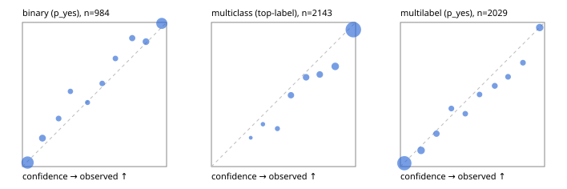

# Evaluation report

- model `Qwen/Qwen3.5-4B` @ `851bf6e806` (shared-prefix tree, forward only: text once per request, each question once, then each candidate), adapter/checkpoint `runs/verdict_json_v1/run/adapter`, prompt `challenger-state-first-v1` (6c9d8459ac44)
- data data/ova/hf.jsonl, data/ova/eval.jsonl; splits ['test']; n=3471; calibration `None`
- cuda / bfloat16; 2026-10-01T13:42:24+0000; wall 115.6s

## Overall

question accuracy 83.6%

**binary**: n 984, positives 475, accuracy 0.912, precision 0.927, recall 0.886, f1 0.906, auroc 0.973, brier 0.065, log_loss 0.222, ece 0.032

**multiclass**: n 2143, accuracy 0.853, macro_f1 0.935, log_loss 0.470, brier 0.221, ece_top_label 0.054

**multilabel**: n 344, labels 2029, exact_match 0.520, micro_f1 0.736, macro_f1 0.831, label_auroc 0.940, brier 0.079, log_loss 0.253, ece 0.023

## By family

| family | n | question acc % | details |
|---|---|---|---|
| eval_adversarial | 27 | 96.3 | bin acc 93.3 F1 90.9 AUROC 0.963 ECE 0.049; mc acc 100.0 mF1 100.0 ECE 0.001; ml EM 100.0 µF1 100.0 ECE 0.041 |
| eval_agent_output | 26 | 88.5 | bin acc 100.0 F1 100.0 AUROC 1.000 ECE 0.068; mc acc 71.4 mF1 70.0 ECE 0.223; ml EM 80.0 µF1 94.1 ECE 0.075 |
| eval_evidence | 17 | 88.2 | bin acc 100.0 F1 100.0 AUROC 1.000 ECE 0.029; ml EM 0.0 µF1 50.0 ECE 0.371 |
| eval_multilabel | 32 | 93.8 | bin acc 100.0 F1 100.0 AUROC 1.000 ECE 0.080; mc acc 100.0 mF1 100.0 ECE 0.016; ml EM 91.7 µF1 98.0 ECE 0.032 |
| eval_policy | 22 | 77.3 | bin acc 84.6 F1 85.7 AUROC 0.905 ECE 0.111; mc acc 60.0 mF1 42.9 ECE 0.394; ml EM 75.0 µF1 94.1 ECE 0.161 |
| eval_routing | 25 | 92.0 | bin acc 100.0 F1 100.0 AUROC 1.000 ECE 0.022; mc acc 92.3 mF1 87.9 ECE 0.008; ml EM 50.0 µF1 80.0 ECE 0.092 |
| eval_urgency_sentiment | 22 | 90.9 | bin acc 80.0 F1 83.3 AUROC 0.958 ECE 0.136; mc acc 100.0 mF1 100.0 ECE 0.085; ml EM 100.0 µF1 100.0 ECE 0.028 |
| heldout_boolq | 300 | 88.0 | bin acc 88.0 F1 89.7 AUROC 0.957 ECE 0.053 |
| heldout_emotion_multiclass | 300 | 57.0 | mc acc 57.0 mF1 46.4 ECE 0.214 |
| heldout_intent_clinc | 300 | 97.3 | mc acc 97.3 mF1 98.1 ECE 0.017 |
| heldout_question_type_trec | 300 | 91.0 | mc acc 91.0 mF1 90.9 ECE 0.028 |
| heldout_sentiment_sst2 | 300 | 91.7 | bin acc 91.7 F1 91.2 AUROC 0.979 ECE 0.072 |
| heldout_topic_dbpedia | 300 | 98.3 | mc acc 98.3 mF1 98.2 ECE 0.016 |
| hf_emotions_multilabel | 300 | 47.3 | ml EM 47.3 µF1 68.3 ECE 0.024 |
| hf_intent_banking77 | 300 | 96.0 | mc acc 96.0 mF1 96.2 ECE 0.017 |
| hf_nli | 300 | 93.0 | bin acc 93.0 F1 90.6 AUROC 0.982 ECE 0.057 |
| hf_sentiment_tweets | 300 | 66.3 | mc acc 66.3 mF1 67.3 ECE 0.141 |
| hf_topic_agnews | 300 | 90.3 | mc acc 90.3 mF1 90.3 ECE 0.054 |

## by hard case

| slice | n | question acc % |
|---|---|---|
| (none) | 3042 | 83.4 |
| contradiction | 107 | 99.1 |
| distractor | 33 | 78.8 |
| double_negation | 6 | 83.3 |
| evidence_end | 13 | 100.0 |
| evidence_middle | 11 | 72.7 |
| evidence_start | 9 | 100.0 |
| exception | 7 | 42.9 |
| hypothetical | 7 | 100.0 |
| injection | 10 | 100.0 |
| lexical_overlap | 20 | 100.0 |
| long_state | 50 | 86.0 |
| missing_evidence | 104 | 87.5 |
| multi_positive | 81 | 50.6 |
| multi_turn | 9 | 88.9 |
| negation | 30 | 96.7 |
| new_label_names | 3 | 100.0 |
| nota | 46 | 100.0 |
| numeric_reasoning | 16 | 68.8 |
| paraphrase | 22 | 86.4 |
| role_reversal | 15 | 93.3 |
| sarcasm | 12 | 100.0 |
| temporal_reasoning | 29 | 72.4 |
| zero_positive | 6 | 83.3 |

## by state tokens

| slice | n | question acc % |
|---|---|---|
| 00000-00127 | 3213 | 83.3 |
| 00128-00511 | 206 | 88.3 |
| 00512-02047 | 52 | 86.5 |

## by candidates

| slice | n | question acc % |
|---|---|---|
| 01 | 984 | 91.2 |
| 03 | 310 | 67.4 |
| 04 | 333 | 89.8 |
| 05 | 22 | 86.4 |
| 06 | 1218 | 73.5 |
| 07 | 49 | 100.0 |
| 08 | 555 | 96.4 |

## Paraphrase groups

11 groups; same prediction 54.5%; all correct 72.7%

## Multiclass abstention (coverage vs error on accepted)

| abstain_below | coverage % | error % |
|---|---|---|
| 0.0 | 100.0 | 14.7 |
| 0.4 | 99.0 | 14.1 |
| 0.5 | 97.2 | 13.1 |
| 0.6 | 92.5 | 11.2 |
| 0.7 | 87.2 | 9.5 |
| 0.8 | 81.7 | 7.7 |
| 0.9 | 72.9 | 5.0 |

## Reliability: binary

| bin | n | mean confidence | observed frequency |
|---|---|---|---|
| [0.0,0.1) | 393 | 0.035 | 0.028 |
| [0.1,0.2) | 66 | 0.139 | 0.197 |
| [0.2,0.3) | 30 | 0.251 | 0.333 |
| [0.3,0.4) | 23 | 0.333 | 0.522 |
| [0.4,0.5) | 18 | 0.452 | 0.444 |
| [0.5,0.6) | 26 | 0.554 | 0.577 |
| [0.6,0.7) | 28 | 0.645 | 0.750 |
| [0.7,0.8) | 46 | 0.762 | 0.891 |
| [0.8,0.9) | 60 | 0.857 | 0.867 |
| [0.9,1.0] | 294 | 0.966 | 0.993 |

## Reliability: multiclass

| bin | n | mean confidence | observed frequency |
|---|---|---|---|
| [0.2,0.3) | 5 | 0.273 | 0.200 |
| [0.3,0.4) | 17 | 0.357 | 0.294 |
| [0.4,0.5) | 38 | 0.458 | 0.263 |
| [0.5,0.6) | 101 | 0.552 | 0.495 |
| [0.6,0.7) | 113 | 0.656 | 0.619 |
| [0.7,0.8) | 119 | 0.752 | 0.639 |
| [0.8,0.9) | 187 | 0.859 | 0.695 |
| [0.9,1.0] | 1563 | 0.984 | 0.950 |

## Reliability: multilabel

| bin | n | mean confidence | observed frequency |
|---|---|---|---|
| [0.0,0.1) | 1192 | 0.027 | 0.023 |
| [0.1,0.2) | 178 | 0.143 | 0.112 |
| [0.2,0.3) | 105 | 0.250 | 0.229 |
| [0.3,0.4) | 67 | 0.353 | 0.403 |
| [0.4,0.5) | 60 | 0.450 | 0.367 |
| [0.5,0.6) | 54 | 0.549 | 0.500 |
| [0.6,0.7) | 75 | 0.655 | 0.560 |
| [0.7,0.8) | 61 | 0.747 | 0.623 |
| [0.8,0.9) | 68 | 0.850 | 0.721 |
| [0.9,1.0] | 169 | 0.966 | 0.964 |
